# //largest-contentful-paint/samples/pages+cached+noadtech

[→ Parent](../..)


## Raw


```yaml
p90min: 7789.631000000003
p90max: 10796.446999999996
p90range: 3006.8159999999934
p90mean: 8462.612265957448
p90median: 8319.118
p90stdev: 561.9821116825655
p90skewness: 1.2164415829815836
p90eccentricity: 1
p90discretization: 1
outlandishness: 1.0160817170373986
confidence: 297.0146039570599
p90confidence: 227.2148184803283

```

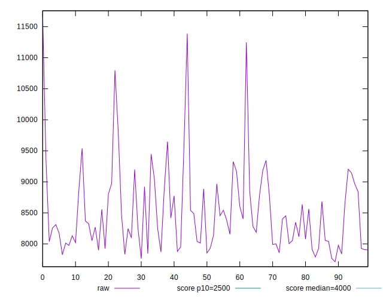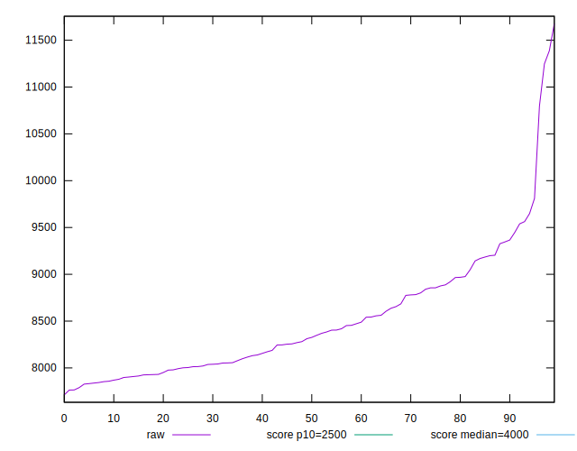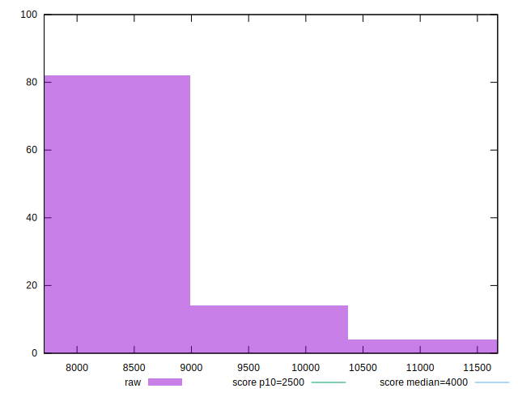
## Score


```yaml
p90min: 0
p90max: 0.03
p90range: 0.03
p90mean: 0.021914893617021286
p90median: 0.02
p90stdev: 0.00802610047398298
p90skewness: -0.4824200354723791
p90eccentricity: 1.0000000000000016
p90discretization: 23.5
outlandishness: 0.9895420492035055
confidence: 0.003608889300835003
p90confidence: 0.0032450302676733673

```

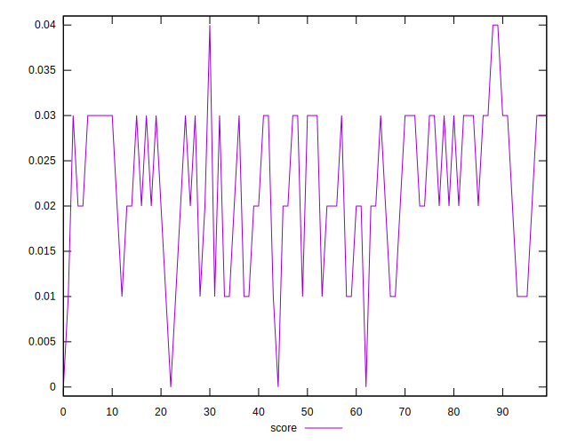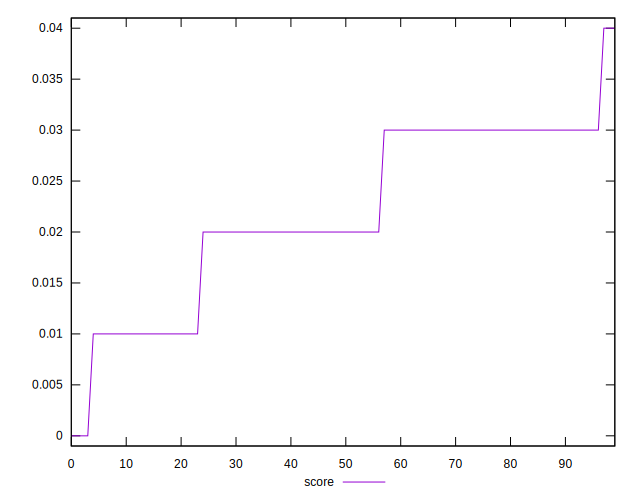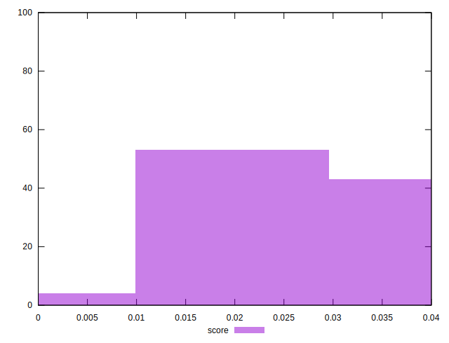
## Raw Estimate

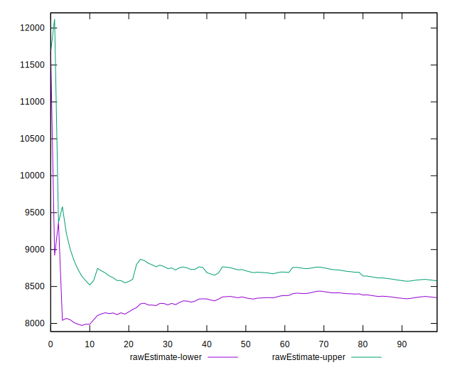
## Score Estimate

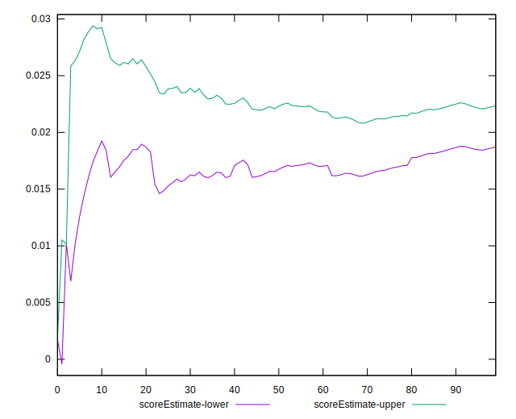
## P Score


```yaml
p90min: 0.0033908085982130576
p90max: 0.03458303135262353
p90range: 0.03119222275441047
p90mean: 0.022237634492800328
p90median: 0.02293204071785121
p90stdev: 0.007852230323939917
p90skewness: -0.29603620592213264
p90eccentricity: 0.9999999999999999
p90discretization: 1
outlandishness: 0.9822258968330905
confidence: 0.003407673867468724
p90confidence: 0.0031747328796250143

```

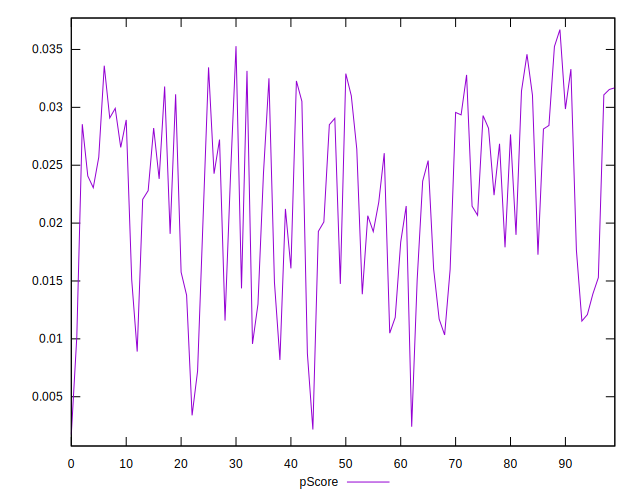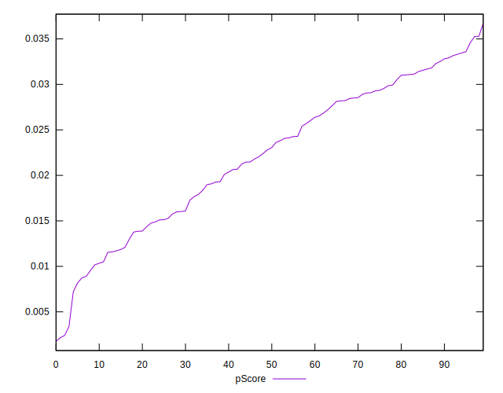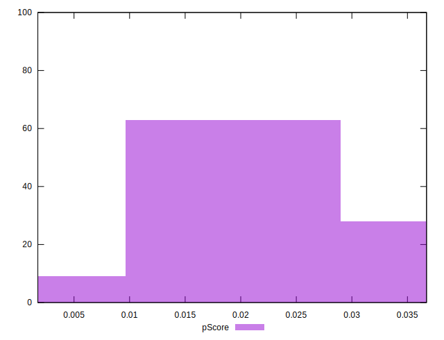
## Score Difference


```yaml
p90min: 0
p90max: 0
p90range: 0
p90mean: 0
p90median: 0
p90stdev: 0
p90skewness: .nan
p90eccentricity: .nan
p90discretization: 94
outlandishness: .nan
confidence: 0
p90confidence: 0

```


## P Score Difference


```yaml
p90min: -0.004714741726677539
p90max: 0.004358774396414531
p90range: 0.00907351612309207
p90mean: 0.0002576138261900636
p90median: 0.0005030632051733668
p90stdev: 0.0025527826395201165
p90skewness: -0.2401615223814856
p90eccentricity: 0.9999999999999991
p90discretization: 1
outlandishness: 0.8615860951978493
confidence: 0.0010740169622703145
p90confidence: 0.0010321147808810068

```

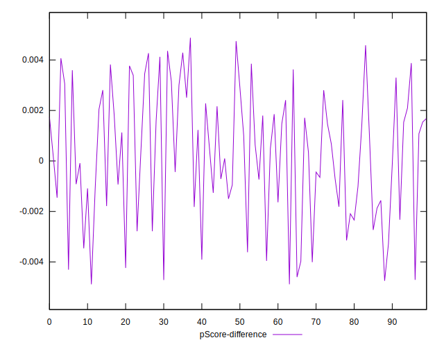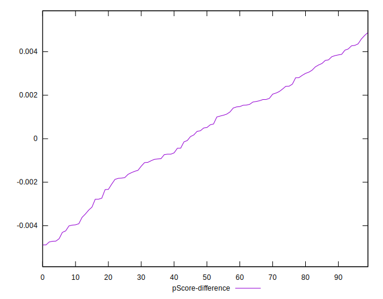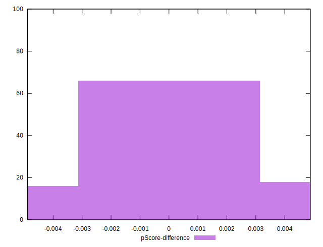