# //largest-contentful-paint/samples/pages+cached

[→ Parent](../..)


## Raw


```yaml
p90min: 14318.820999999998
p90max: 17853.050999999996
p90range: 3534.2299999999977
p90mean: 15567.054053191492
p90median: 15414.232250000001
p90stdev: 750.405081705004
p90skewness: 0.7140013280376649
p90eccentricity: 1.0000000000000004
p90discretization: 1
outlandishness: 0.9886981368780672
confidence: 504.27644333496795
p90confidence: 303.39605279576375

```

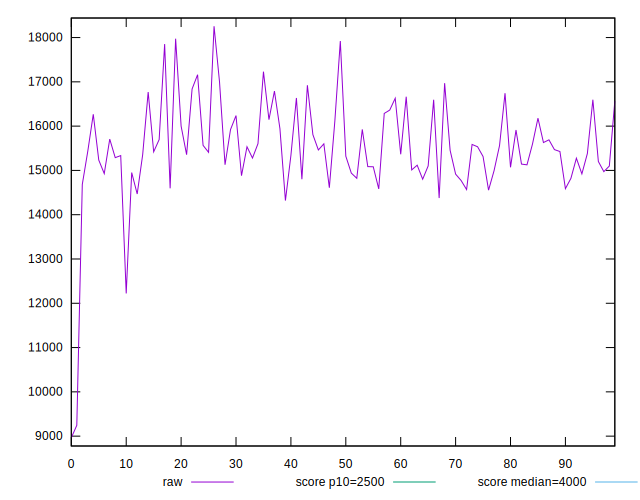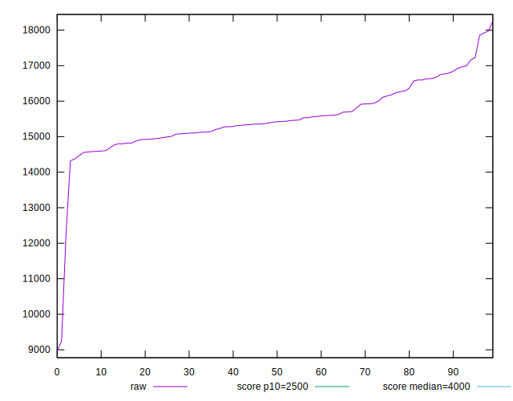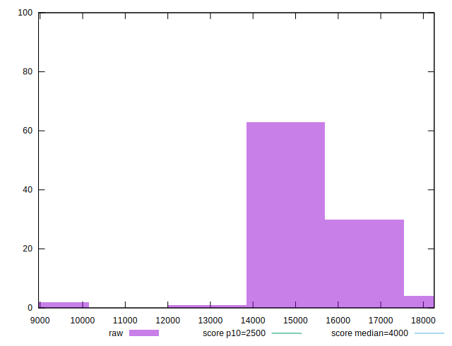
## Score


```yaml
p90min: 0
p90max: 0
p90range: 0
p90mean: 0
p90median: 0
p90stdev: 0
p90skewness: .nan
p90eccentricity: .nan
p90discretization: 94
outlandishness: .inf
confidence: 0.0005487899156712152
p90confidence: 0

```

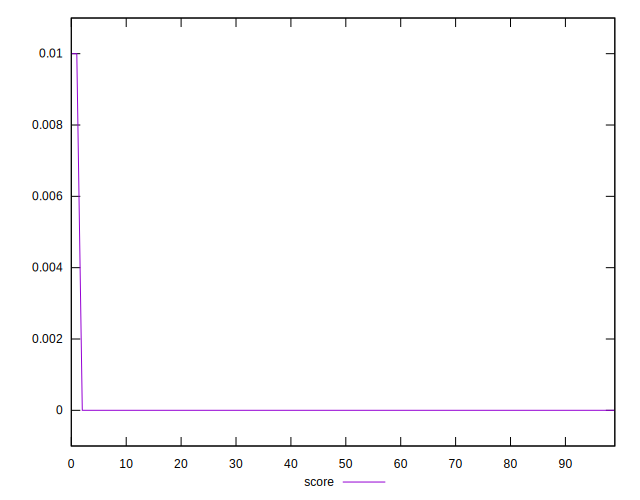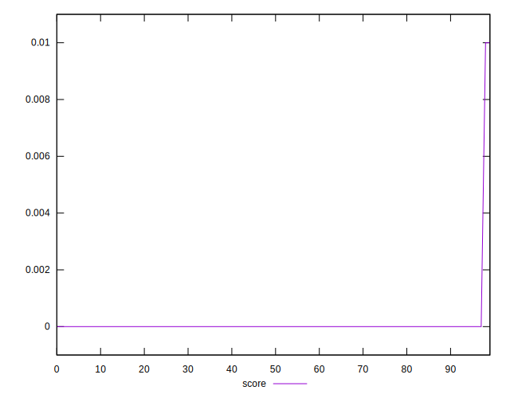
## Raw Estimate

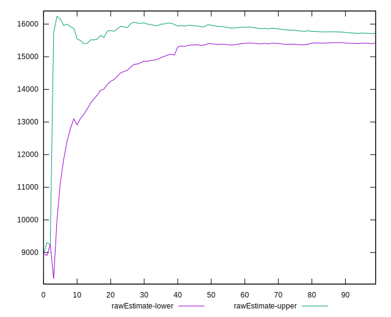
## Score Estimate

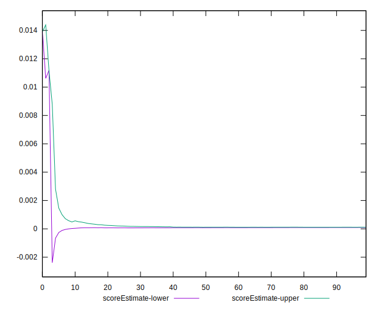
## P Score


```yaml
p90min: 0.00002264698507525864
p90max: 0.0002533032902050647
p90range: 0.00023065630512980606
p90mean: 0.0001193278413871686
p90median: 0.00011743471214384349
p90stdev: 0.00005307620270323941
p90skewness: 0.3024387284964389
p90eccentricity: 0.9999999999999997
p90discretization: 1
outlandishness: 9.887139602367846
confidence: 0.0006870167328410329
p90confidence: 0.000021459223544918727

```

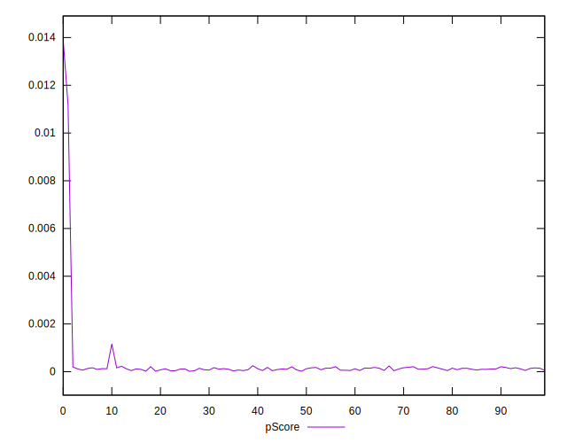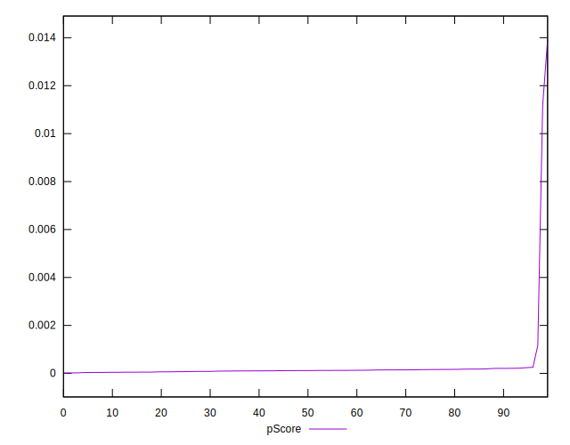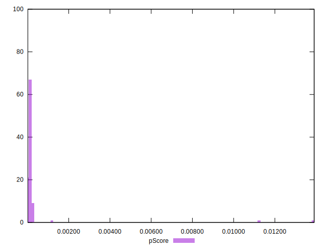
## Score Difference


```yaml
p90min: 0
p90max: 0
p90range: 0
p90mean: 0
p90median: 0
p90stdev: 0
p90skewness: .nan
p90eccentricity: .nan
p90discretization: 94
outlandishness: .nan
confidence: 0
p90confidence: 0

```


## P Score Difference


```yaml
p90min: 0.00002264698507525864
p90max: 0.0002533032902050647
p90range: 0.00023065630512980606
p90mean: 0.0001193278413871686
p90median: 0.00011743471214384349
p90stdev: 0.00005307620270323941
p90skewness: 0.3024387284964389
p90eccentricity: 0.9999999999999997
p90discretization: 1
outlandishness: 2.1559854716477966
confidence: 0.00015931555532848894
p90confidence: 0.000021459223544918727

```

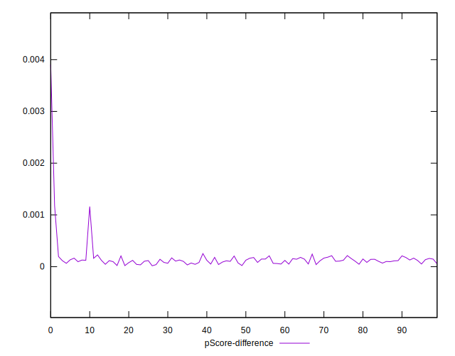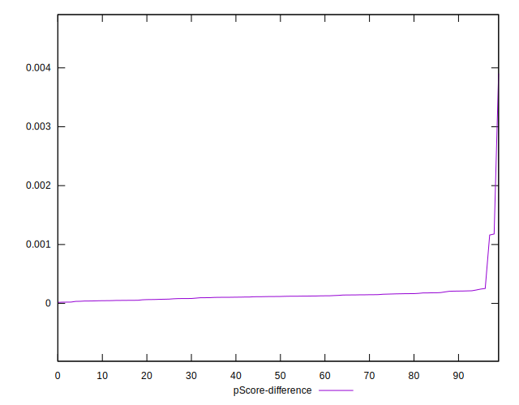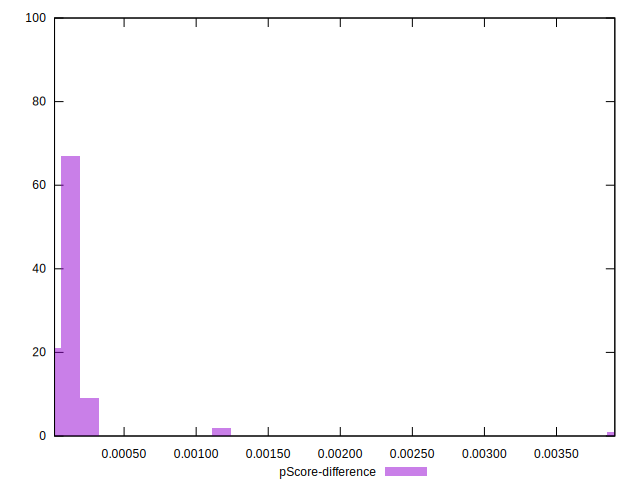