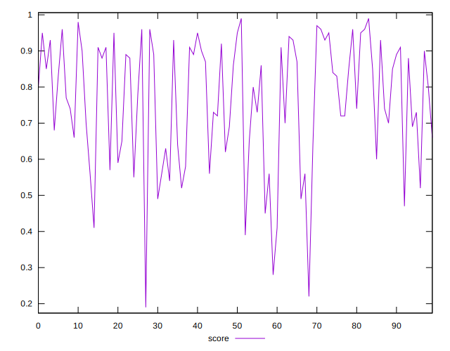

# //mainthread-work-breakdown/samples/pages+cached+noadtech+nomedia

[→ Parent](../..)


## Raw


```yaml
p90min: 1513.824
p90max: 4642.871999999997
p90range: 3129.0479999999966
p90mean: 2673.8253191489353
p90median: 2542.5
p90stdev: 831.9775293181563
p90skewness: 0.4588304496755648
p90eccentricity: 1.0000000000000002
p90discretization: 1
outlandishness: 1.041376116347088
confidence: 398.705648308167
p90confidence: 336.37658454601205

```


## Score


```yaml
p90min: 0.39
p90max: 0.97
p90range: 0.58
p90mean: 0.7655319148936169
p90median: 0.8
p90stdev: 0.16191419464718984
p90skewness: -0.5372240417971219
p90eccentricity: 1.0000000000000002
p90discretization: 2.238095238095238
outlandishness: 0.9755103329979814
confidence: 0.07298626930854094
p90confidence: 0.06546347931965876

```


## Raw Estimate


## Score Estimate


## P Score


```yaml
p90min: 0.3901368828481326
p90max: 0.9655207162140704
p90range: 0.5753838333659378
p90mean: 0.7652466584196306
p90median: 0.8018295884873867
p90stdev: 0.16187589935584526
p90skewness: -0.5375754367925001
p90eccentricity: 0.9999999999999994
p90discretization: 1
outlandishness: 0.9756837234129933
confidence: 0.07288383516215799
p90confidence: 0.06544799616193786

```


## Score Difference


```yaml
p90min: 0
p90max: 1.1102230246251565e-16
p90range: 1.1102230246251565e-16
p90mean: 1.594469237493576e-17
p90median: 0
p90stdev: 3.765153231580655e-17
p90skewness: 2.0288174526293132
p90eccentricity: 0.9999999999999996
p90discretization: 31.333333333333332
outlandishness: 1.3199456790123456
confidence: 1.570792638952132e-17
p90confidence: 1.5222879701684292e-17

```


## P Score Difference


```yaml
p90min: -0.004479283785929544
p90max: 0.00460822034377284
p90range: 0.009087504129702384
p90mean: -0.00023029755698439968
p90median: -0.00032666930996069765
p90stdev: 0.0027770963120615118
p90skewness: 0.11126319632413657
p90eccentricity: 0.9999999999999996
p90discretization: 1
outlandishness: 0.8681121766484621
confidence: 0.0011506807853138858
p90confidence: 0.001122806974332776

```

