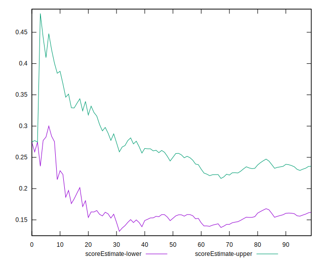
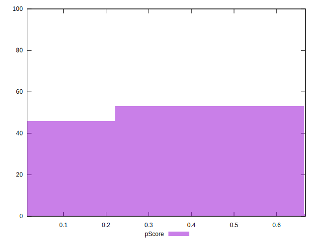

# //mainthread-work-breakdown/samples/pages

[→ Parent](../..)


## Raw


```yaml
p90min: 3428.108
p90max: 12391.107999999998
p90range: 8962.999999999998
p90mean: 6294.84957446808
p90median: 5761.613999999987
p90stdev: 2195.988714961136
p90skewness: 0.7374996033386622
p90eccentricity: 0.9999999999999997
p90discretization: 1
outlandishness: 1.0324466282996614
confidence: 962.7975862723591
p90confidence: 887.8595365978147

```


## Score


```yaml
p90min: 0.02
p90max: 0.61
p90range: 0.59
p90mean: 0.2692553191489361
p90median: 0.25
p90stdev: 0.179924566709911
p90skewness: 0.4007957883428677
p90eccentricity: 0.9999999999999992
p90discretization: 2.0434782608695654
outlandishness: 1.02876177041977
confidence: 0.07508825385549187
p90confidence: 0.07274524742922067

```


## Raw Estimate


## Score Estimate


## P Score


```yaml
p90min: 0.017157357163887166
p90max: 0.6136264577646704
p90range: 0.5964691006007832
p90mean: 0.2693061444962019
p90median: 0.24741596707309219
p90stdev: 0.1798529796842874
p90skewness: 0.39814044282322547
p90eccentricity: 0.9999999999999997
p90discretization: 1
outlandishness: 1.0282265545591196
confidence: 0.07506094327757466
p90confidence: 0.0727163041004305

```


## Score Difference


```yaml
p90min: 0
p90max: 5.551115123125783e-17
p90range: 5.551115123125783e-17
p90mean: 5.905441620346577e-19
p90median: 0
p90stdev: 5.695001657605475e-18
p90skewness: 9.539955591519902
p90eccentricity: 1.0000000000000007
p90discretization: 47
outlandishness: 22.090000000000003
confidence: 5.653406413389277e-18
p90confidence: 2.302544406624999e-18

```


## P Score Difference


```yaml
p90min: -0.0048018817347054155
p90max: 0.004555786463661948
p90range: 0.009357668198367364
p90mean: -0.0000199166061332706
p90median: -0.00004723483553030483
p90stdev: 0.0026330311637748796
p90skewness: -0.07426426510733194
p90eccentricity: 1.0000000000000004
p90discretization: 1
outlandishness: 0.9597876092466703
confidence: 0.0011037122924431053
p90confidence: 0.0010645600375765786

```

