# //max-potential-fid/samples/pages+cached+noadtech

[→ Parent](../..)


## Raw


```yaml
p90min: 116
p90max: 588.9999999999995
p90range: 472.99999999999955
p90mean: 265.02127659574467
p90median: 234
p90stdev: 125.4458413889219
p90skewness: 1.0511064011148714
p90eccentricity: 1.0000000000000007
p90discretization: 1.146341463414634
outlandishness: 1.092441160386165
confidence: 61.31975284284102
p90confidence: 50.71897038672273

```

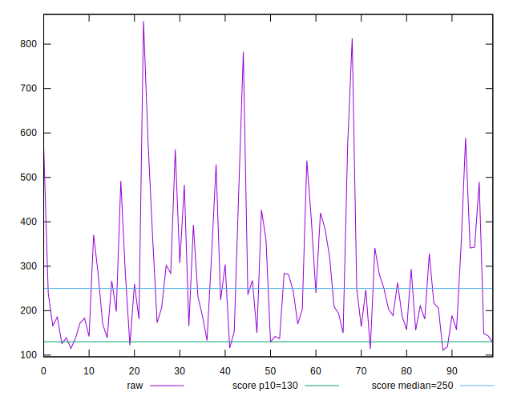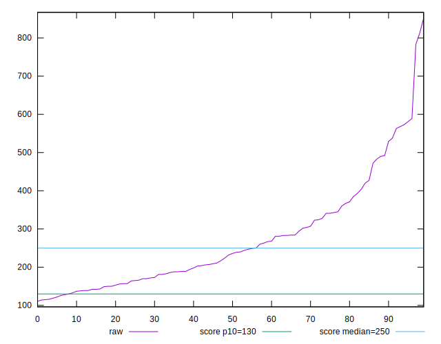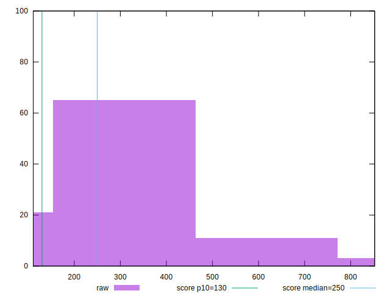
## Score


```yaml
p90min: 0.05
p90max: 0.93
p90range: 0.88
p90mean: 0.5341489361702128
p90median: 0.55
p90stdev: 0.2778274743030136
p90skewness: -0.27404215876619936
p90eccentricity: 1.0000000000000002
p90discretization: 1.5666666666666667
outlandishness: 0.986755954392071
confidence: 0.11477267947648356
p90confidence: 0.11232834254031239

```

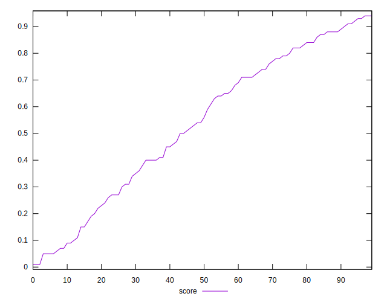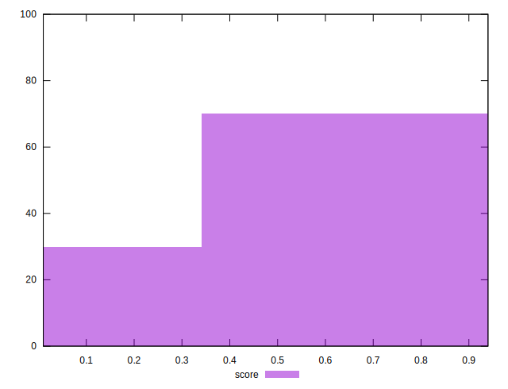
## Raw Estimate

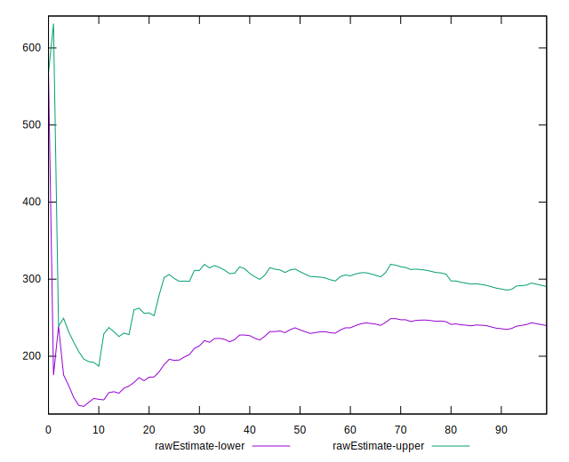
## Score Estimate

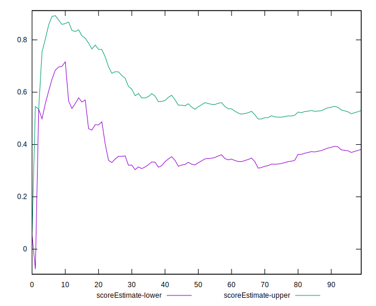
## P Score


```yaml
p90min: 0.046530917357135215
p90max: 0.9338195705791867
p90range: 0.8872886532220515
p90mean: 0.5336708759576125
p90median: 0.5515873860348441
p90stdev: 0.2776975533163733
p90skewness: -0.2744998275238194
p90eccentricity: 1.0000000000000002
p90discretization: 1.146341463414634
outlandishness: 0.9868307019728243
confidence: 0.11470783806490062
p90confidence: 0.11227581422529562

```

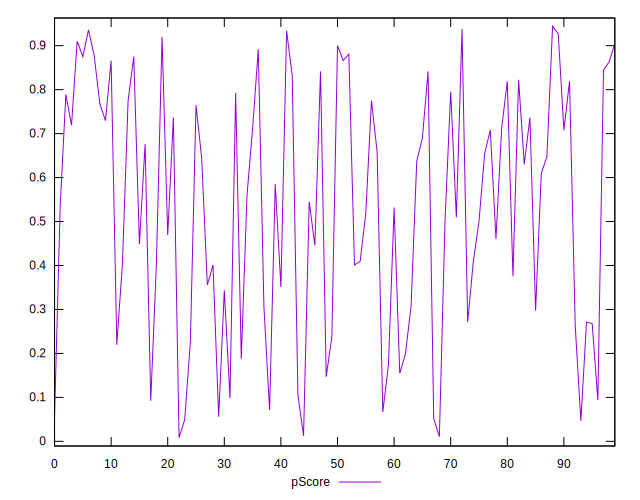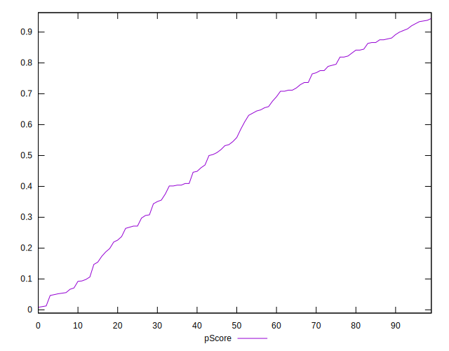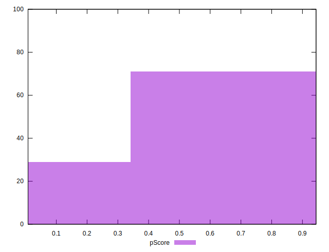
## Score Difference


```yaml
p90min: 0
p90max: 1.1102230246251565e-16
p90range: 1.1102230246251565e-16
p90mean: 8.267618268485208e-18
p90median: 0
p90stdev: 2.6803159497813462e-17
p90skewness: 3.2035019781585894
p90eccentricity: 0.9999999999999959
p90discretization: 31.333333333333332
outlandishness: 1.8032653061224493
confidence: 1.2309298685672562e-17
p90confidence: 1.0836777351793967e-17

```

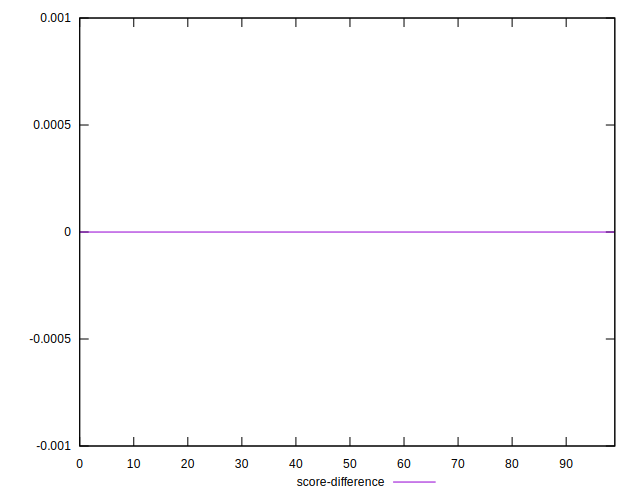
## P Score Difference


```yaml
p90min: -0.004880487462922911
p90max: 0.004708516728663348
p90range: 0.009589004191586259
p90mean: -0.00048082560503657015
p90median: -0.0006789655733441813
p90stdev: 0.0027236656677791923
p90skewness: 0.17099405491285755
p90eccentricity: 0.9999999999999999
p90discretization: 1.119047619047619
outlandishness: 0.8946979601021205
confidence: 0.001138209181660008
p90confidence: 0.0011012044466196668

```

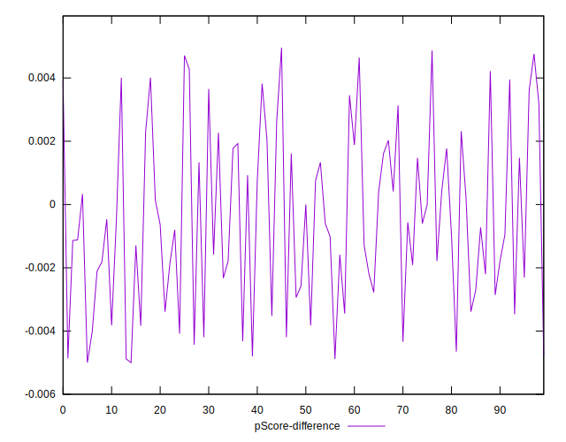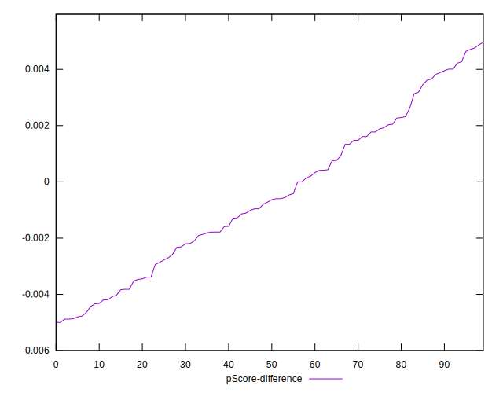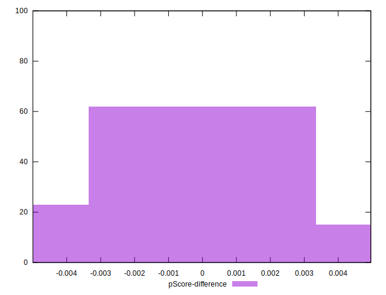