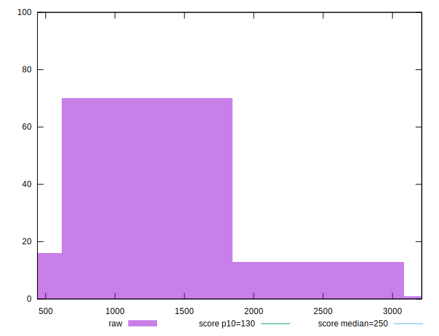
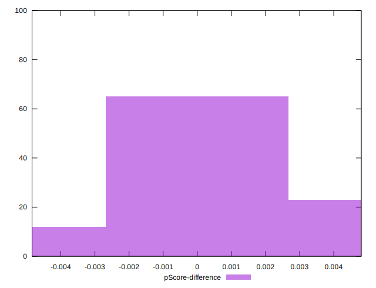

# //max-potential-fid/samples/pages+cached

[→ Parent](../..)


## Raw


```yaml
p90min: 504
p90max: 2310.000000000002
p90range: 1806.0000000000018
p90mean: 1097.1489361702127
p90median: 877.5000000000009
p90stdev: 500.843011829923
p90skewness: 0.7904165255088951
p90eccentricity: 0.9999999999999996
p90discretization: 1.0217391304347827
outlandishness: 1.054669172511924
confidence: 225.89993327593268
p90confidence: 202.49568741496884

```


## Score


```yaml
p90min: 0
p90max: 0.08
p90range: 0.08
p90mean: 0.015425531914893624
p90median: 0.01
p90stdev: 0.02186344922355823
p90skewness: 1.58860703820731
p90eccentricity: 1
p90discretization: 11.75
outlandishness: 1.422837650416171
confidence: 0.01137076445993825
p90confidence: 0.008839604577112685

```


## Raw Estimate


## Score Estimate


## P Score


```yaml
p90min: 0.000006578352256370046
p90max: 0.08471603248599108
p90range: 0.08470945413373471
p90mean: 0.015955359890657463
p90median: 0.0069516774531329095
p90stdev: 0.022004621836094508
p90skewness: 1.6210554548914866
p90eccentricity: 1.0000000000000002
p90discretization: 1.032967032967033
outlandishness: 1.4078841586589916
confidence: 0.011441730027404333
p90confidence: 0.008896682033609988

```


## Score Difference


```yaml
p90min: 0
p90max: 0
p90range: 0
p90mean: 0
p90median: 0
p90stdev: 0
p90skewness: .nan
p90eccentricity: .nan
p90discretization: 94
outlandishness: .nan
confidence: 0
p90confidence: 0

```


## P Score Difference


```yaml
p90min: -0.004546117692208012
p90max: 0.004570504469321954
p90range: 0.009116622161529966
p90mean: 0.0005665045076594276
p90median: 0.0002908511222536603
p90stdev: 0.0021761351156808577
p90skewness: -0.18531060514685743
p90eccentricity: 0.9999999999999991
p90discretization: 1.032967032967033
outlandishness: 0.8809652250476496
confidence: 0.0009461409295083628
p90confidence: 0.0008798325338465285

```

