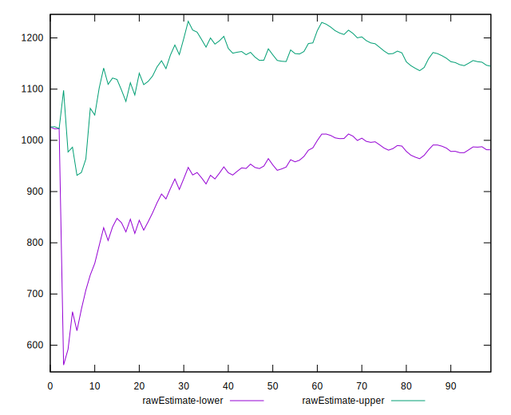

# //max-potential-fid/samples/pages

[→ Parent](../..)


## Raw


```yaml
p90min: 506.0000000000009
p90max: 2178.000000000002
p90range: 1672.000000000001
p90mean: 1063.1063829787236
p90median: 1000.0000000000009
p90stdev: 403.6075212825617
p90skewness: 0.6518385695996625
p90eccentricity: 1.0000000000000002
p90discretization: 1.010752688172043
outlandishness: 1.0575125270680197
confidence: 191.96946964687857
p90confidence: 163.18243548882253

```


## Score


```yaml
p90min: 0
p90max: 0.08
p90range: 0.08
p90mean: 0.012872340425531922
p90median: 0
p90stdev: 0.020660494753480103
p90skewness: 1.863733548118595
p90eccentricity: 0.9999999999999994
p90discretization: 10.444444444444445
outlandishness: 1.4312859504132225
confidence: 0.010303074127052239
p90confidence: 0.008353238417270767

```


## Raw Estimate


## Score Estimate


## P Score


```yaml
p90min: 0.000011067542400433616
p90max: 0.083517711796046
p90range: 0.08350664425364557
p90mean: 0.013829369937481021
p90median: 0.0032958108783772977
p90stdev: 0.020736335064549742
p90skewness: 1.8678071053911696
p90eccentricity: 1
p90discretization: 1.0217391304347827
outlandishness: 1.374037225599745
confidence: 0.010158201262880624
p90confidence: 0.008383901390619843

```


## Score Difference


```yaml
p90min: 0
p90max: 0
p90range: 0
p90mean: 0
p90median: 0
p90stdev: 0
p90skewness: .nan
p90eccentricity: .nan
p90discretization: 94
outlandishness: .nan
confidence: 0
p90confidence: 0

```


## P Score Difference


```yaml
p90min: -0.004427345759982382
p90max: 0.004628896449655119
p90range: 0.009056242209637501
p90mean: 0.0008611147225652934
p90median: 0.000551687600562123
p90stdev: 0.0020712451408845304
p90skewness: -0.4867830759850792
p90eccentricity: 0.9999999999999994
p90discretization: 1.0217391304347827
outlandishness: 0.8863256473688219
confidence: 0.0009158633410781722
p90confidence: 0.0008374244996968303

```

