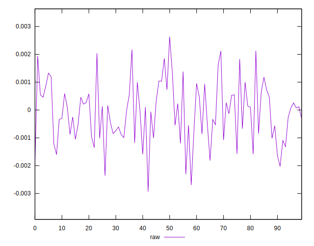
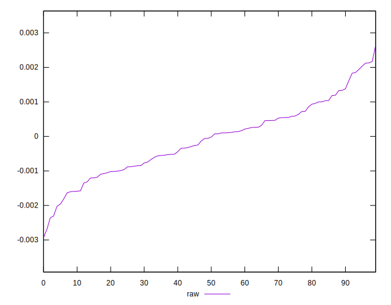
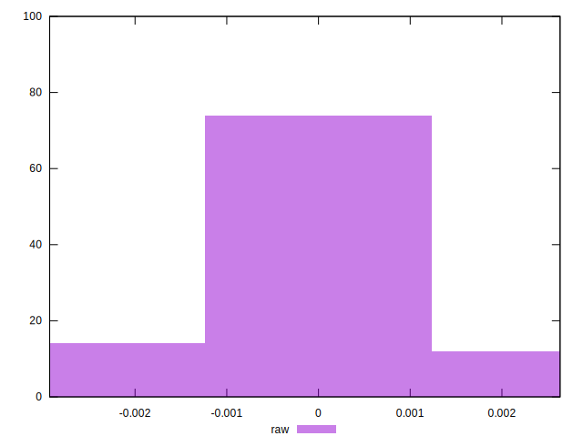

# //meta/pScore-difference/samples/pages+cached+noadtech+nomedia

[→ Parent](../..)


## Raw


```yaml
p90min: -0.0023046656284136015
p90max: 0.00212377435745599
p90range: 0.004428439985869592
p90mean: -0.00009563144800244845
p90median: -0.00003877628698205977
p90stdev: 0.00100257017638681
p90skewness: 0.1055363922928321
p90eccentricity: 1.0000000000000002
p90discretization: 1
outlandishness: 1.1017439688438502
confidence: 0.0004502762166308573
p90confidence: 0.00040534884635294496

```

