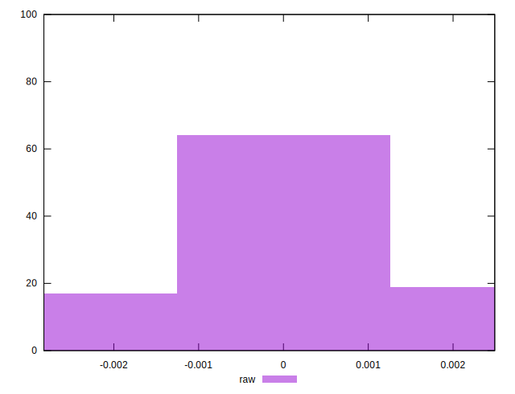

# //meta/pScore-difference/samples/pages+cached+noadtech

[→ Parent](../..)


## Raw


```yaml
p90min: -0.0017828952715003737
p90max: 0.002136540490087568
p90range: 0.003919435761587942
p90mean: 0.00017258021178952096
p90median: 0.00019264268848044705
p90stdev: 0.0010233078852332433
p90skewness: -0.08075385027543332
p90eccentricity: 1.0000000000000007
p90discretization: 1
outlandishness: 0.8597781935193863
confidence: 0.00045356719362600297
p90confidence: 0.00041373330317690476

```

