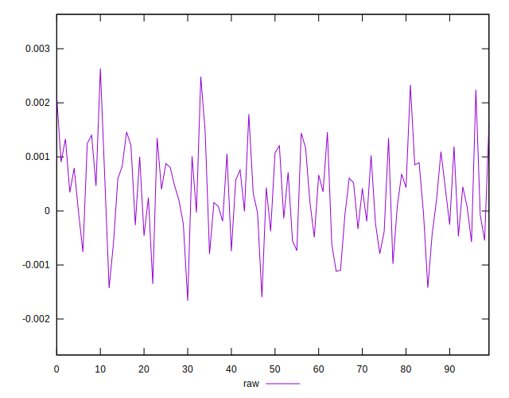
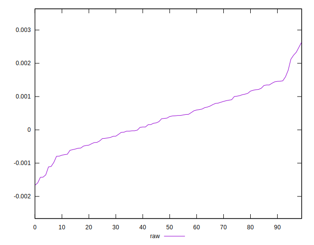
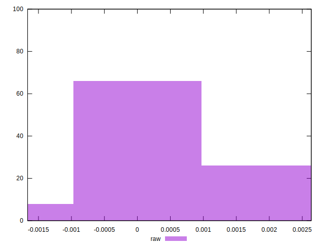

# //meta/pScore-difference/samples/pages+cached

[→ Parent](../..)


## Raw


```yaml
p90min: -0.0014206475915938426
p90max: 0.0022424839690006124
p90range: 0.003663131560594455
p90mean: 0.0003333335303586684
p90median: 0.0003766530785726095
p90stdev: 0.0007911905254319743
p90skewness: 0.024438925607690367
p90eccentricity: 1
p90discretization: 1
outlandishness: 1.0464194681402585
confidence: 0.00035834104517626223
p90confidence: 0.00031988600327713715

```

