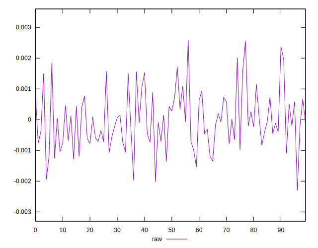
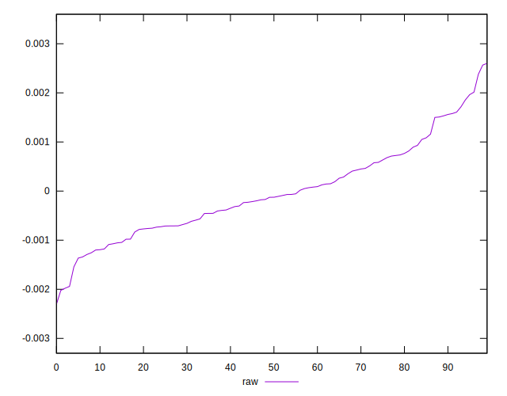
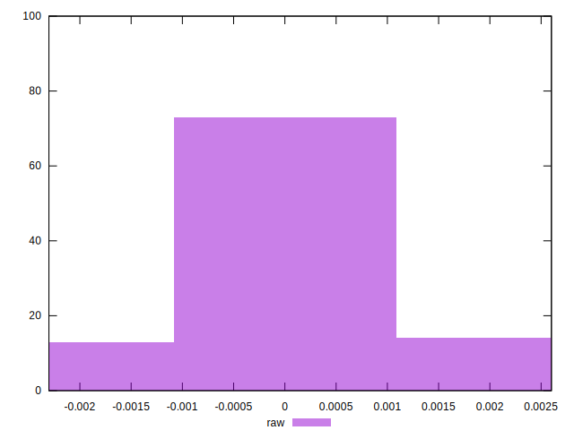

# //meta/pScore-difference/samples/pages

[→ Parent](../..)


## Raw


```yaml
p90min: -0.001940711890038569
p90max: 0.002015175414797732
p90range: 0.003955887304836301
p90mean: -0.000031582869935647536
p90median: -0.00012606371778001922
p90stdev: 0.0008826441813461883
p90skewness: 0.4221497517828661
p90eccentricity: 1.0000000000000002
p90discretization: 1
outlandishness: 0.2987658354654555
confidence: 0.0004028149424566544
p90confidence: 0.0003568616033824442

```

