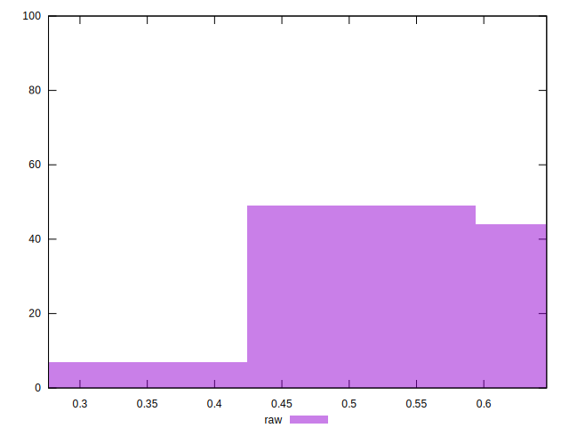

# //meta/pScore/samples/pages+cached+noadtech+nomedia

[→ Parent](../..)


## Raw


```yaml
p90min: 0.3652492101445055
p90max: 0.6442058394572995
p90range: 0.27895662931279397
p90mean: 0.5621919735932851
p90median: 0.5847601077914324
p90stdev: 0.06896829978367526
p90skewness: -0.9358895604008769
p90eccentricity: 1.000000000000001
p90discretization: 1
outlandishness: 0.9796582856686145
confidence: 0.03261813201293051
p90confidence: 0.027884552533757802

```

