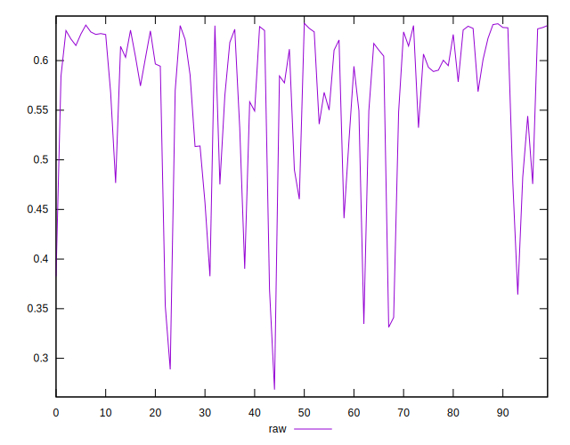
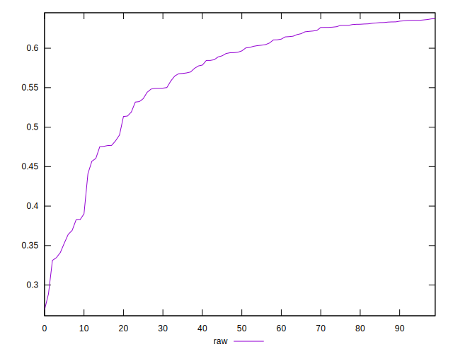
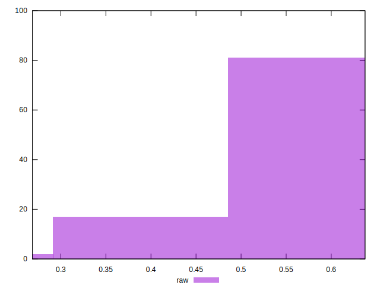

# //meta/pScore/samples/pages+cached+noadtech

[→ Parent](../..)


## Raw


```yaml
p90min: 0.33461945584072905
p90max: 0.635789397336814
p90range: 0.301169941496085
p90mean: 0.5669310160903008
p90median: 0.5957541583178964
p90stdev: 0.07896957141990707
p90skewness: -1.4658368016146543
p90eccentricity: 1
p90discretization: 1
outlandishness: 0.9788721385714364
confidence: 0.0354810669140362
p90confidence: 0.031928163659733375

```

