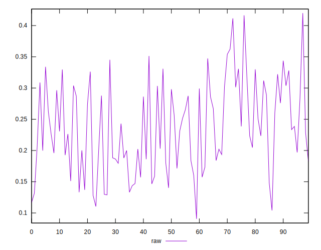
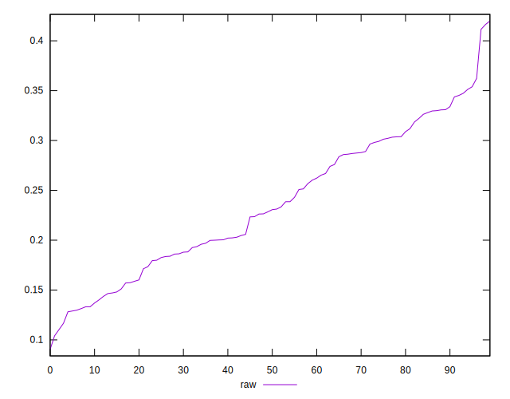
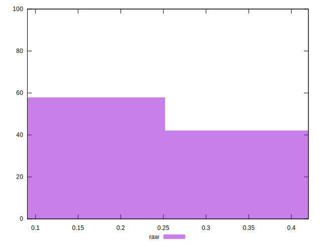

# //meta/pScore/samples/pages+cached

[→ Parent](../..)


## Raw


```yaml
p90min: 0.11662224443967016
p90max: 0.36230613003204104
p90range: 0.24568388559237087
p90mean: 0.23558880776534588
p90median: 0.22954485231653232
p90stdev: 0.0682943215912438
p90skewness: 0.08341480355310453
p90eccentricity: 1
p90discretization: 1
outlandishness: 1.011853602225546
confidence: 0.030106186018302457
p90confidence: 0.027612056613568234

```

