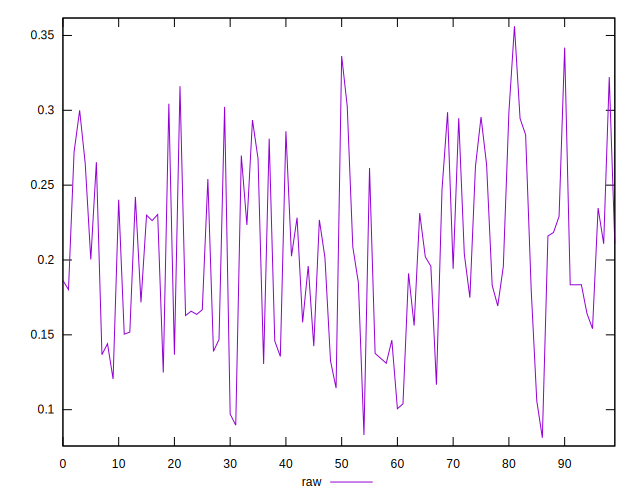
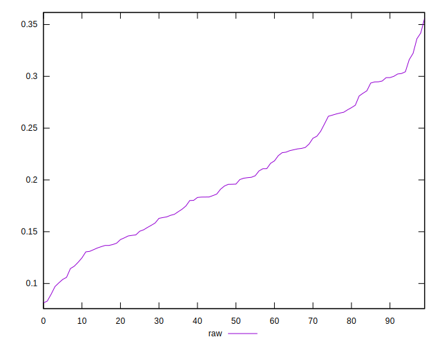
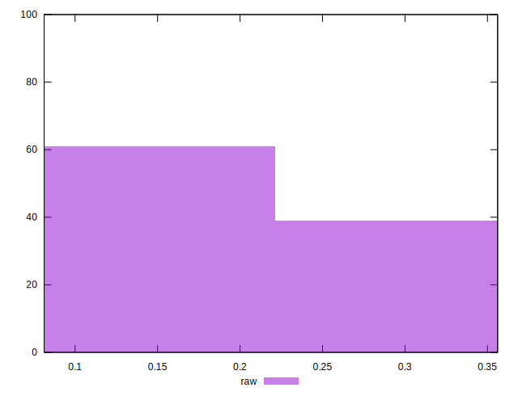

# //meta/pScore/samples/pages

[→ Parent](../..)


## Raw


```yaml
p90min: 0.09706880872671529
p90max: 0.3221810486341212
p90range: 0.22511223990740592
p90mean: 0.2031062354835694
p90median: 0.19590334876081839
p90stdev: 0.05989872397612935
p90skewness: 0.2217704757641028
p90eccentricity: 0.9999999999999999
p90discretization: 1
outlandishness: 1.006870254094597
confidence: 0.025994801218350926
p90confidence: 0.02421763506794151

```

