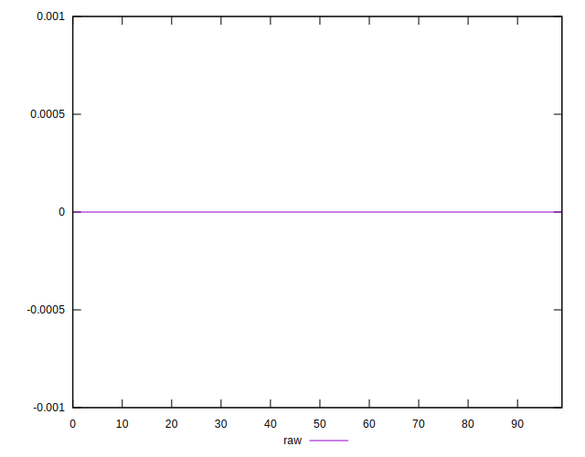
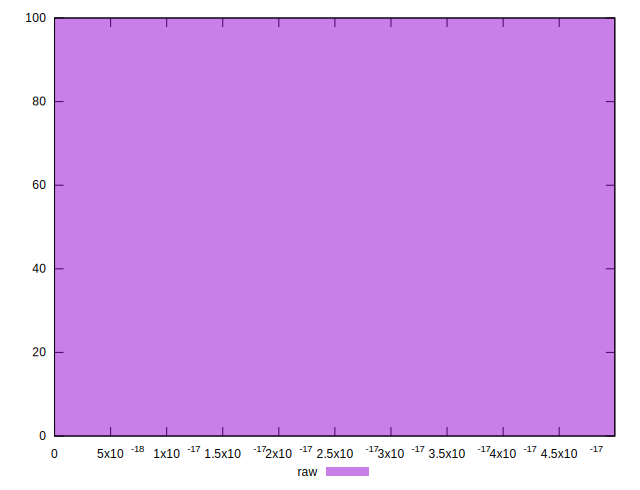

# //meta/score-difference/samples/pages+cached+noadtech+nomedia+nocss

[→ Parent](../..)


## Raw


```yaml
p90min: 0
p90max: 3.053113317719181e-17
p90range: 3.053113317719181e-17
p90mean: 7.057002736314163e-18
p90median: 0
p90stdev: 1.0086253987152834e-17
p90skewness: 0.9500297534780516
p90eccentricity: 1.0000000000000013
p90discretization: 23.5
outlandishness: 1.2127630818788184
confidence: 4.424824781631086e-18
p90confidence: 4.0779703147062214e-18

```

