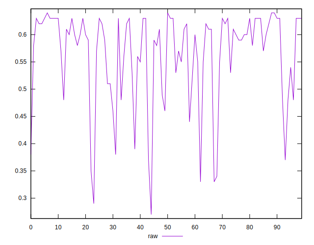
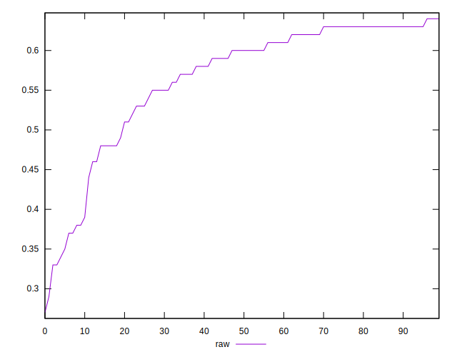
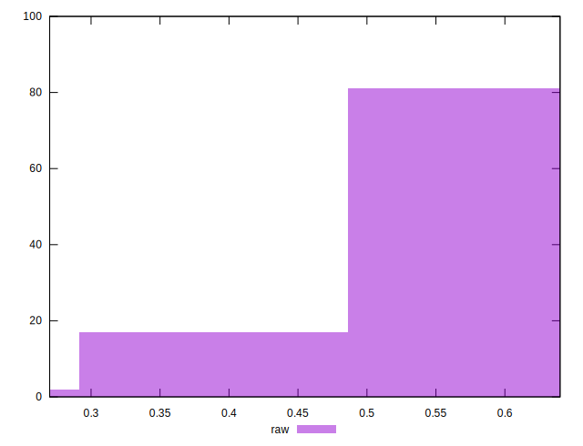

# //meta/score/samples/pages+cached+noadtech

[→ Parent](../..)


## Raw


```yaml
p90min: 0.33
p90max: 0.64
p90range: 0.31
p90mean: 0.5669148936170213
p90median: 0.6
p90stdev: 0.07901018781258635
p90skewness: -1.4873558475836368
p90eccentricity: 1.0000000000000007
p90discretization: 3.9166666666666665
outlandishness: 0.9792419030460373
confidence: 0.035502950134406554
p90confidence: 0.03194458526123652

```

