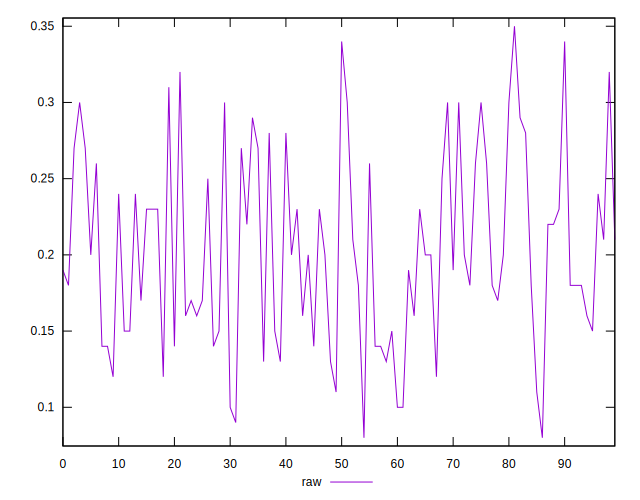
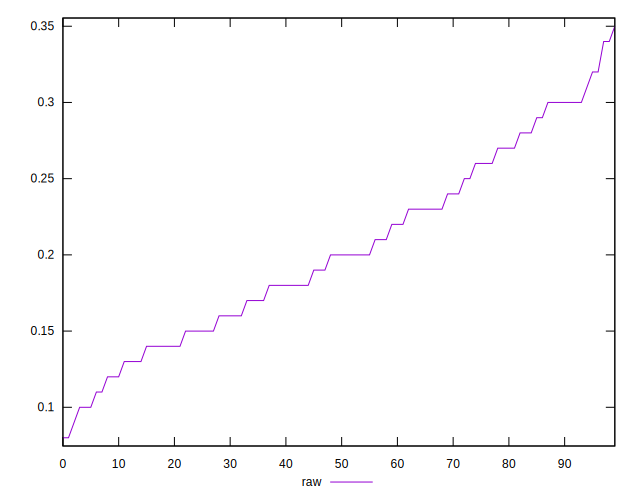
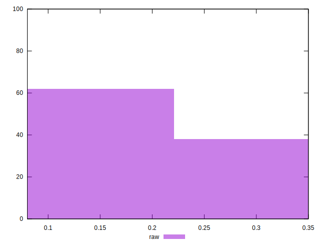

# //meta/score/samples/pages

[→ Parent](../..)


## Raw


```yaml
p90min: 0.1
p90max: 0.32
p90range: 0.22
p90mean: 0.2029787234042553
p90median: 0.2
p90stdev: 0.05990825942477778
p90skewness: 0.22437060810083218
p90eccentricity: 0.9999999999999994
p90discretization: 4.086956521739131
outlandishness: 1.0061309617675107
confidence: 0.0259872008306424
p90confidence: 0.024221490342315445

```

