# //offscreen-images/samples/pages+cached+noadtech

[→ Parent](../..)


## Raw


```yaml
p90min: 0
p90max: 310
p90range: 310
p90mean: 77.02127659574468
p90median: 0
p90stdev: 98.38947560084158
p90skewness: 0.865845701940539
p90eccentricity: 1.0000000000000007
p90discretization: 9.4
outlandishness: 1.2036271977351116
confidence: 43.8064008322728
p90confidence: 39.77981927589787

```

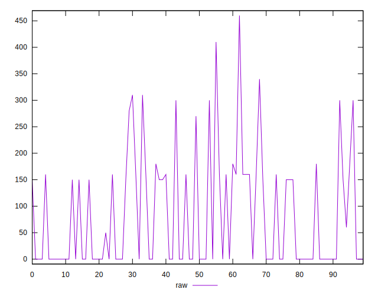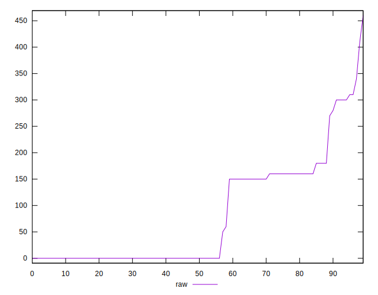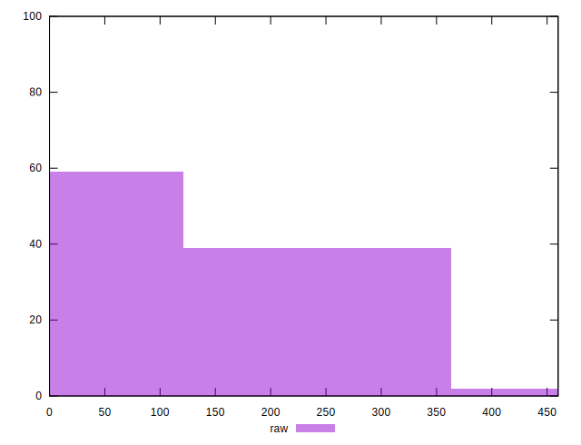
## Score


```yaml
p90min: 0.74
p90max: 1
p90range: 0.26
p90mean: 0.9370212765957444
p90median: 1
p90stdev: 0.08102836103480884
p90skewness: -0.9111435121909969
p90eccentricity: 0.9999999999999989
p90discretization: 9.4
outlandishness: 0.9884621749198356
confidence: 0.03520837317935646
p90confidence: 0.032760552269467835

```

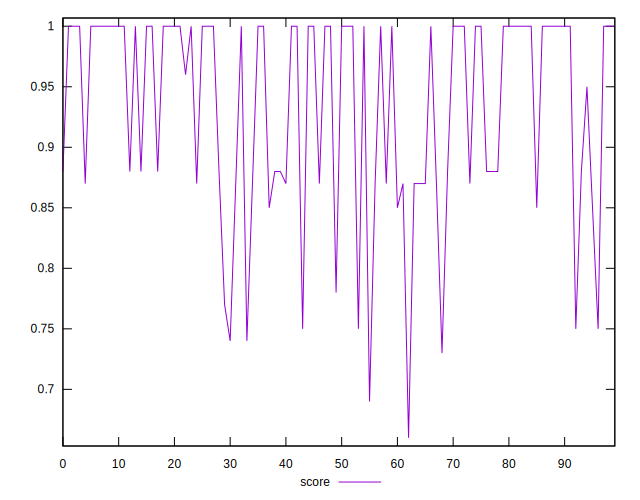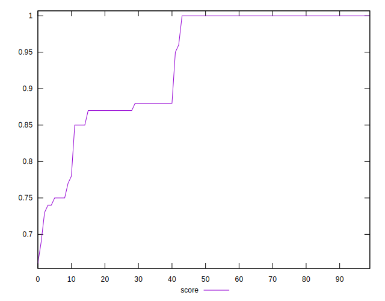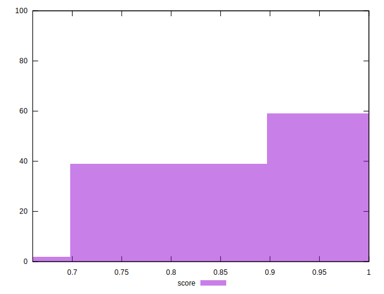
## Raw Estimate

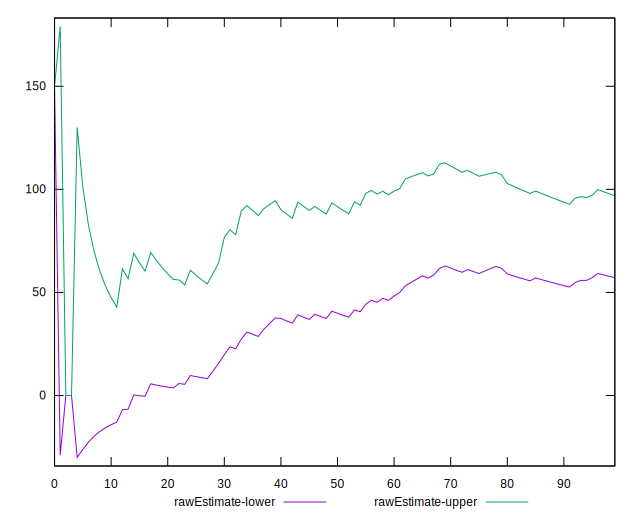
## Score Estimate

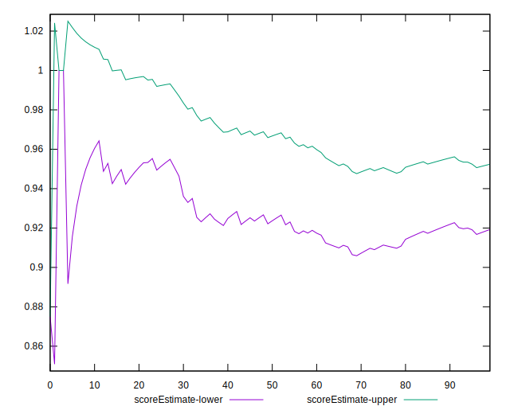
## P Score


```yaml
p90min: 0.7444444444444445
p90max: 1
p90range: 0.25555555555555554
p90mean: 0.9358747044917257
p90median: 1
p90stdev: 0.08185214336714901
p90skewness: -0.8604196271480994
p90eccentricity: 1.0000000000000007
p90discretization: 9.4
outlandishness: 0.9885470329077419
confidence: 0.035475401594358406
p90confidence: 0.033093615456389516

```

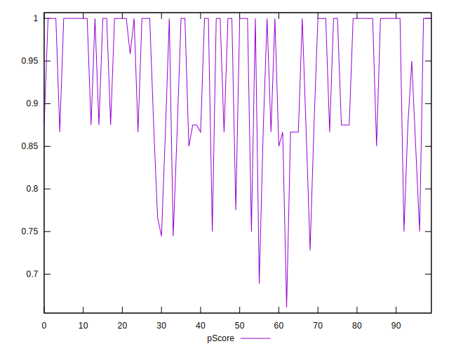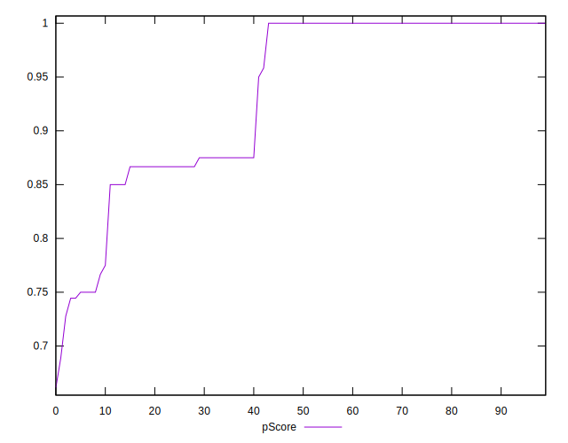
## Score Difference


```yaml
p90min: 0
p90max: 0
p90range: 0
p90mean: 0
p90median: 0
p90stdev: 0
p90skewness: .nan
p90eccentricity: .nan
p90discretization: 94
outlandishness: .inf
confidence: 6.092792000602806e-18
p90confidence: 0

```

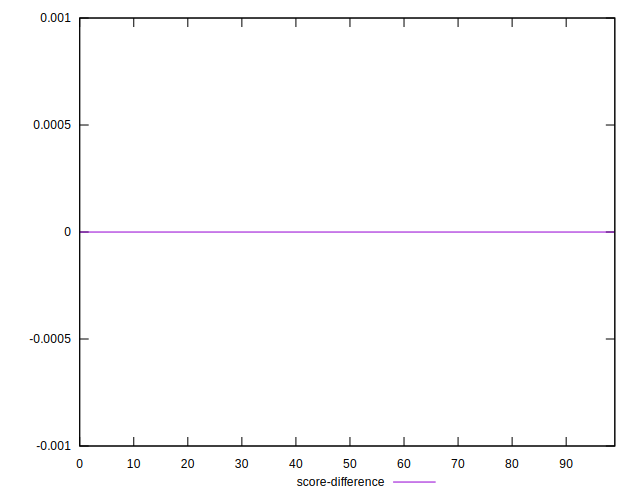
## P Score Difference


```yaml
p90min: -0.0050000000000000044
p90max: 0
p90range: 0.0050000000000000044
p90mean: -0.0011170212765957397
p90median: 0
p90stdev: 0.0018111065440540922
p90skewness: -1.1788376756502712
p90eccentricity: 1.000000000000001
p90discretization: 13.428571428571429
outlandishness: 0.9697560090702954
confidence: 0.0008036885072713614
p90confidence: 0.0007322479418850721

```

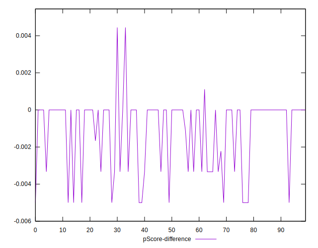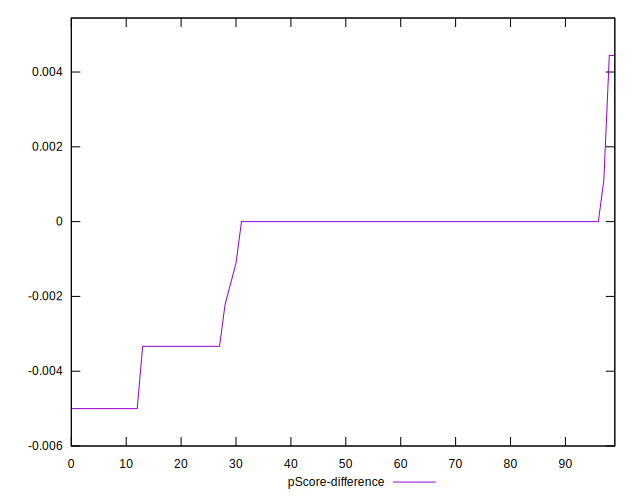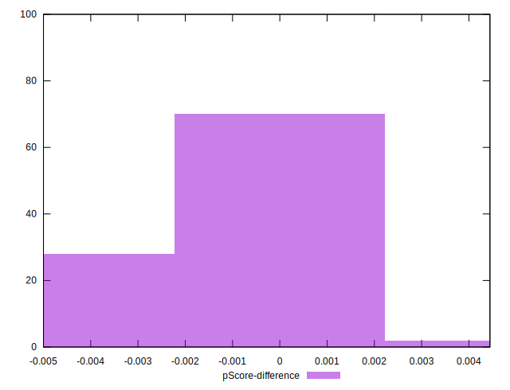