# //offscreen-images/samples/pages

[→ Parent](../..)


## Raw


```yaml
p90min: 0
p90max: 300
p90range: 300
p90mean: 151.91489361702128
p90median: 150
p90stdev: 82.40115414065565
p90skewness: 0.018115857945369112
p90eccentricity: 1.0000000000000007
p90discretization: 8.545454545454545
outlandishness: 1.003757023593751
confidence: 34.746485628106356
p90confidence: 33.31558583703487

```

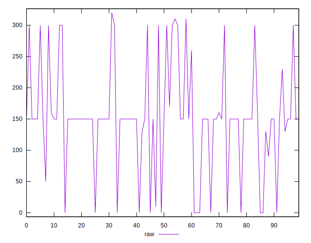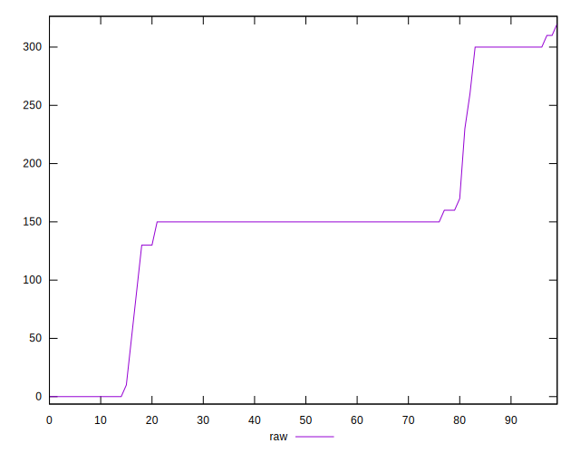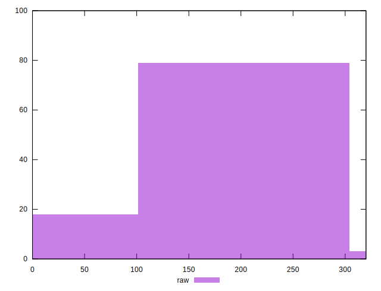
## Score


```yaml
p90min: 0.75
p90max: 1
p90range: 0.25
p90mean: 0.8764893617021277
p90median: 0.88
p90stdev: 0.06881531631233735
p90skewness: -0.15384746742506997
p90eccentricity: 1.0000000000000009
p90discretization: 8.545454545454545
outlandishness: 0.9991117400020542
confidence: 0.02898571380884255
p90confidence: 0.02782269983249216

```

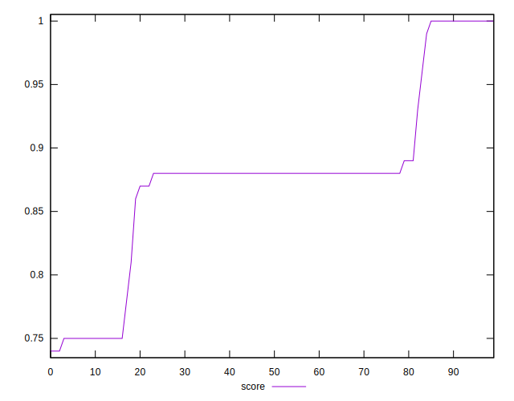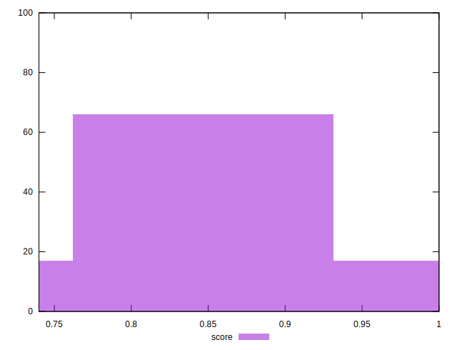
## Raw Estimate

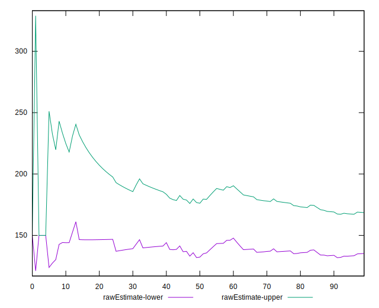
## Score Estimate

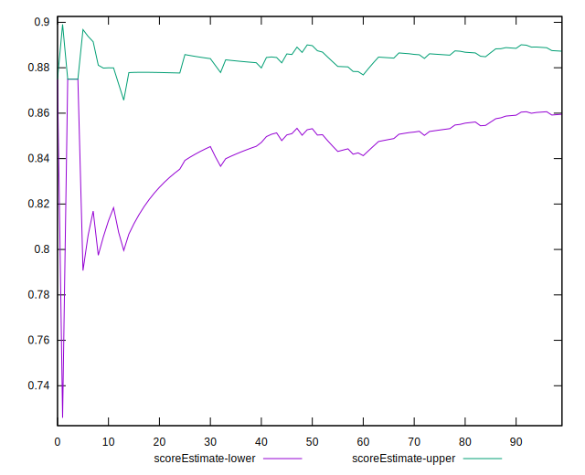
## P Score


```yaml
p90min: 0.75
p90max: 1
p90range: 0.25
p90mean: 0.8734042553191489
p90median: 0.875
p90stdev: 0.0686676284505464
p90skewness: -0.018115857945367297
p90eccentricity: 1
p90discretization: 8.545454545454545
outlandishness: 0.9997104012649267
confidence: 0.02887649887176705
p90confidence: 0.027762988197529065

```

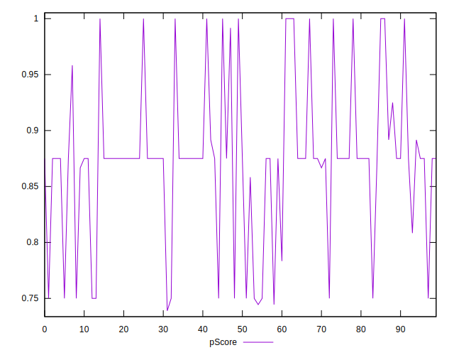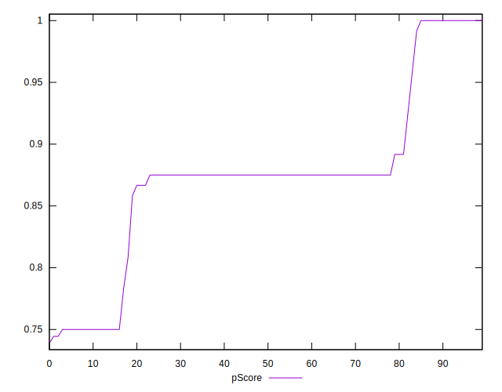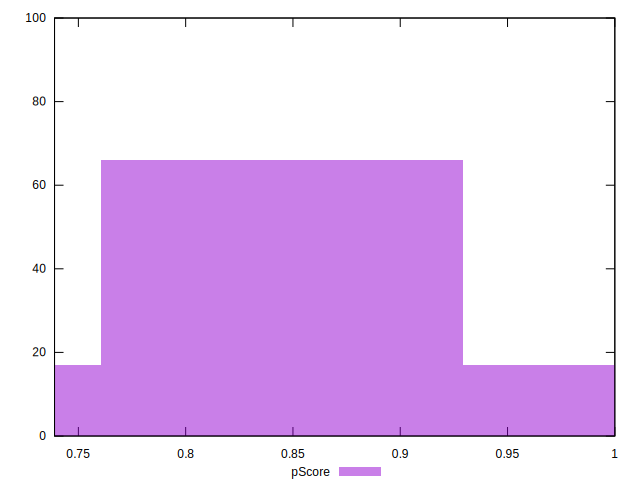
## Score Difference


```yaml
p90min: 0
p90max: 0
p90range: 0
p90mean: 0
p90median: 0
p90stdev: 0
p90skewness: .nan
p90eccentricity: .nan
p90discretization: 94
outlandishness: .nan
confidence: 0
p90confidence: 0

```


## P Score Difference


```yaml
p90min: -0.0050000000000000044
p90max: 0.0016666666666667052
p90range: 0.00666666666666671
p90mean: -0.002972813238770687
p90median: -0.0050000000000000044
p90stdev: 0.0024695511732228726
p90skewness: 0.5117479413195768
p90eccentricity: 1.0000000000000004
p90discretization: 11.75
outlandishness: 0.9012539095447198
confidence: 0.0010613785366515999
p90confidence: 0.0009984634917857733

```

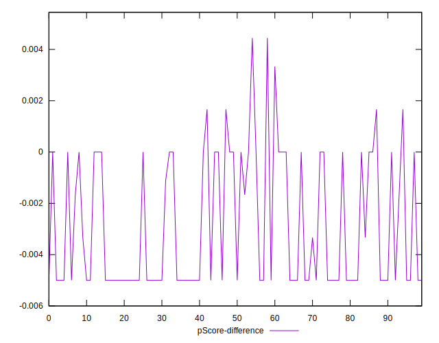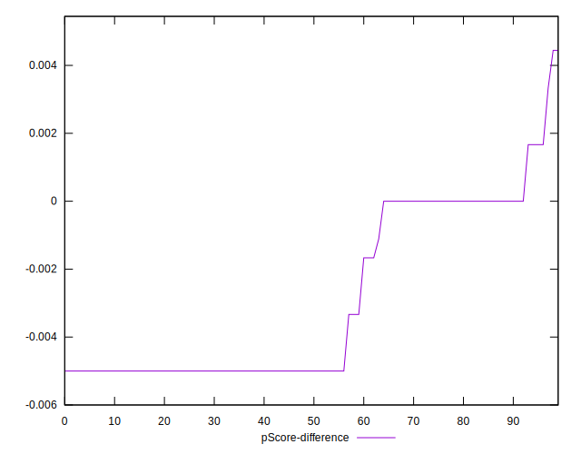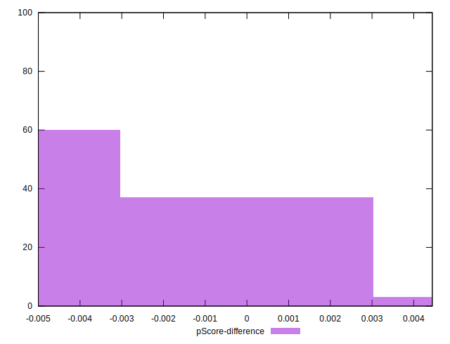