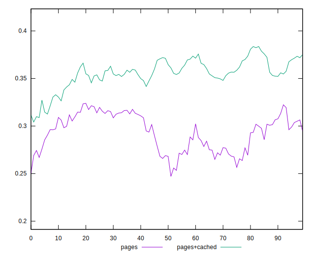
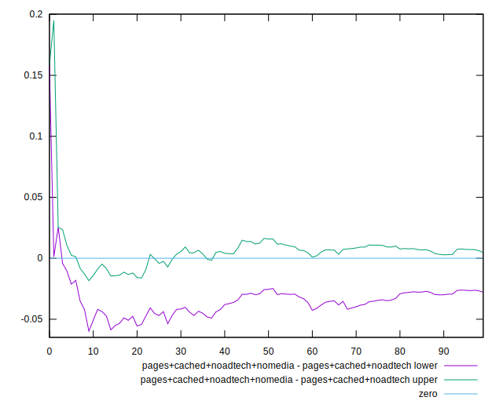

# Harmonicabsorber Tue Feb 09 2021 13:04:43 GMT+0100 (Central European Standard Time)

This report represents a new data collection; while previously we would collect
samples in sequence, starting with this report:

* Sampling order is randomized using a probabilistic round robin scheduler
* Multiple samples (four in this report) are collected at the same time

The hope is that this change in setup will reduce false positive results
caused by performance fluctuations; especially low frequency fluctuation
where the wavelength is similar to the time it takes to collect a full
experimental sample.

To this end, report 11 and this report are compared.

All in all, there is some indication that randomizing the sampling schedule
improves experiment quality.

Variance being compressed towards the ends of the scoring interval
presents a small difficulty for differential scoring; nonetheless
differential scoring is an improvement.

## pages vs pages+cached

In report 11, the differential pages+cached - pages seems to have a bend
from sample 40 on.

Checking the comparison graph, we can see that both graphs bend upwards,
but from sample 40 the pages graph bends downwards:

Checking the pScore meta score graph with smoothing (sliding window of seven elements) we can see a clear
drop in the score past sample 40. The pages graph does not feature such a drop:

On the other hand, in the graph from this data collection, there is also a bend visible, but too a much lesser degree.
The effect size is visibly smaller.

Checking out the comparison graph, we can again see a bend in both data samples,
but this time the bends are in the same direction but offset from each other.

The pages+cached bend is greater; this might be due to the nonlinearity of the mapping
from raw measurements into the score space (variance is compressed asymptotically towards zero and one,
because scores approach zero and one asymptotically).

Looking at the pScore graphs – again with an average window size of 7 –
a much greater degree of correlation between the scores is visible.

## pages+cached+noadtech+nomedia vs pages+cached+noadtech3

The effect visible in report 11 (2.2±0.25)% improvement is no longer visible.
This could indicate that the effect from 11 was an artifact due to these low
frequency performance oscillation; whether this is the case is unclear.

From report 11:

From this report:

## Other differentials

Other differentials show less marked changes.

[Parent ../](../)

## Metas

[pScore](meta/pScore)  
[pScore-difference](meta/pScore-difference)  
[score](meta/score)  
[score-difference](meta/score-difference)  
[scoreEstimate](meta/scoreEstimate)  

## Measurements

[bootup-time](bootup-time)  
[critical-request-chains](critical-request-chains)  
[cumulative-layout-shift](cumulative-layout-shift)  
[diagnostics](diagnostics)  
[dom-size](dom-size)  
[duplicated-javascript](duplicated-javascript)  
[efficient-animated-content](efficient-animated-content)  
[estimated-input-latency](estimated-input-latency)  
[final-screenshot](final-screenshot)  
[first-contentful-paint](first-contentful-paint)  
[first-cpu-idle](first-cpu-idle)  
[first-meaningful-paint](first-meaningful-paint)  
[font-display](font-display)  
[full-page-screenshot](full-page-screenshot)  
[interactive](interactive)  
[largest-contentful-paint](largest-contentful-paint)  
[largest-contentful-paint-element](largest-contentful-paint-element)  
[layout-shift-elements](layout-shift-elements)  
[legacy-javascript](legacy-javascript)  
[long-tasks](long-tasks)  
[main-thread-tasks](main-thread-tasks)  
[mainthread-work-breakdown](mainthread-work-breakdown)  
[max-potential-fid](max-potential-fid)  
[metrics](metrics)  
[network-requests](network-requests)  
[network-rtt](network-rtt)  
[network-server-latency](network-server-latency)  
[no-document-write](no-document-write)  
[non-composited-animations](non-composited-animations)  
[offscreen-images](offscreen-images)  
[performance-budget](performance-budget)  
[preload-lcp-image](preload-lcp-image)  
[redirects](redirects)  
[render-blocking-resources](render-blocking-resources)  
[resource-summary](resource-summary)  
[screenshot-thumbnails](screenshot-thumbnails)  
[server-response-time](server-response-time)  
[speed-index](speed-index)  
[third-party-facades](third-party-facades)  
[third-party-summary](third-party-summary)  
[timing-budget](timing-budget)  
[total-blocking-time](total-blocking-time)  
[total-byte-weight](total-byte-weight)  
[unminified-css](unminified-css)  
[unminified-javascript](unminified-javascript)  
[unsized-images](unsized-images)  
[unused-css-rules](unused-css-rules)  
[unused-javascript](unused-javascript)  
[user-timings](user-timings)  
[uses-http2](uses-http2)  
[uses-long-cache-ttl](uses-long-cache-ttl)  
[uses-optimized-images](uses-optimized-images)  
[uses-passive-event-listeners](uses-passive-event-listeners)  
[uses-rel-preconnect](uses-rel-preconnect)  
[uses-rel-preload](uses-rel-preload)  
[uses-responsive-images](uses-responsive-images)  
[uses-text-compression](uses-text-compression)  
[uses-webp-images](uses-webp-images)  

## Variance/Correlation

[pages](correlation/pages)  
[pages+cached](correlation/pages+cached)  
[pages+cached+noadtech](correlation/pages+cached+noadtech)  
[pages+cached+noadtech+nomedia](correlation/pages+cached+noadtech+nomedia)  
[pages+cached+noadtech+nomedia+nocss](correlation/pages+cached+noadtech+nomedia+nocss)  
[pages+cached+noadtech+nomedia+nocss+nojs](correlation/pages+cached+noadtech+nomedia+nocss+nojs)  
[pages+cached+baseline](correlation/pages+cached+baseline)  
