# //render-blocking-resources/samples/pages+cached+noadtech+nomedia+nocss

[→ Parent](../..)


## Raw


```yaml
p90min: 0
p90max: 46
p90range: 46
p90mean: 2.0851063829787235
p90median: 0
p90stdev: 8.878206132863705
p90skewness: 4.250440617826167
p90eccentricity: 1.0000000000000027
p90discretization: 13.428571428571429
outlandishness: 9.013474427321949
confidence: 12.31426763698043
p90confidence: 3.5895448502264955

```

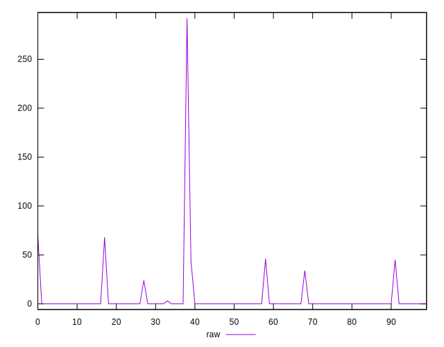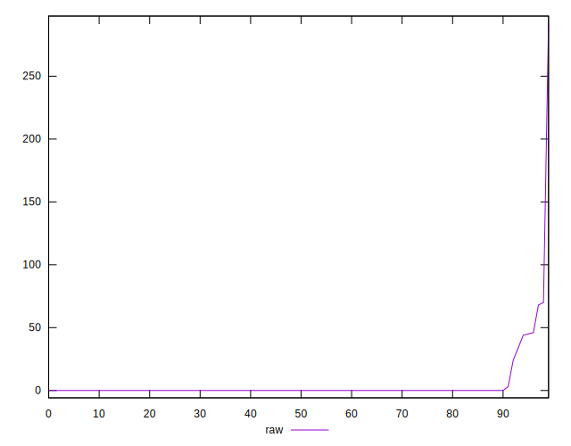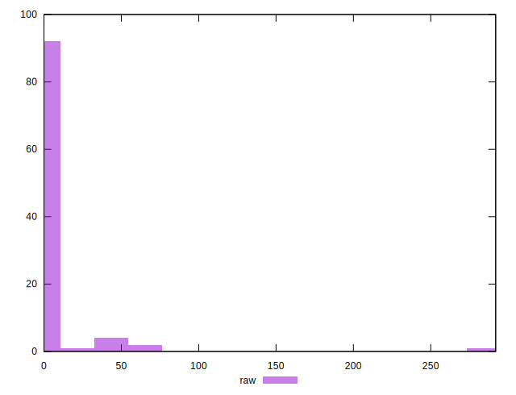
## Score


```yaml
p90min: 0.96
p90max: 1
p90range: 0.040000000000000036
p90mean: 0.9981914893617021
p90median: 1
p90stdev: 0.007850025878456712
p90skewness: -4.288740674380659
p90eccentricity: 1.0000000000000013
p90discretization: 23.5
outlandishness: 0.9930166043157611
confidence: 0.01022875891904553
p90confidence: 0.0031738416009349925

```

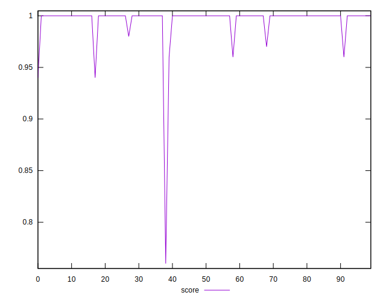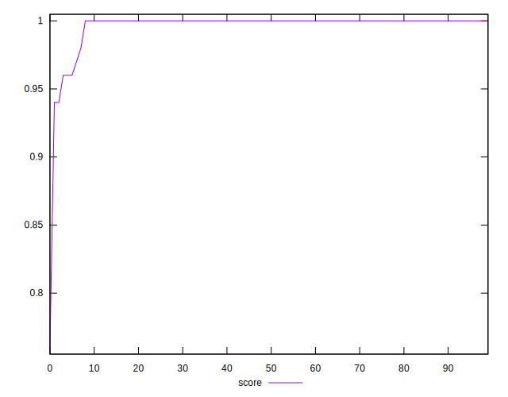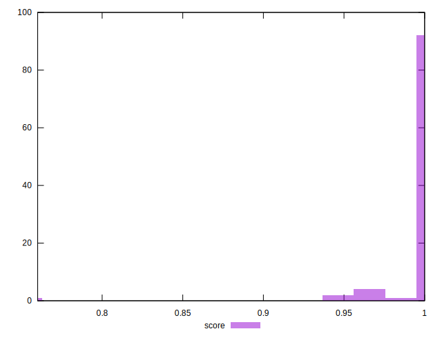
## Raw Estimate

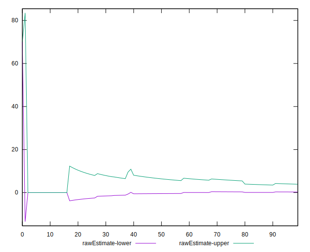
## Score Estimate

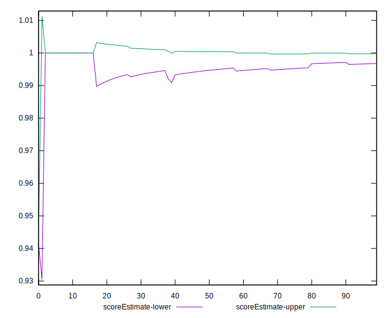
## P Score


```yaml
p90min: 0.9616666666666667
p90max: 1
p90range: 0.03833333333333333
p90mean: 0.9982624113475178
p90median: 1
p90stdev: 0.007398505110719752
p90skewness: -4.2504406178261975
p90eccentricity: 1.0000000000000033
p90discretization: 13.428571428571429
outlandishness: 0.9930418786711491
confidence: 0.010261889697483676
p90confidence: 0.0029912873751887455

```

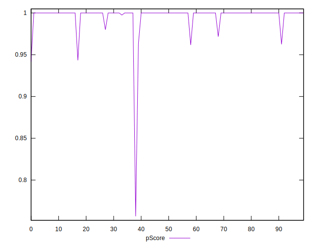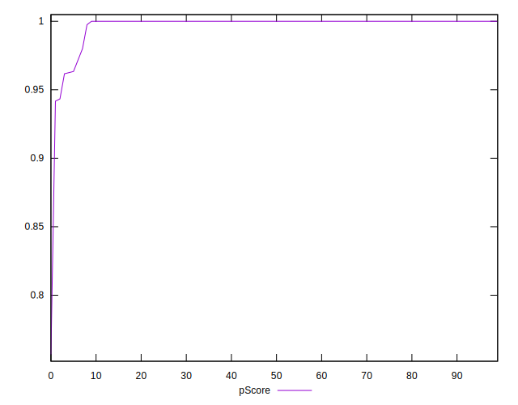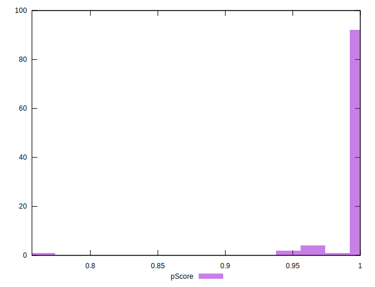
## Score Difference


```yaml
p90min: 0
p90max: 0
p90range: 0
p90mean: 0
p90median: 0
p90stdev: 0
p90skewness: .nan
p90eccentricity: .nan
p90discretization: 94
outlandishness: .inf
confidence: 6.092792000602812e-18
p90confidence: 0

```

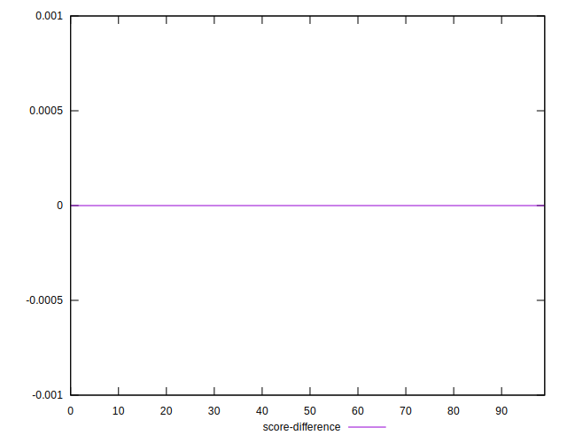
## P Score Difference


```yaml
p90min: 0
p90max: 0.0016666666666667052
p90range: 0.0016666666666667052
p90mean: 0.000053191489361703354
p90median: 0
p90stdev: 0.00029295588017479965
p90skewness: 5.32600228748546
p90eccentricity: 1.0000000000000002
p90discretization: 47
outlandishness: 2.4544444444445097
confidence: 0.0002866435694151741
p90confidence: 0.00011844490376636831

```

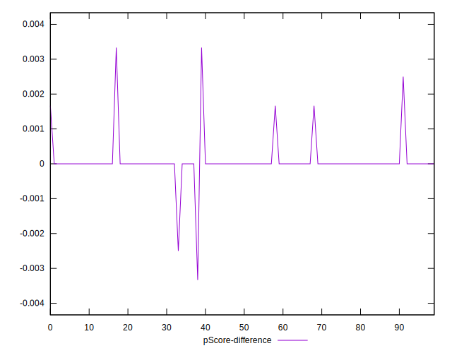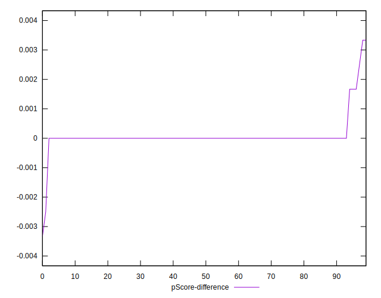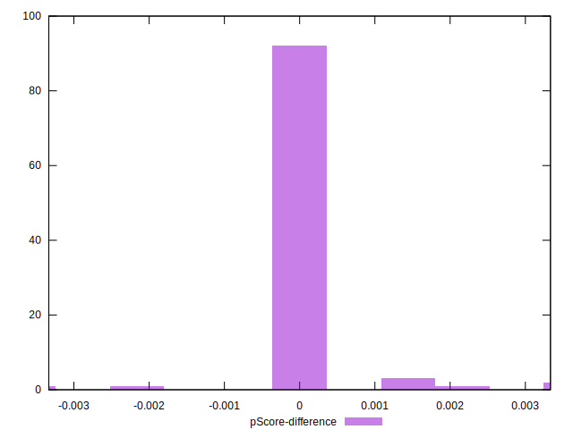