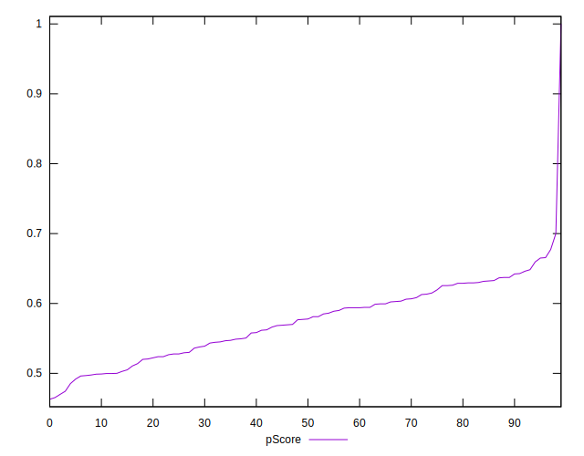

# //render-blocking-resources/samples/pages+cached+noadtech+nomedia

[→ Parent](../..)


## Raw


```yaml
p90min: 452
p90max: 968
p90range: 516
p90mean: 622.3404255319149
p90median: 610.5
p90stdev: 98.73061923378688
p90skewness: 0.609065807655937
p90eccentricity: 0.9999999999999996
p90discretization: 1.146341463414634
outlandishness: 1.0065330285655345
confidence: 54.25326610615164
p90confidence: 39.917746955487736

```


## Score


```yaml
p90min: 0.47
p90max: 0.67
p90range: 0.20000000000000007
p90mean: 0.5738297872340428
p90median: 0.58
p90stdev: 0.04968210395249198
p90skewness: -0.07816714942348241
p90eccentricity: 1.0000000000000004
p90discretization: 4.7
outlandishness: 1.0117808792614709
confidence: 0.026993934401004137
p90confidence: 0.020086956500249886

```


## Raw Estimate


## Score Estimate


## P Score


```yaml
p90min: 0.4743529411764706
p90max: 0.6655555555555556
p90range: 0.19120261437908498
p90mean: 0.5733165067445418
p90median: 0.5774999999999999
p90stdev: 0.049421376449072074
p90skewness: -0.09938487035516966
p90eccentricity: 0.9999999999999999
p90discretization: 1.146341463414634
outlandishness: 1.0117360005344151
confidence: 0.026928543912668038
p90confidence: 0.019981541841792138

```


## Score Difference


```yaml
p90min: 0
p90max: 1.1102230246251565e-16
p90range: 1.1102230246251565e-16
p90mean: 5.3148974583119196e-18
p90median: 0
p90stdev: 2.152855451067871e-17
p90skewness: 4.168481617099147
p90eccentricity: 1.0000000000000016
p90discretization: 31.333333333333332
outlandishness: 3.5400567162041815e+26
confidence: 0.00039002790835975806
p90confidence: 8.704203396514392e-18

```


## P Score Difference


```yaml
p90min: -0.0050000000000000044
p90max: 0.004352941176470615
p90range: 0.00935294117647062
p90mean: -0.0005451258517591482
p90median: -0.0005555555555555314
p90stdev: 0.0025847947728579175
p90skewness: 0.1717470345545773
p90eccentricity: 1
p90discretization: 2.473684210526316
outlandishness: 0.942013849860732
confidence: 0.0010822330014625813
p90confidence: 0.0010450575968787249

```

