# //speed-index/samples/pages+cached+noadtech+nomedia+nocss

[→ Parent](../..)


## Raw


```yaml
p90min: 1614.1460000000002
p90max: 4136.875050001919
p90range: 2522.7290500019185
p90mean: 1944.1568497871933
p90median: 1748.1744710022328
p90stdev: 472.7570298442226
p90skewness: 2.50170317285653
p90eccentricity: 1.0000000000000004
p90discretization: 1
outlandishness: 1.0726894746782578
confidence: 255.42998433536425
p90confidence: 191.14025248908402

```

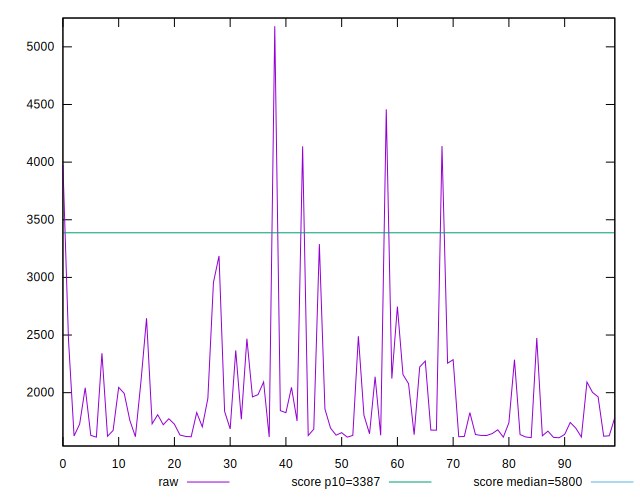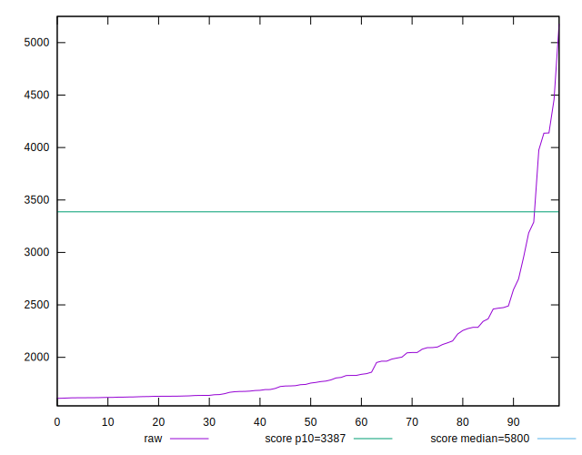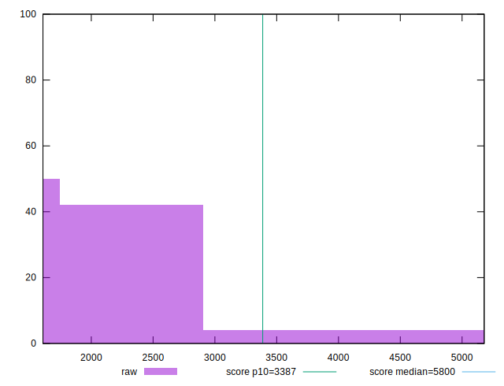
## Score


```yaml
p90min: 0.79
p90max: 1
p90range: 0.20999999999999996
p90mean: 0.9895744680851063
p90median: 1
p90stdev: 0.030939711231684843
p90skewness: -4.919140737332573
p90eccentricity: 0.9999999999999983
p90discretization: 9.4
outlandishness: 0.9837475068534517
confidence: 0.022690763004747847
p90confidence: 0.012509225338673957

```

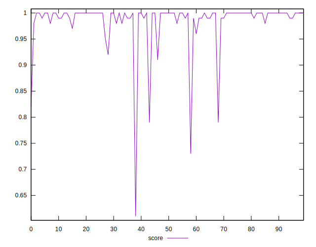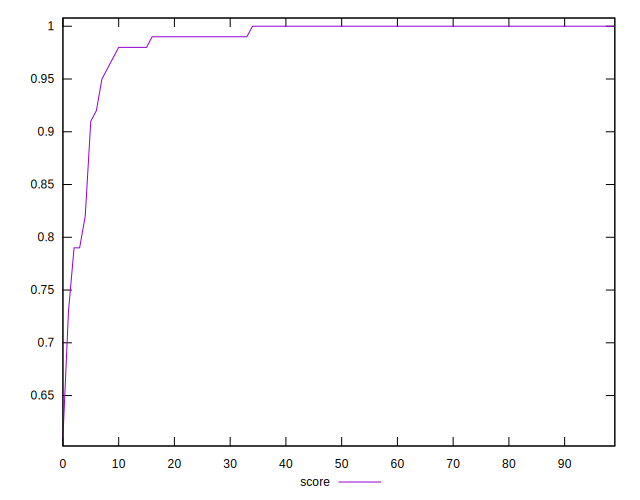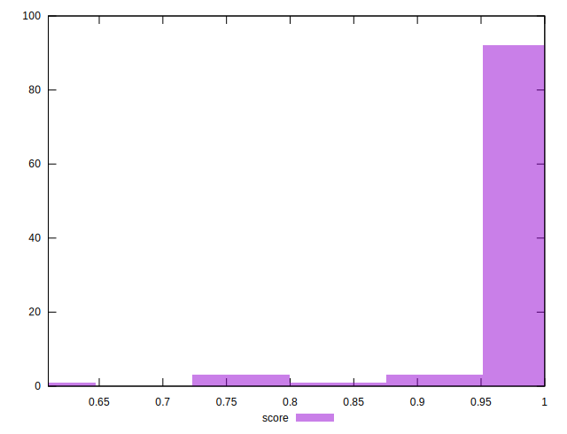
## Raw Estimate

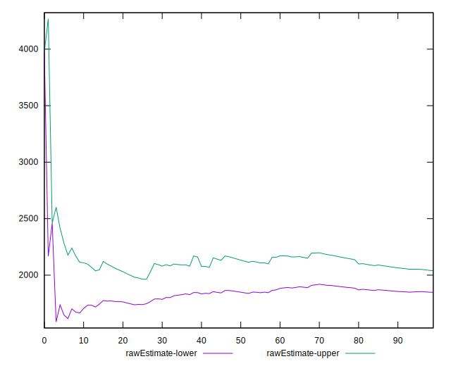
## Score Estimate

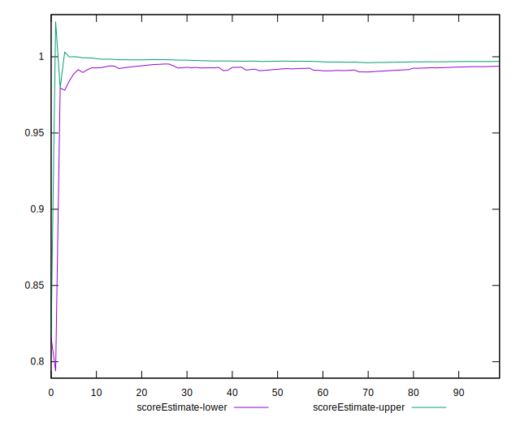
## P Score


```yaml
p90min: 0.7896106645144555
p90max: 0.9988453068927772
p90range: 0.20923464237832168
p90mean: 0.9886222713513846
p90median: 0.9978625793526199
p90stdev: 0.030775665801812575
p90skewness: -5.0485160688042345
p90eccentricity: 1.000000000000001
p90discretization: 1
outlandishness: 0.9837841871233861
confidence: 0.022627743202105248
p90confidence: 0.012442900180281713

```

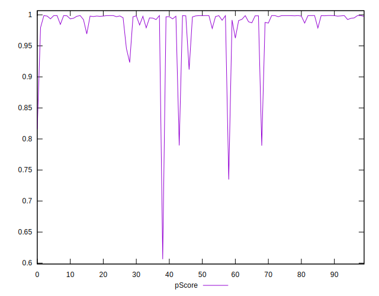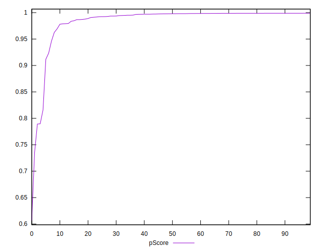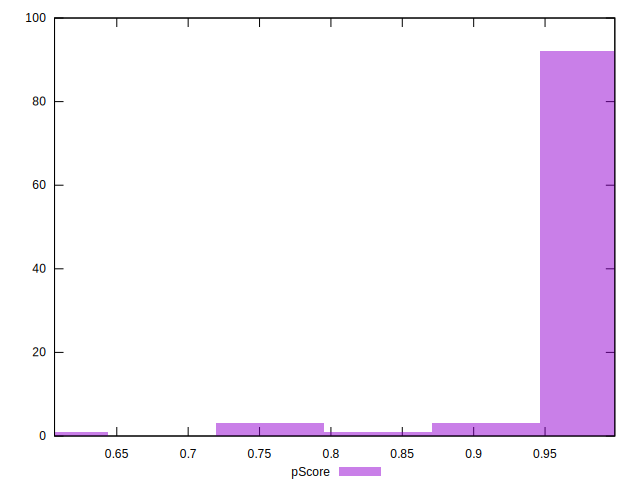
## Score Difference


```yaml
p90min: 0
p90max: 0
p90range: 0
p90mean: 0
p90median: 0
p90stdev: 0
p90skewness: .nan
p90eccentricity: .nan
p90discretization: 94
outlandishness: .inf
confidence: 6.0927920006028104e-18
p90confidence: 0

```

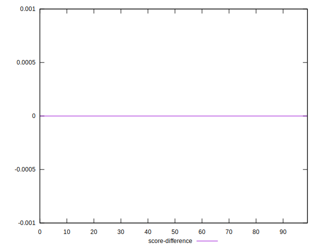
## P Score Difference


```yaml
p90min: -0.004261610205451127
p90max: 0.004532528208508468
p90range: 0.008794138413959596
p90mean: -0.0009792228702958396
p90median: -0.0012457381599435546
p90stdev: 0.001901204432868797
p90skewness: 1.270317892723192
p90eccentricity: 1
p90discretization: 1
outlandishness: 0.8945333958806458
confidence: 0.0008592722094058788
p90confidence: 0.0007686753922023116

```

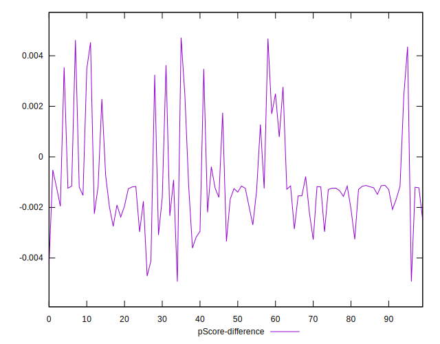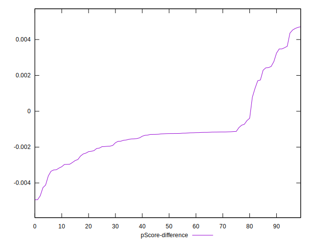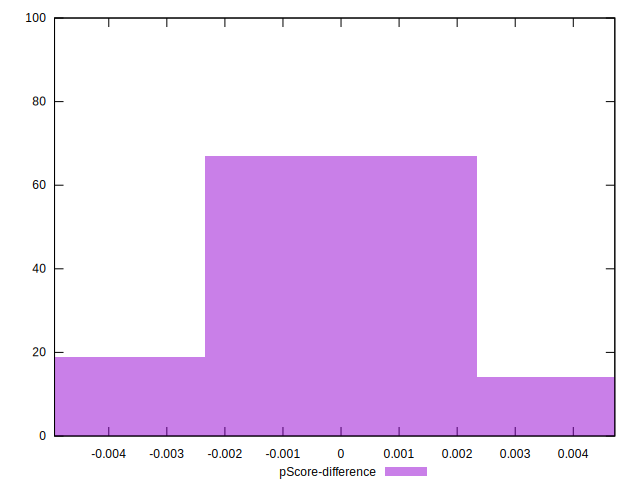