# //speed-index/samples/pages+cached+noadtech+nomedia

[→ Parent](../..)


## Raw


```yaml
p90min: 2135.4675
p90max: 4566.0938999800555
p90range: 2430.6263999800553
p90mean: 2796.70059070813
p90median: 2614.159689990229
p90stdev: 634.484812383623
p90skewness: 1.0586581746642798
p90eccentricity: 1.0000000000000004
p90discretization: 1
outlandishness: 1.033472235130328
confidence: 293.0489492835752
p90confidence: 256.52836358553174

```

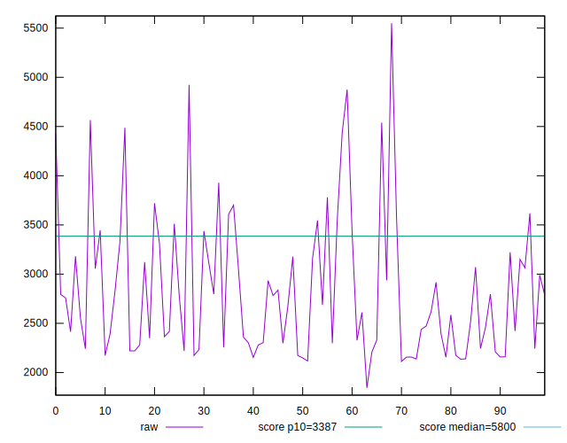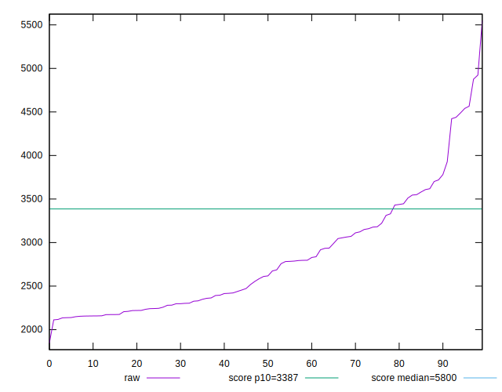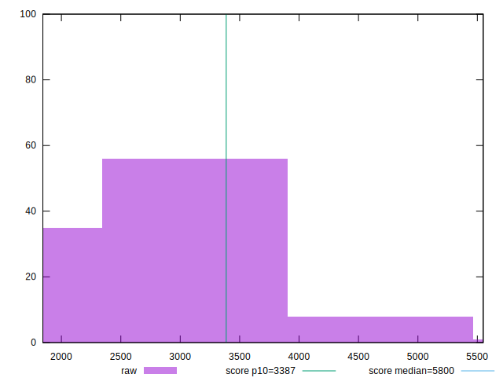
## Score


```yaml
p90min: 0.72
p90max: 0.99
p90range: 0.27
p90mean: 0.9437234042553192
p90median: 0.97
p90stdev: 0.06521623676161649
p90skewness: -1.9804850163236905
p90eccentricity: 0.9999999999999997
p90discretization: 5.222222222222222
outlandishness: 0.982438288492859
confidence: 0.03349380612380535
p90confidence: 0.02636755706226247

```

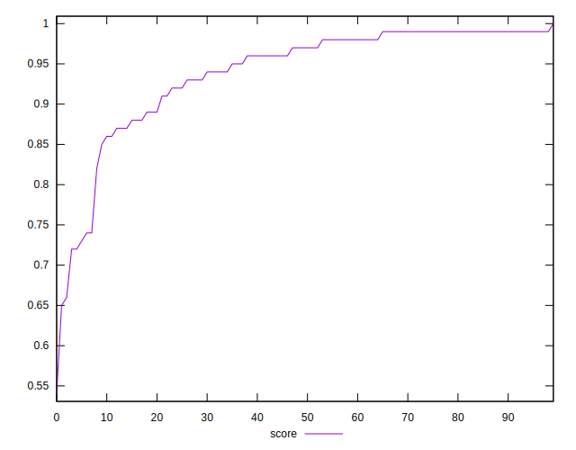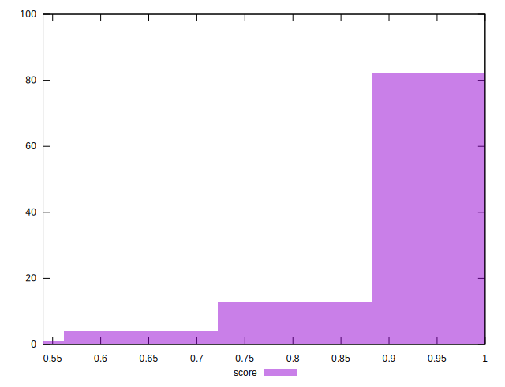
## Raw Estimate

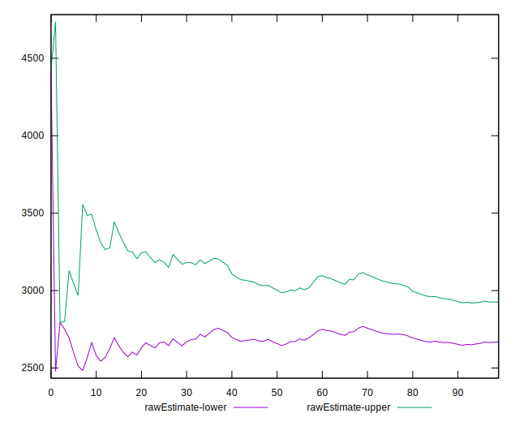
## Score Estimate

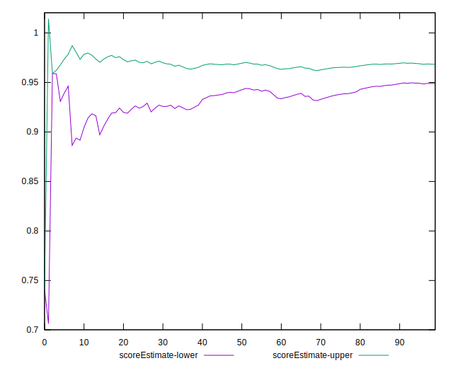
## P Score


```yaml
p90min: 0.7156210125873697
p90max: 0.9913549133166961
p90range: 0.27573390072932646
p90mean: 0.9433198236356981
p90median: 0.9711917810813004
p90stdev: 0.06522896566284835
p90skewness: -1.9951481720898172
p90eccentricity: 1.0000000000000004
p90discretization: 1
outlandishness: 0.9825806802078751
confidence: 0.033420472854006615
p90confidence: 0.026372703480489538

```

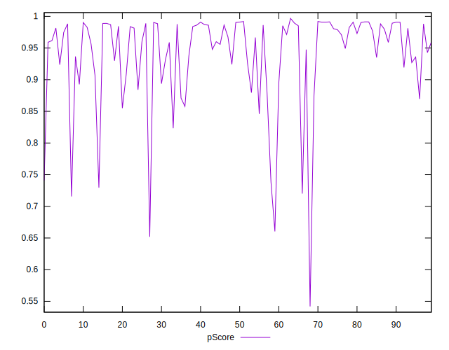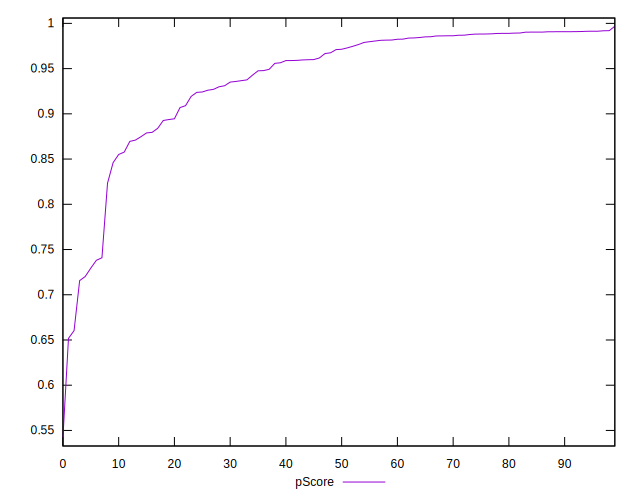
## Score Difference


```yaml
p90min: 0
p90max: 1.1102230246251565e-16
p90range: 1.1102230246251565e-16
p90mean: 7.086529944415892e-18
p90median: 0
p90stdev: 2.7139343474843187e-17
p90skewness: 3.5685919470918006
p90eccentricity: 0.999999999999998
p90discretization: 47
outlandishness: 1.9881000000000004
confidence: 1.245461386168843e-17
p90confidence: 1.0972699794392905e-17

```

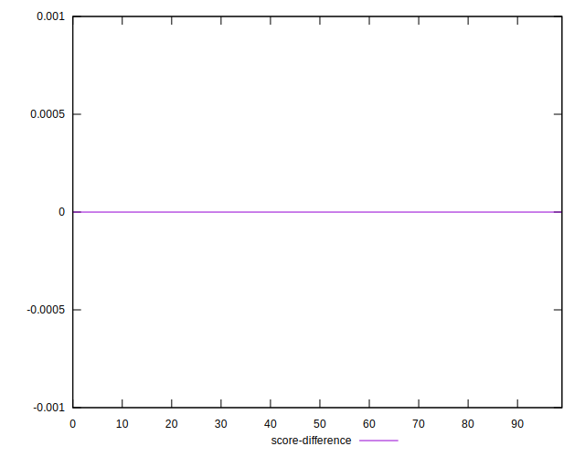
## P Score Difference


```yaml
p90min: -0.004766944062622125
p90max: 0.004382868826637409
p90range: 0.009149812889259534
p90mean: -0.00034444913640234887
p90median: -0.00033877344763055817
p90stdev: 0.0023221995814638164
p90skewness: 0.035878259756064276
p90eccentricity: 0.9999999999999997
p90discretization: 1
outlandishness: 0.9305085225964924
confidence: 0.0009953177615620288
p90confidence: 0.0009388878140580937

```

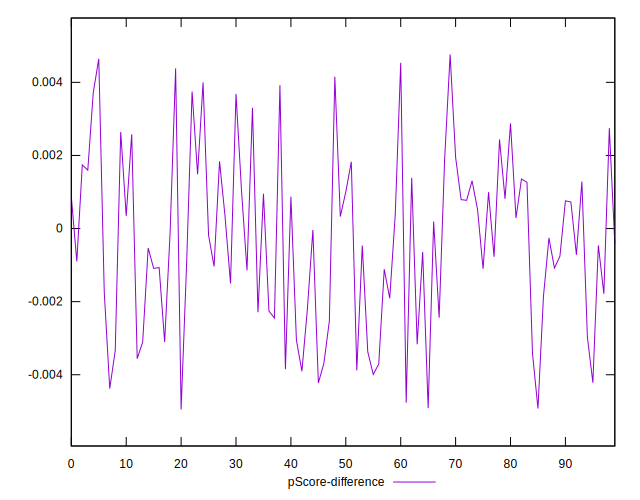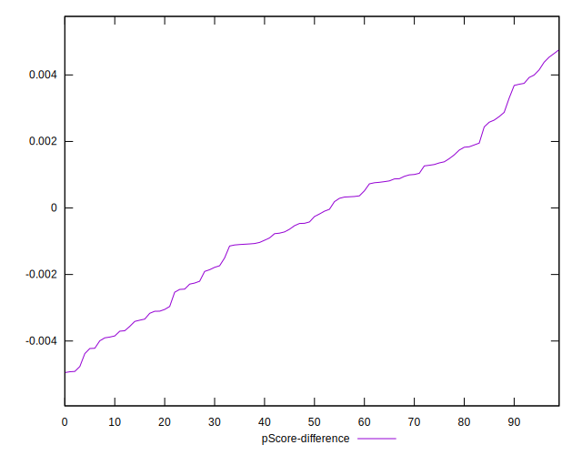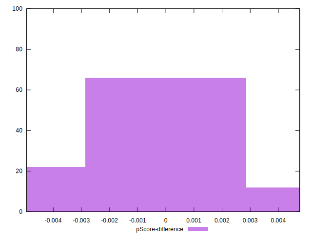