# //speed-index/samples/pages+cached+noadtech

[→ Parent](../..)


## Raw


```yaml
p90min: 2123.8900000000003
p90max: 5292.132378005148
p90range: 3168.2423780051477
p90mean: 2792.4965151250203
p90median: 2513.4631920098072
p90stdev: 725.579728399086
p90skewness: 1.3089241519548682
p90eccentricity: 0.9999999999999994
p90discretization: 1
outlandishness: 1.0720394519291077
confidence: 392.131117265224
p90confidence: 293.3589216703155

```

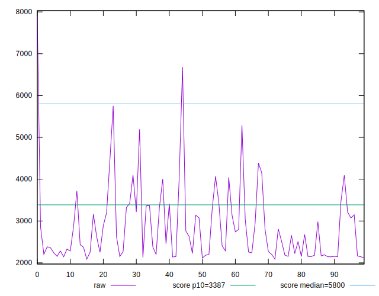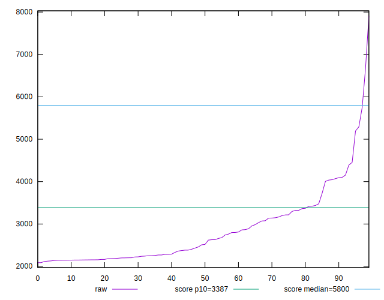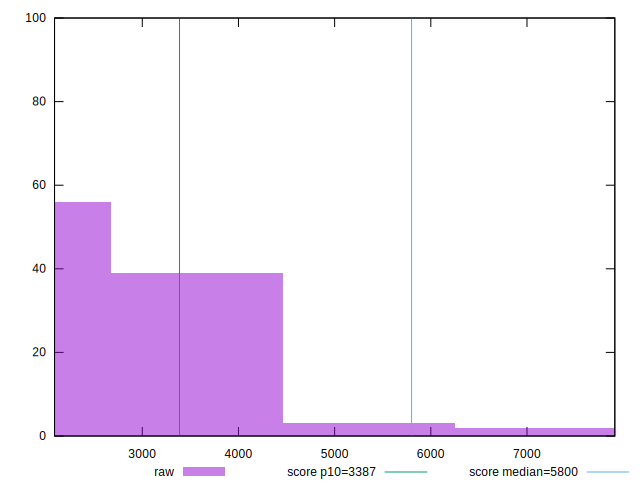
## Score


```yaml
p90min: 0.59
p90max: 0.99
p90range: 0.4
p90mean: 0.9399999999999993
p90median: 0.98
p90stdev: 0.07933232015563767
p90skewness: -2.3756844558180132
p90eccentricity: 0.9999999999999983
p90discretization: 4.947368421052632
outlandishness: 0.9670839293798096
confidence: 0.04940764044525588
p90confidence: 0.03207482649192962

```

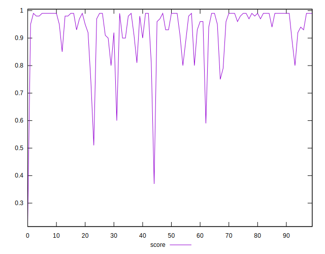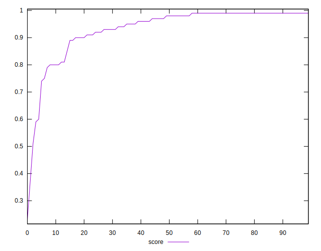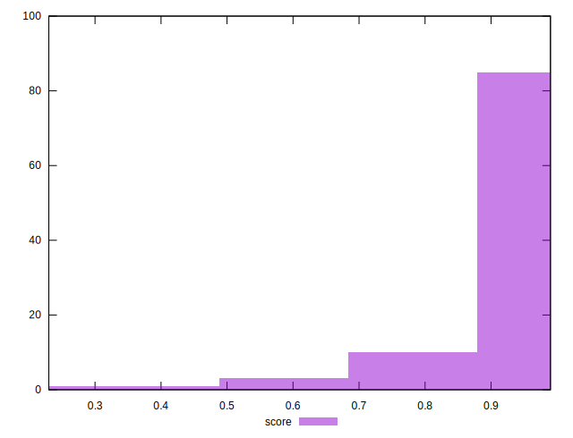
## Raw Estimate

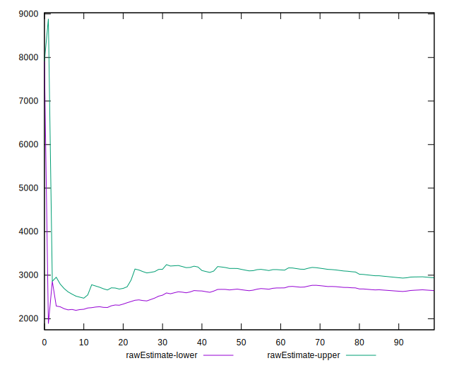
## Score Estimate

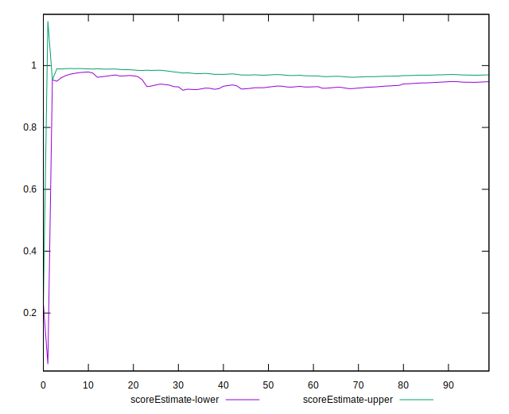
## P Score


```yaml
p90min: 0.586409964582062
p90max: 0.9916541665086283
p90range: 0.4052442019265663
p90mean: 0.9397270749911634
p90median: 0.9768246273354131
p90stdev: 0.07961927076535004
p90skewness: -2.3710934935793184
p90eccentricity: 0.9999999999999999
p90discretization: 1
outlandishness: 0.9671576125193228
confidence: 0.04954740684086585
p90confidence: 0.03219084340660224

```

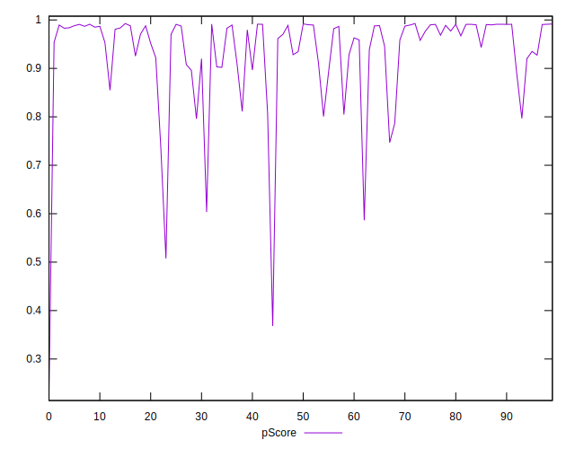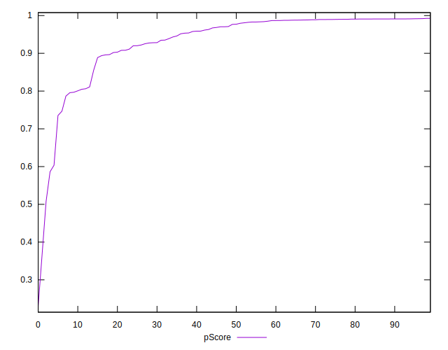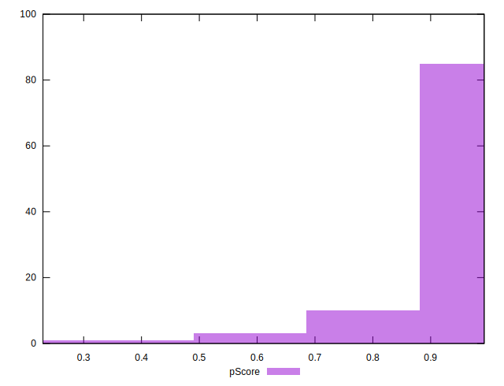
## Score Difference


```yaml
p90min: 0
p90max: 1.1102230246251565e-16
p90range: 1.1102230246251565e-16
p90mean: 4.724353296277262e-18
p90median: 0
p90stdev: 2.240957533134066e-17
p90skewness: 4.532597979574665
p90eccentricity: 0.9999999999999994
p90discretization: 47
outlandishness: 2.706025000000001
confidence: 1.1103983576888548e-17
p90confidence: 9.060408659427041e-18

```

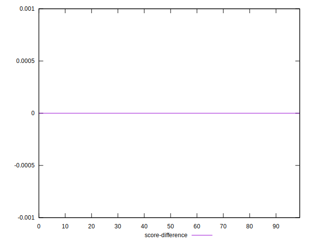
## P Score Difference


```yaml
p90min: -0.004524019765613452
p90max: 0.0038843197971658583
p90range: 0.00840833956277931
p90mean: -0.00024529133319852966
p90median: 0.000022700582476720133
p90stdev: 0.00222351736085949
p90skewness: -0.02402013871785993
p90eccentricity: 0.9999999999999999
p90discretization: 1
outlandishness: 0.9037726388854009
confidence: 0.0009635333344125739
p90confidence: 0.0008989896351379204

```

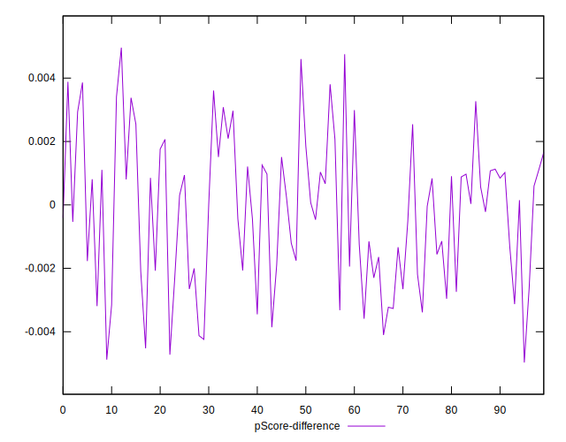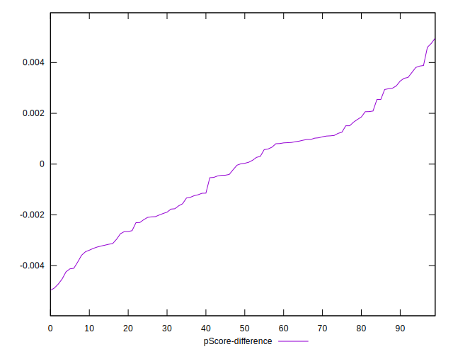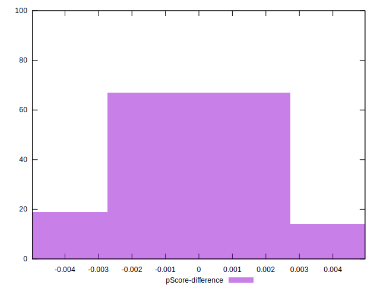