# //speed-index/samples/pages

[→ Parent](../..)


## Raw


```yaml
p90min: 5547.232198606025
p90max: 10108.084546870428
p90range: 4560.852348264403
p90mean: 7181.972958956598
p90median: 6841.857685547013
p90stdev: 1101.9448443440817
p90skewness: 0.8372144088512052
p90eccentricity: 1.0000000000000002
p90discretization: 1
outlandishness: 1.0150207435310266
confidence: 500.62587232028227
p90confidence: 445.52698845403785

```

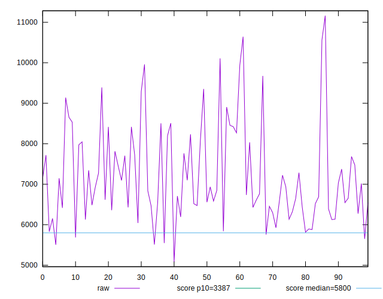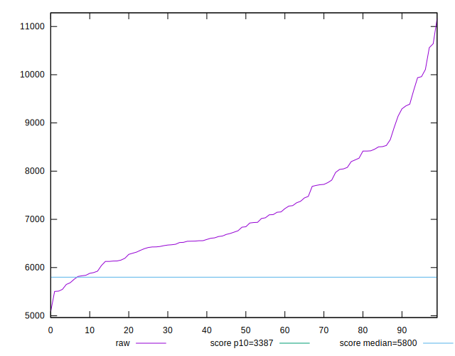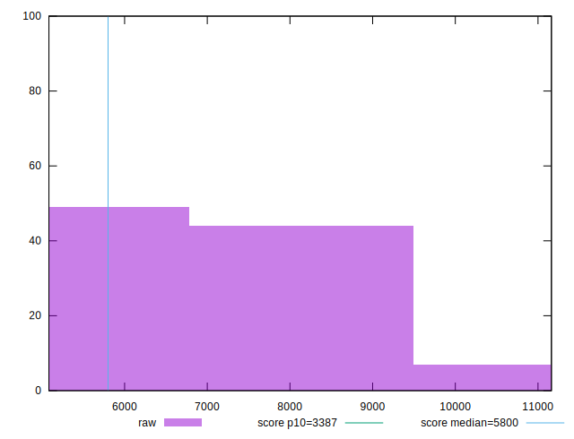
## Score


```yaml
p90min: 0.09
p90max: 0.54
p90range: 0.45000000000000007
p90mean: 0.32585106382978724
p90median: 0.35
p90stdev: 0.11532940403487082
p90skewness: -0.2644229038104432
p90eccentricity: 1.0000000000000002
p90discretization: 2.41025641025641
outlandishness: 0.9984596207469882
confidence: 0.05010557364052263
p90confidence: 0.04662879664402771

```

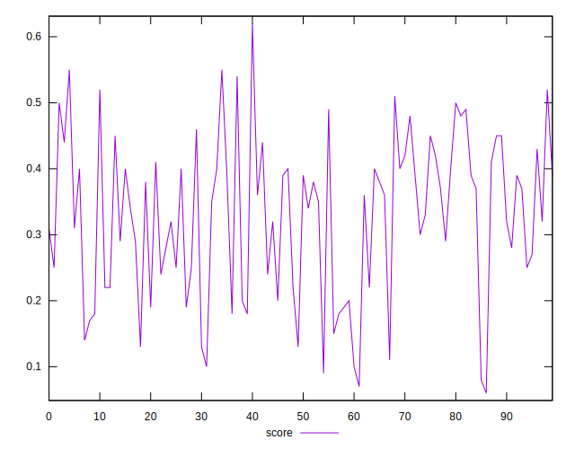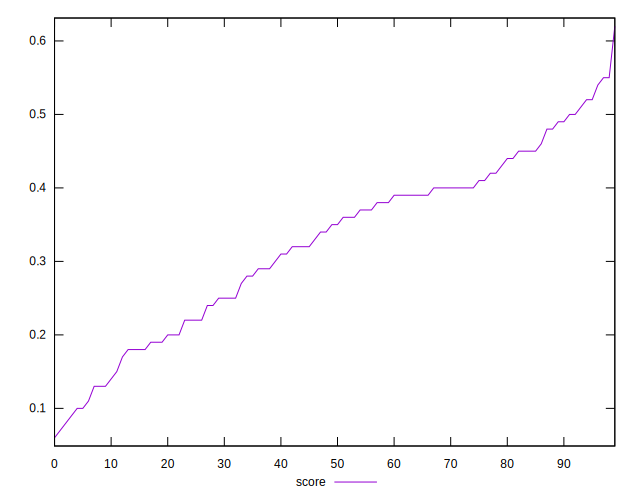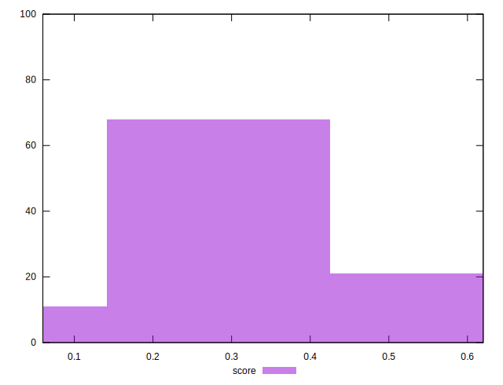
## Raw Estimate

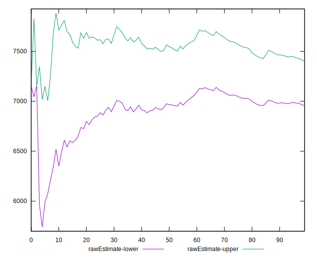
## Score Estimate

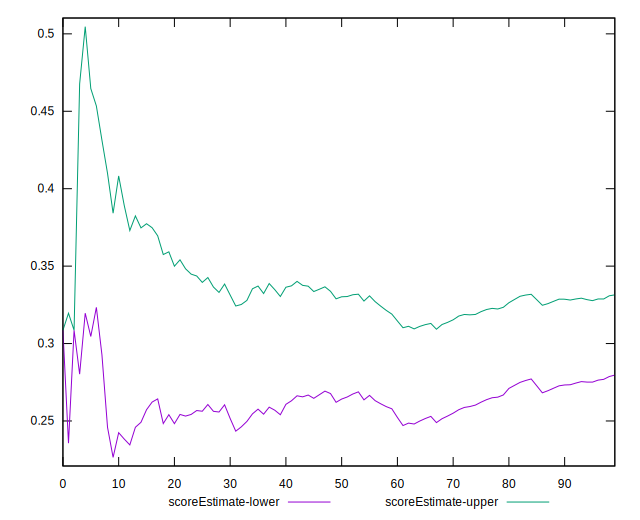
## P Score


```yaml
p90min: 0.09285165885823582
p90max: 0.5422720113524644
p90range: 0.44942035249422857
p90mean: 0.32551979671198367
p90median: 0.3469445345239671
p90stdev: 0.11514341835862611
p90skewness: -0.2598272768084453
p90eccentricity: 0.9999999999999996
p90discretization: 1
outlandishness: 0.9986700110287147
confidence: 0.05005839800327659
p90confidence: 0.0465536008312262

```

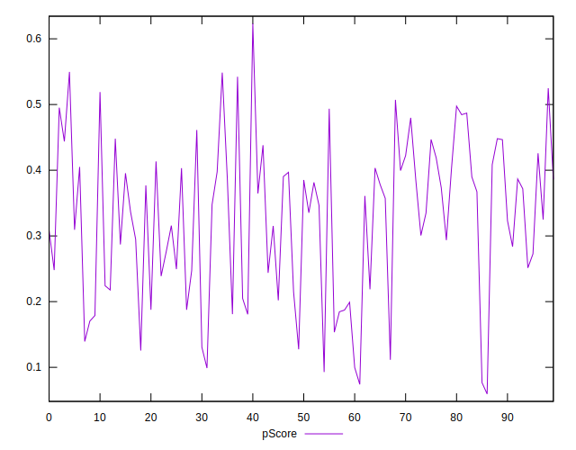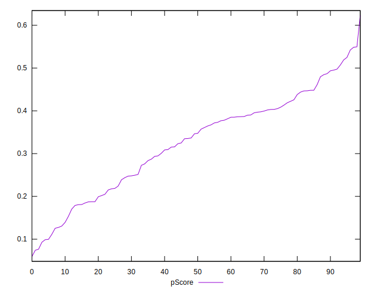
## Score Difference


```yaml
p90min: 0
p90max: 5.551115123125783e-17
p90range: 5.551115123125783e-17
p90mean: 5.905441620346577e-19
p90median: 0
p90stdev: 5.695001657605475e-18
p90skewness: 9.539955591519906
p90eccentricity: 1
p90discretization: 47
outlandishness: 14.137600000000003
confidence: 4.2640661458251376e-18
p90confidence: 2.302544406624999e-18

```

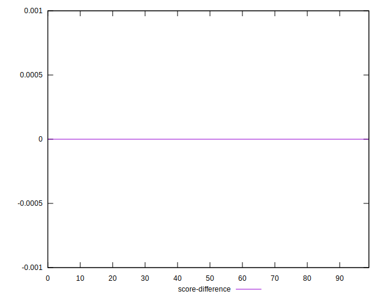
## P Score Difference


```yaml
p90min: -0.004823416596850927
p90max: 0.004865697759943333
p90range: 0.00968911435679426
p90mean: -0.00031535054506662627
p90median: -0.0008110878631975849
p90stdev: 0.0028353195969345116
p90skewness: 0.28179727244396746
p90eccentricity: 0.9999999999999999
p90discretization: 1
outlandishness: 0.8854769304221289
confidence: 0.001178331192179388
p90confidence: 0.0011463472131210519

```

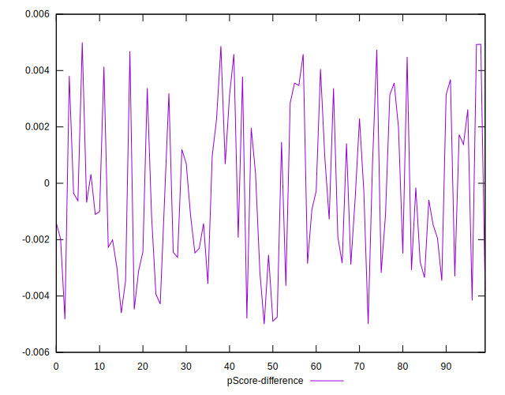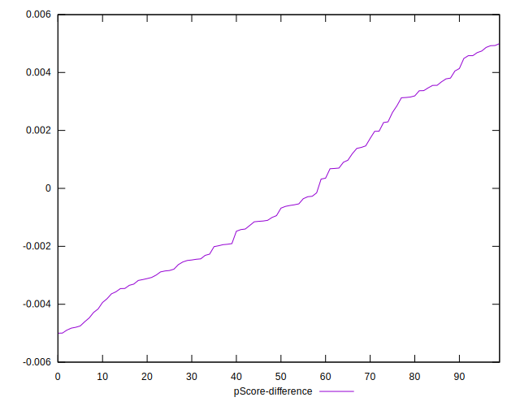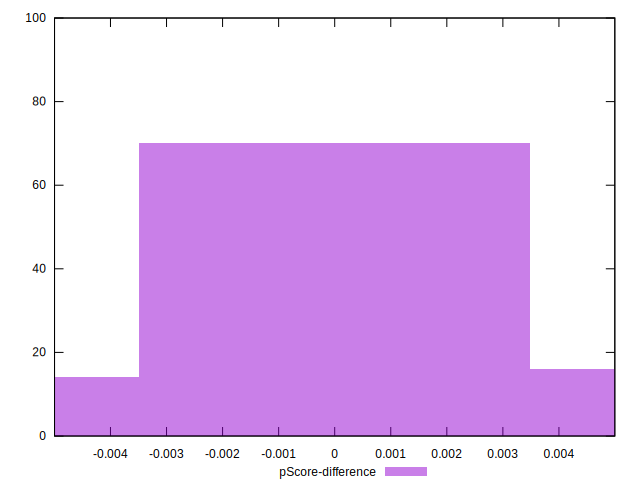