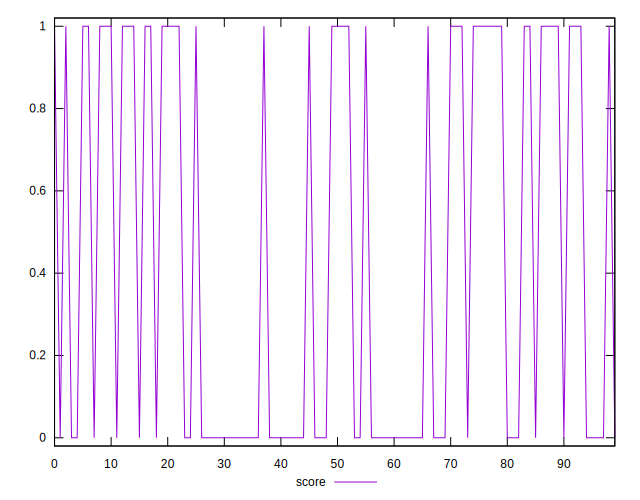
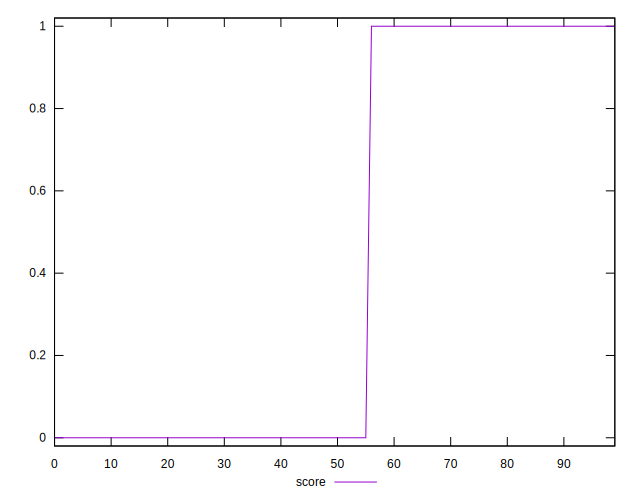
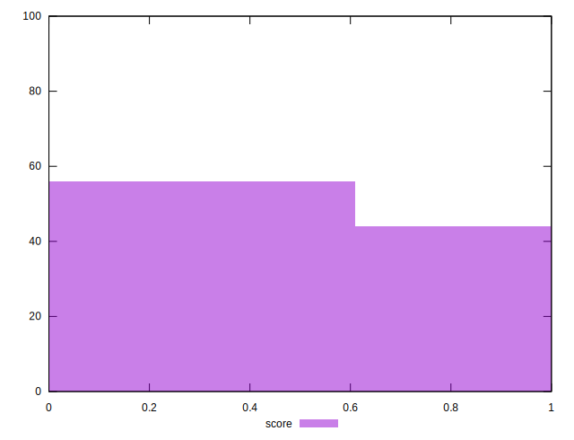

# //third-party-summary/samples/pages+cached+noadtech+nomedia+nocss

[→ Parent](../..)


## Raw


```yaml
p90range: 0

```


## Score


```yaml
p90min: 0
p90max: 1
p90range: 1
p90mean: 0.43617021276595747
p90median: 0
p90stdev: 0.49590902216198557
p90skewness: 0.257425392084087
p90eccentricity: 1.000000000000001
p90discretization: 47
outlandishness: 1.0176380725758478
confidence: 0.19458010724830363
p90confidence: 0.20050082753690662

```

