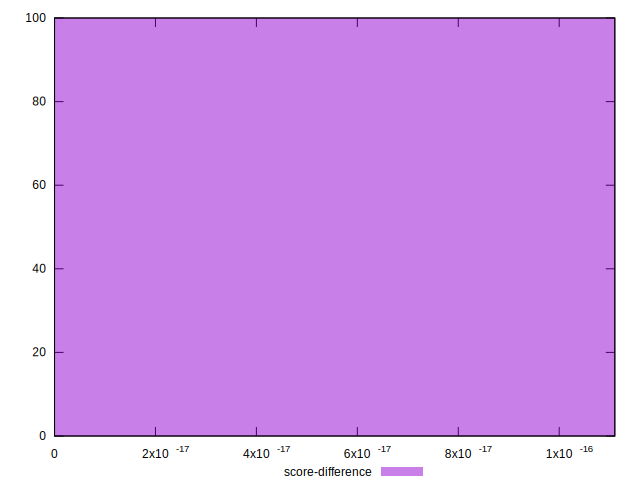

# //total-blocking-time/samples/pages+cached+noadtech+nomedia

[→ Parent](../..)


## Raw


```yaml
p90min: 90
p90max: 1094.999999999999
p90range: 1004.9999999999991
p90mean: 344.19557978723395
p90median: 307.15325000000007
p90stdev: 184.39437364764098
p90skewness: 1.0697492872038679
p90eccentricity: 1.0000000000000002
p90discretization: 1
outlandishness: 1.1958296088339035
confidence: 119.10831822541589
p90confidence: 74.55243372730001

```


## Score


```yaml
p90min: 0.15
p90max: 1
p90range: 0.85
p90mean: 0.8065957446808512
p90median: 0.875
p90stdev: 0.19332781767835486
p90skewness: -1.07058235303655
p90eccentricity: 1.0000000000000007
p90discretization: 2.238095238095238
outlandishness: 0.9580593545389716
confidence: 0.0906315406054958
p90confidence: 0.07816431179538585

```


## Raw Estimate


## Score Estimate


## P Score


```yaml
p90min: 0.14791025556827542
p90max: 0.9995110711084791
p90range: 0.8516008155402037
p90mean: 0.8060657614149926
p90median: 0.8776489271563197
p90stdev: 0.19340483425735788
p90skewness: -1.0763536855996576
p90eccentricity: 0.9999999999999994
p90discretization: 1
outlandishness: 0.9581506223711608
confidence: 0.09061688726209871
p90confidence: 0.07819545034526915

```


## Score Difference


```yaml
p90min: 0
p90max: 1.1102230246251565e-16
p90range: 1.1102230246251565e-16
p90mean: 1.1810883240693155e-17
p90median: 0
p90stdev: 3.4231191749227874e-17
p90skewness: 2.553242569566711
p90eccentricity: 1.0000000000000002
p90discretization: 47
outlandishness: 1.4932839999999998
confidence: 1.4635906249893463e-17
p90confidence: 1.384000283635259e-17

```


## P Score Difference


```yaml
p90min: -0.004575849016267952
p90max: 0.004402433092654534
p90range: 0.008978282108922486
p90mean: -0.0005036539835198165
p90median: -0.0005885394923005605
p90stdev: 0.0025736771226142117
p90skewness: 0.2202847254456447
p90eccentricity: 1
p90discretization: 1
outlandishness: 0.9127122647694011
confidence: 0.0010791760046610108
p90confidence: 0.0010405626230538673

```

