# //total-blocking-time/samples/pages+cached+noadtech

[→ Parent](../..)


## Raw


```yaml
p90min: 57.5
p90max: 976.818999999999
p90range: 919.318999999999
p90mean: 288.5883989361701
p90median: 235
p90stdev: 194.77322510293286
p90skewness: 1.2893239278976327
p90eccentricity: 1.0000000000000002
p90discretization: 1.032967032967033
outlandishness: 1.1403470875328787
confidence: 97.10802375018746
p90confidence: 78.74870403631026

```

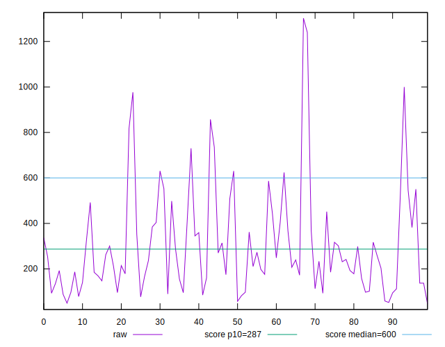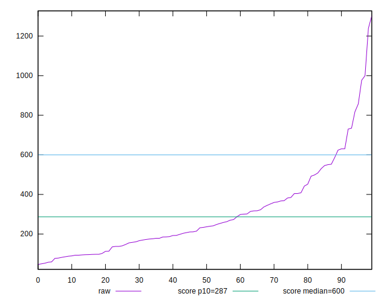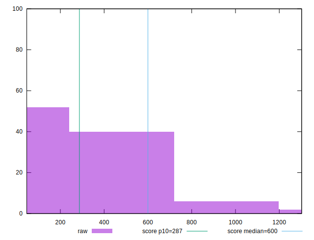
## Score


```yaml
p90min: 0.2
p90max: 1
p90range: 0.8
p90mean: 0.8543617021276592
p90median: 0.95
p90stdev: 0.19601106411801664
p90skewness: -1.5789316753585225
p90eccentricity: 0.9999999999999994
p90discretization: 2.611111111111111
outlandishness: 0.9595411210087867
confidence: 0.0897255928175607
p90confidence: 0.07924917435604706

```

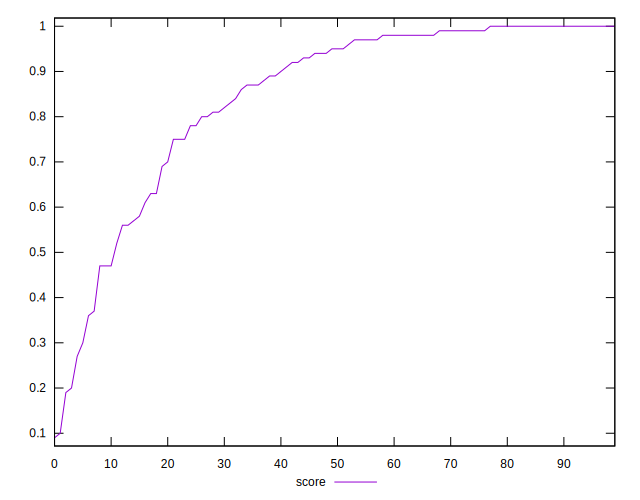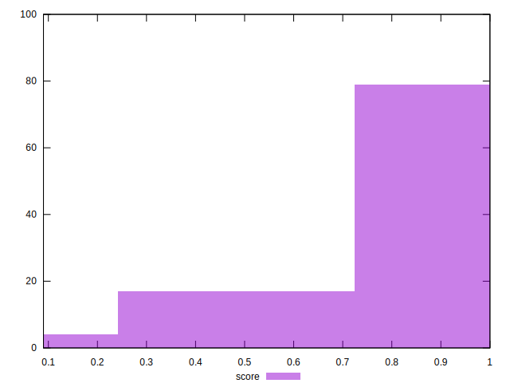
## Raw Estimate

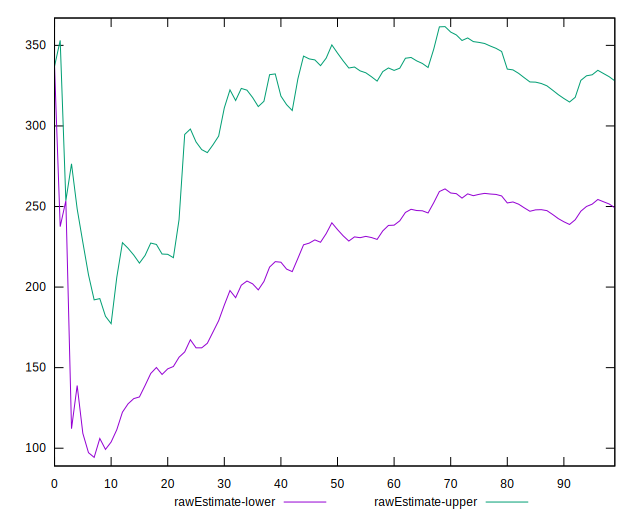
## Score Estimate

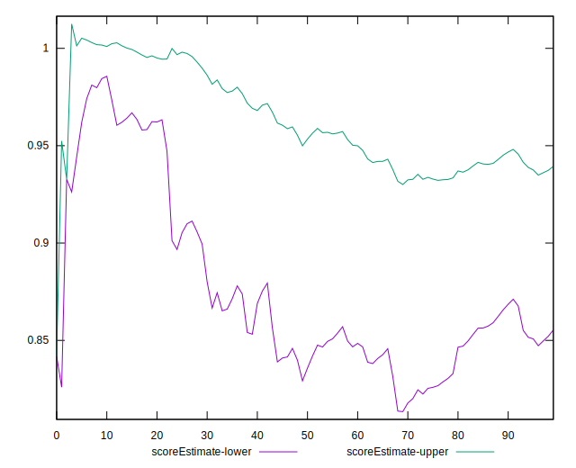
## P Score


```yaml
p90min: 0.19850733624894923
p90max: 0.9999770244129023
p90range: 0.801469688163953
p90mean: 0.8543179245380756
p90median: 0.9483298885029499
p90stdev: 0.1964120609089653
p90skewness: -1.588349137025524
p90eccentricity: 0.9999999999999997
p90discretization: 1.0444444444444445
outlandishness: 0.95954705261546
confidence: 0.08984583936944016
p90confidence: 0.07941130124794012

```

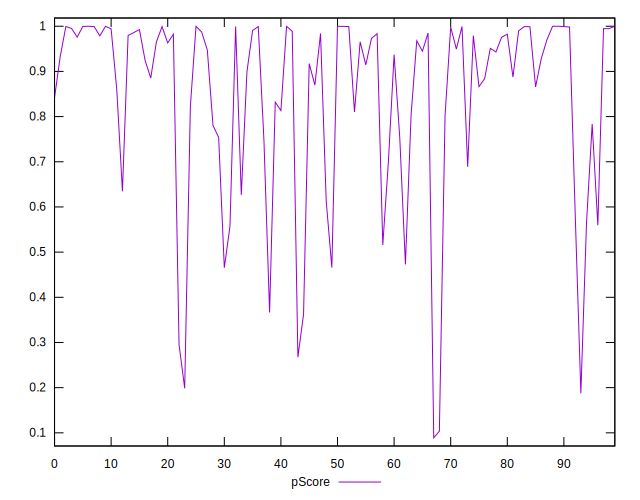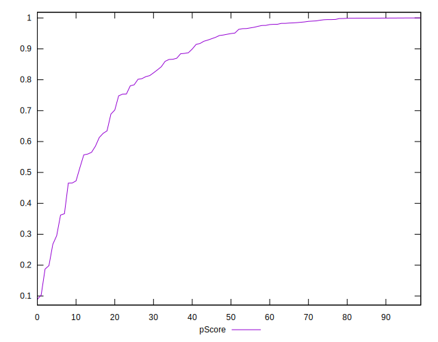
## Score Difference


```yaml
p90min: 0
p90max: 1.1102230246251565e-16
p90range: 1.1102230246251565e-16
p90mean: 1.1220339078658496e-17
p90median: 0
p90stdev: 3.196038971947008e-17
p90skewness: 2.638183324788261
p90eccentricity: 1.0000000000000009
p90discretization: 31.333333333333332
outlandishness: 1.5297783933518008
confidence: 1.38906358868617e-17
p90confidence: 1.2921895550959817e-17

```

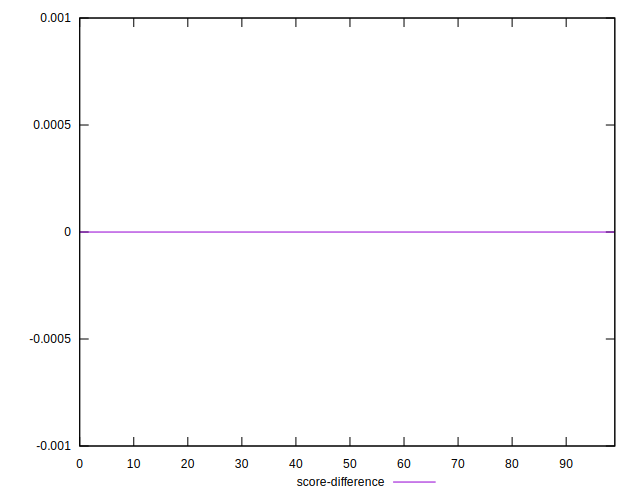
## P Score Difference


```yaml
p90min: -0.0046738482694783645
p90max: 0.004771505547831234
p90range: 0.009445353817309599
p90mean: -0.00004567899364535329
p90median: -0.00039093606174139817
p90stdev: 0.0026578280282151647
p90skewness: 0.11008491019147712
p90eccentricity: 0.9999999999999999
p90discretization: 1.032967032967033
outlandishness: 0.7782089001450441
confidence: 0.0011108367591097488
p90confidence: 0.0010745856503773345

```

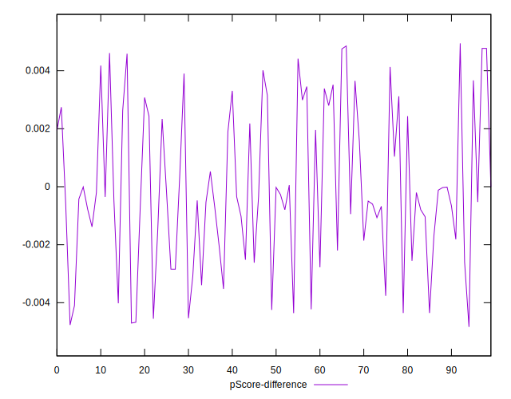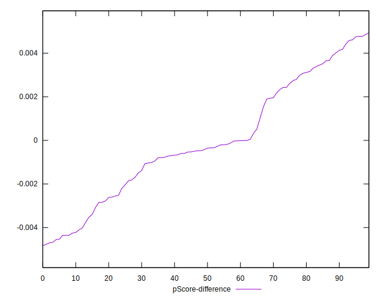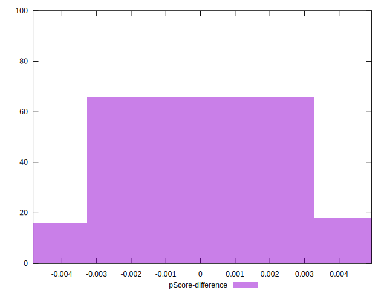