# //total-blocking-time/samples/pages+cached

[→ Parent](../..)


## Raw


```yaml
p90min: 672
p90max: 4035.052500000004
p90range: 3363.052500000004
p90mean: 1909.041335106383
p90median: 1670.2500000000002
p90stdev: 991.9184948173139
p90skewness: 0.6618580041344059
p90eccentricity: 0.9999999999999996
p90discretization: 1
outlandishness: 1.0569287753602634
confidence: 445.0981331708962
p90confidence: 401.0422681825522

```

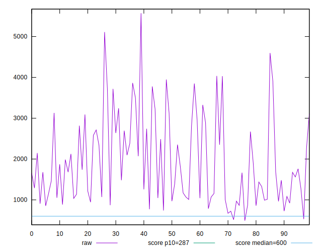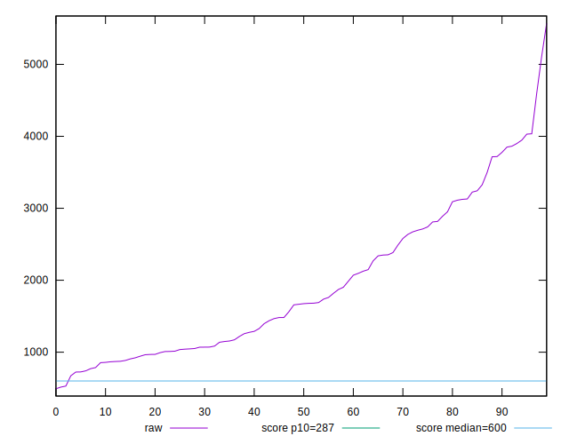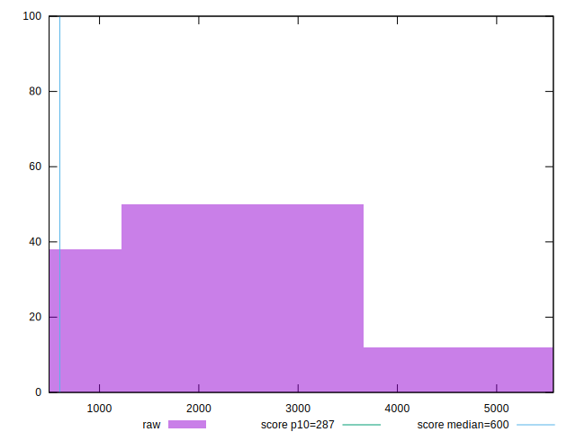
## Score


```yaml
p90min: 0
p90max: 0.42
p90range: 0.42
p90mean: 0.09489361702127656
p90median: 0.04
p90stdev: 0.10945459255599102
p90skewness: 1.0669141731302405
p90eccentricity: 1.0000000000000007
p90discretization: 3.032258064516129
outlandishness: 1.2809570290977093
confidence: 0.05437441719010611
p90confidence: 0.044253553382666025

```

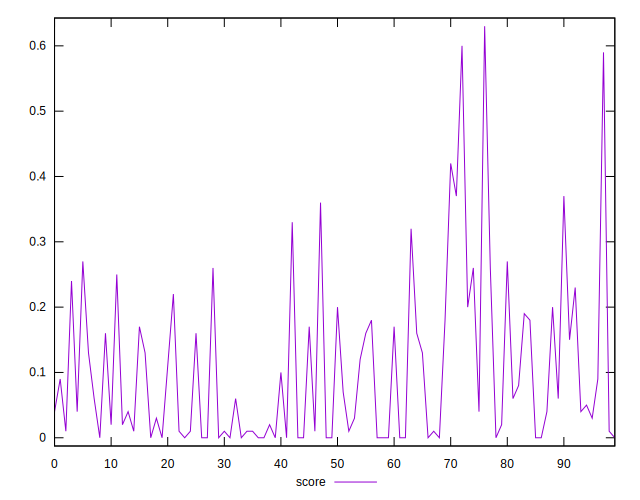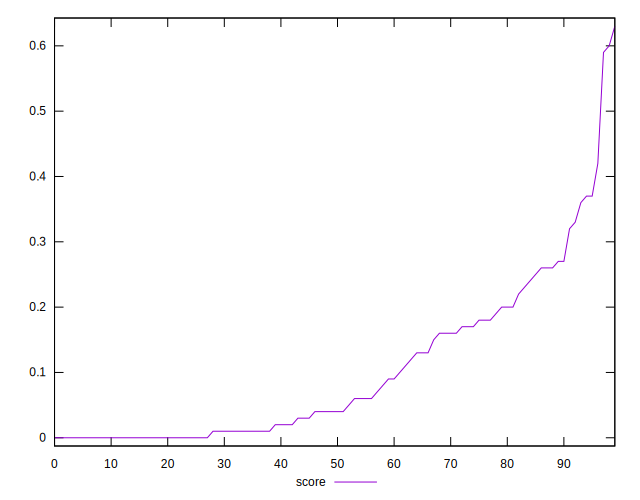
## Raw Estimate

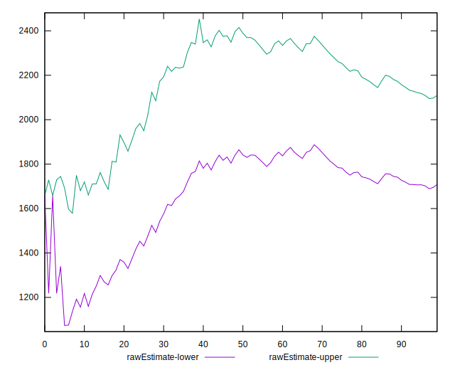
## Score Estimate

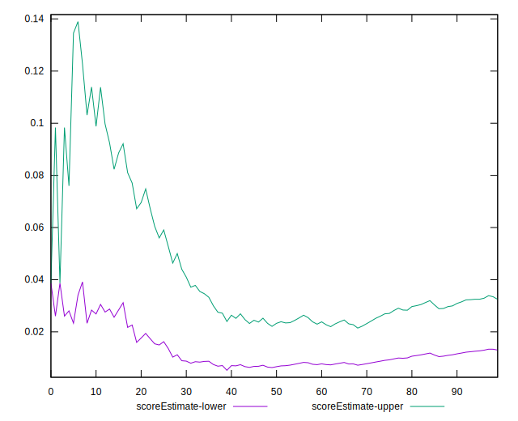
## P Score


```yaml
p90min: 0.0004631869839760716
p90max: 0.42193532858179983
p90range: 0.42147214159782376
p90mean: 0.09531135013272271
p90median: 0.03760703320593675
p90stdev: 0.10909731459126701
p90skewness: 1.0752359543224643
p90eccentricity: 1.0000000000000002
p90discretization: 1
outlandishness: 1.2806118071024635
confidence: 0.054347974931040606
p90confidence: 0.04410910243624935

```

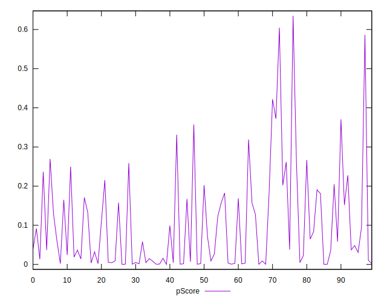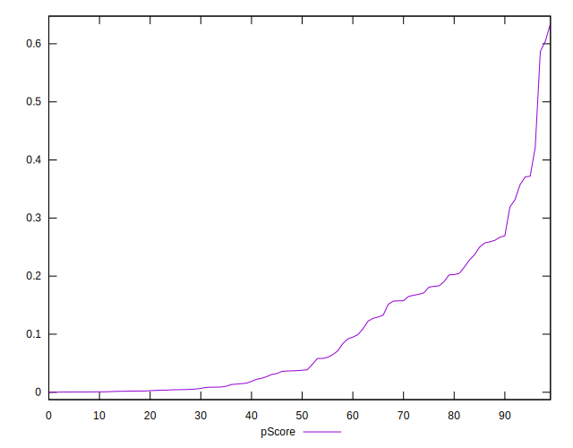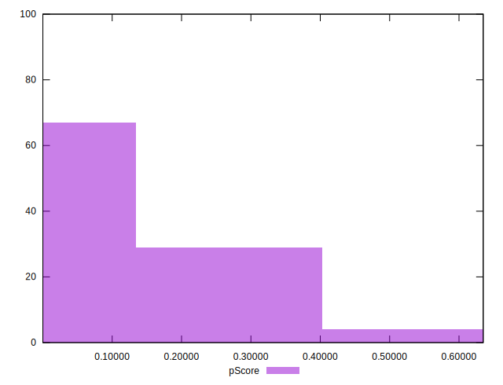
## Score Difference


```yaml
p90min: 0
p90max: 0
p90range: 0
p90mean: 0
p90median: 0
p90stdev: 0
p90skewness: .nan
p90eccentricity: .nan
p90discretization: 94
outlandishness: .nan
confidence: 0
p90confidence: 0

```


## P Score Difference


```yaml
p90min: -0.0042986006445951234
p90max: 0.004871773331202376
p90range: 0.009170373975797499
p90mean: 0.00047653727722598866
p90median: 0.0006324204374979769
p90stdev: 0.002440933917919095
p90skewness: -0.04472799232500709
p90eccentricity: 0.9999999999999999
p90discretization: 1
outlandishness: 0.9247248381996498
confidence: 0.001035998469064517
p90confidence: 0.0009868932579045109

```

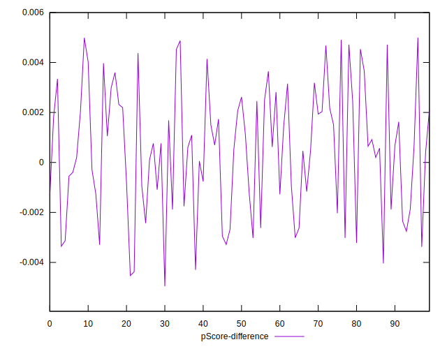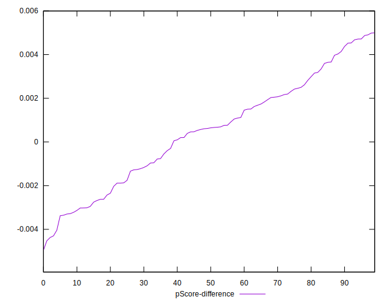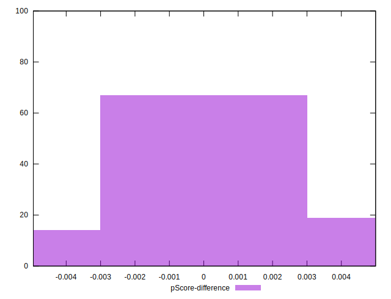