# //total-blocking-time/samples/pages

[→ Parent](../..)


## Raw


```yaml
p90min: 621.9999999999991
p90max: 3935.7759999999976
p90range: 3313.7759999999985
p90mean: 1635.8193563829793
p90median: 1467.9127500000004
p90stdev: 825.056140258055
p90skewness: 0.9369211525737805
p90eccentricity: 0.9999999999999999
p90discretization: 1
outlandishness: 1.0726949310888583
confidence: 383.27296017835135
p90confidence: 333.5781998176901

```

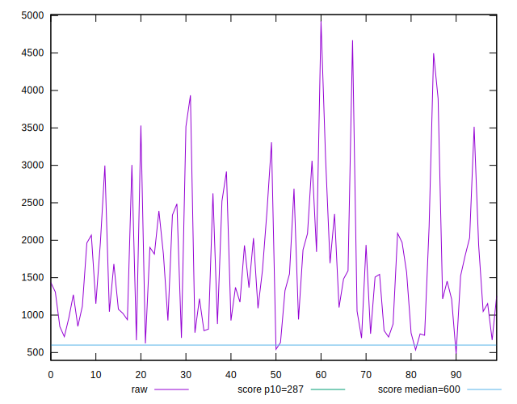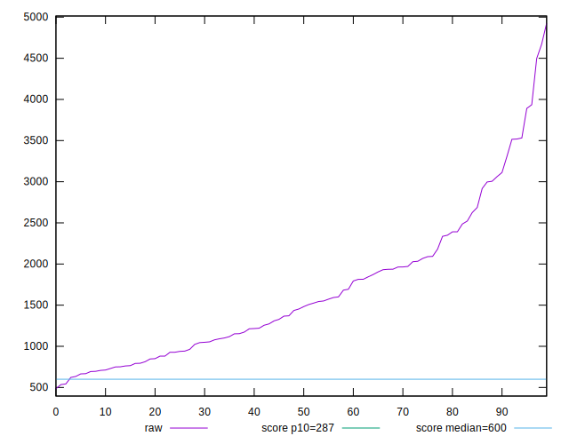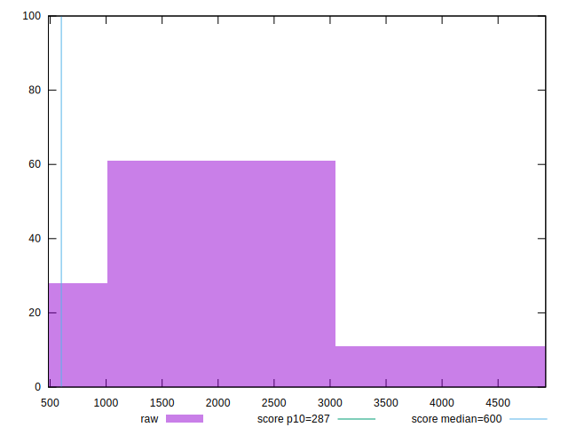
## Score


```yaml
p90min: 0
p90max: 0.48
p90range: 0.48
p90mean: 0.12468085106382976
p90median: 0.06
p90stdev: 0.1362312030966035
p90skewness: 1.0402073671729208
p90eccentricity: 1
p90discretization: 2.8484848484848486
outlandishness: 1.1741164745658075
confidence: 0.06137534507429783
p90confidence: 0.055079596733562344

```

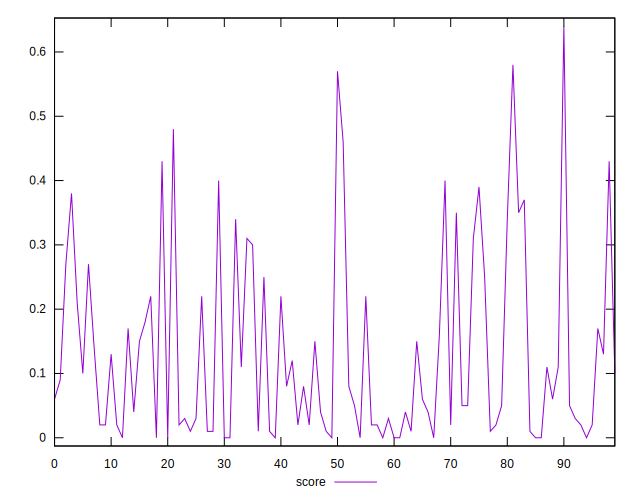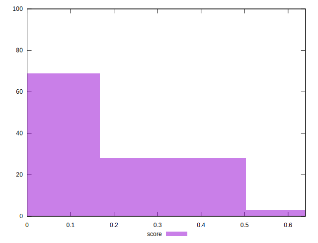
## Raw Estimate

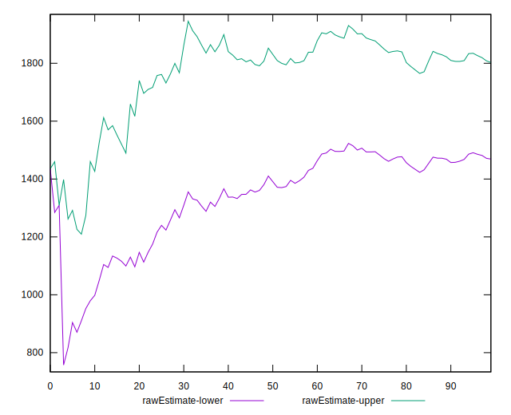
## Score Estimate

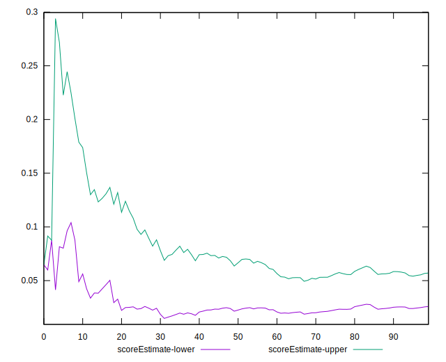
## P Score


```yaml
p90min: 0.0005402249485435551
p90max: 0.47505053147054904
p90range: 0.4745103065220055
p90mean: 0.12448001536867849
p90median: 0.06003814214039618
p90stdev: 0.13604422743764122
p90skewness: 1.0372490585815988
p90eccentricity: 1.0000000000000007
p90discretization: 1
outlandishness: 1.1751867832307732
confidence: 0.06135684960247715
p90confidence: 0.05500400066114616

```

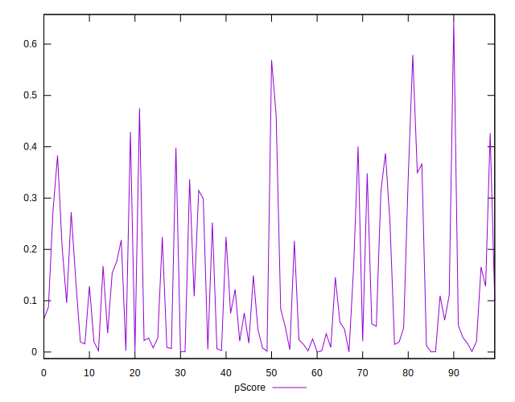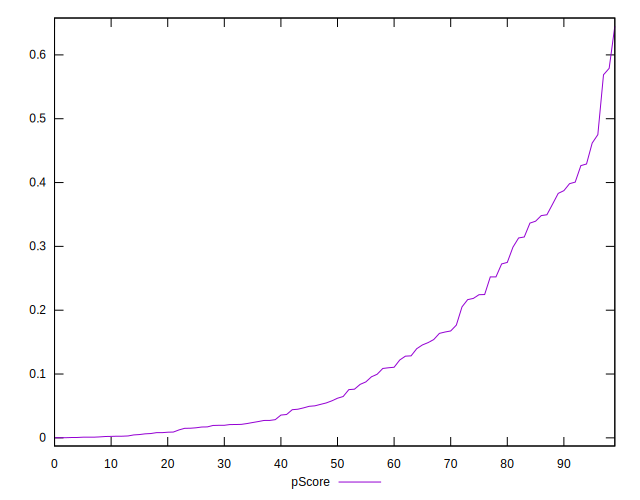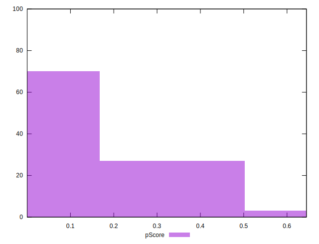
## Score Difference


```yaml
p90min: 0
p90max: 0
p90range: 0
p90mean: 0
p90median: 0
p90stdev: 0
p90skewness: .nan
p90eccentricity: .nan
p90discretization: 94
outlandishness: .inf
confidence: 5.258534703630927e-18
p90confidence: 0

```

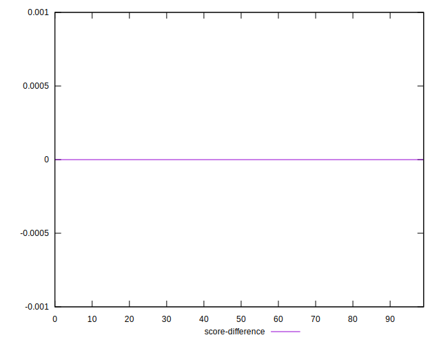
## P Score Difference


```yaml
p90min: -0.004776312092409557
p90max: 0.004877605141609211
p90range: 0.009653917234018768
p90mean: -0.00016607492705432536
p90median: -0.000368082016693699
p90stdev: 0.0027281897014687292
p90skewness: 0.15261763084330832
p90eccentricity: 0.9999999999999992
p90discretization: 1
outlandishness: 0.8840974740331995
confidence: 0.001139089661710819
p90confidence: 0.0011030335573194532

```

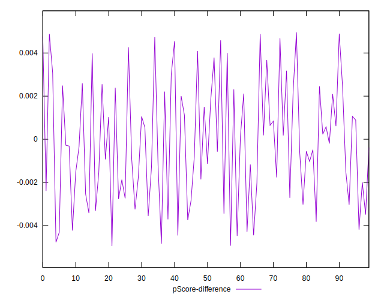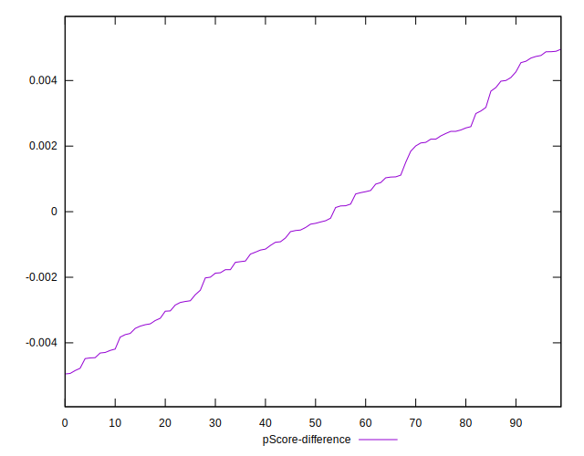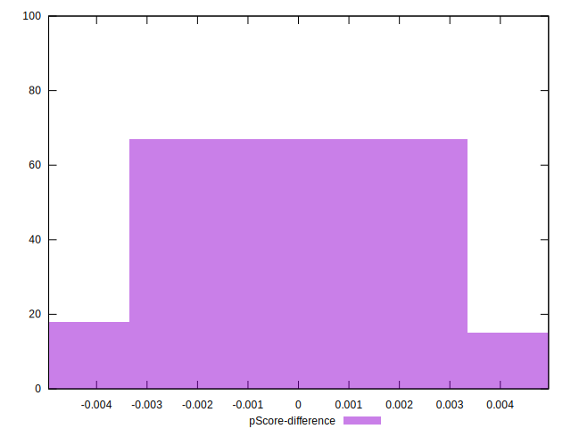