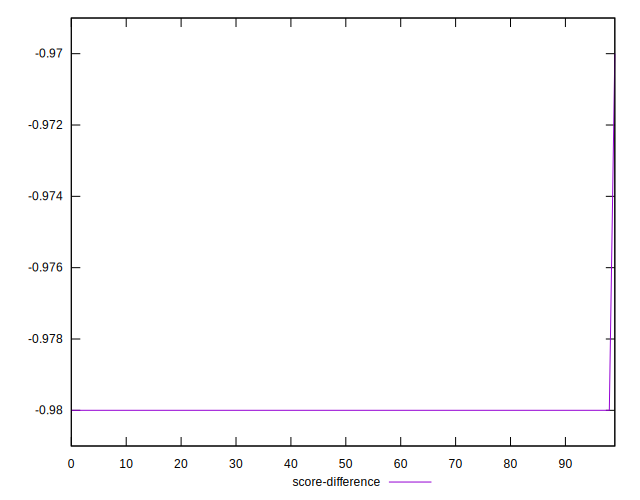

# //total-byte-weight/samples/pages

[→ Parent](../..)


## Raw


```yaml
p90min: 2201592
p90max: 2202851
p90range: 1259
p90mean: 2202288.35106383
p90median: 2202191.5
p90stdev: 382.8589459564299
p90skewness: 0.2902617704062549
p90eccentricity: 0.999999999999998
p90discretization: 1.236842105263158
outlandishness: 1.000139440676152
confidence: 655.9433739409607
p90confidence: 154.7935852417254

```


## Score


```yaml
p90min: 0.98
p90max: 0.98
p90range: 0
p90mean: 0.9800000000000002
p90median: 0.98
p90stdev: 2.220446049250313e-16
p90skewness: -1
p90eccentricity: 1
p90discretization: 94
outlandishness: 0.9997959287796755
confidence: 0.0003900279083597579
p90confidence: 8.977478740653372e-17

```


## Raw Estimate


## Score Estimate


## P Score


```yaml
p90min: 0
p90max: 0
p90range: 0
p90mean: 0
p90median: 0
p90stdev: 0
p90skewness: .nan
p90eccentricity: .nan
p90discretization: 94
outlandishness: .nan
confidence: 0
p90confidence: 0

```


## Score Difference


```yaml
p90min: -0.98
p90max: -0.98
p90range: 0
p90mean: -0.9800000000000002
p90median: -0.98
p90stdev: 2.220446049250313e-16
p90skewness: 1
p90eccentricity: 1
p90discretization: 94
outlandishness: 0.9997959287796755
confidence: 0.0003900279083597579
p90confidence: 8.977478740653372e-17

```


## P Score Difference


```yaml
p90min: -0.98
p90max: -0.98
p90range: 0
p90mean: -0.9800000000000002
p90median: -0.98
p90stdev: 2.220446049250313e-16
p90skewness: 1
p90eccentricity: 1
p90discretization: 94
outlandishness: 0.9997959287796755
confidence: 0.0003900279083597579
p90confidence: 8.977478740653372e-17

```

