# //unminified-javascript/samples/pages+cached+noadtech+nomedia+nocss

[→ Parent](../..)


## Raw


```yaml
p90min: 0
p90max: 150
p90range: 150
p90mean: 80.63829787234043
p90median: 150
p90stdev: 73.26443668116981
p90skewness: -0.13894245628377513
p90eccentricity: 1.0000000000000007
p90discretization: 15.666666666666666
outlandishness: 0.9965728622050806
confidence: 28.844784034104695
p90confidence: 29.62152235012491

```

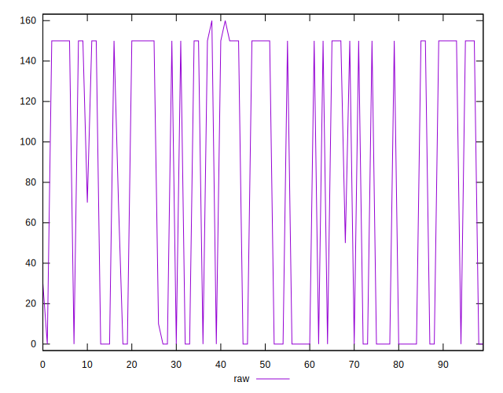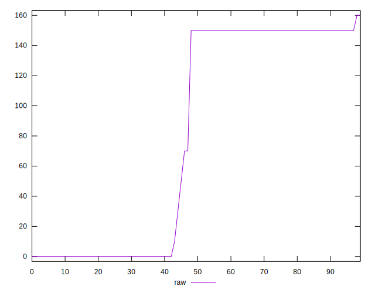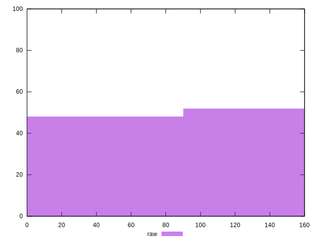
## Score


```yaml
p90min: 0.88
p90max: 1
p90range: 0.12
p90mean: 0.9354255319148934
p90median: 0.88
p90stdev: 0.058612773526440023
p90skewness: 0.14231499575605266
p90eccentricity: 0.9999999999999983
p90discretization: 15.666666666666666
outlandishness: 1.0001592238969799
confidence: 0.023093499693138012
p90confidence: 0.02369771282855554

```

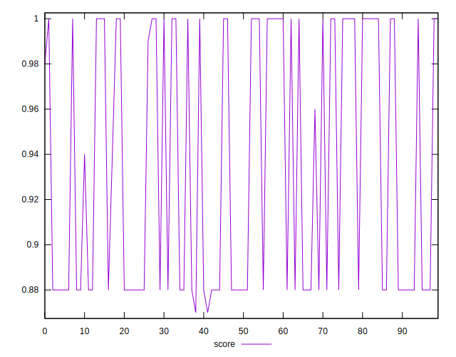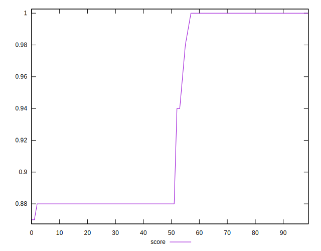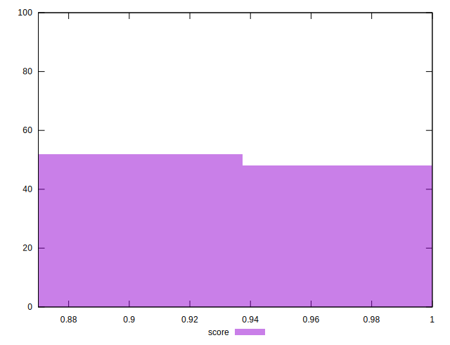
## Raw Estimate

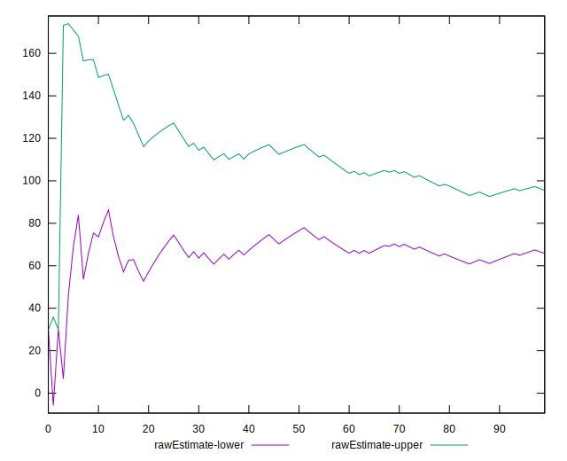
## Score Estimate

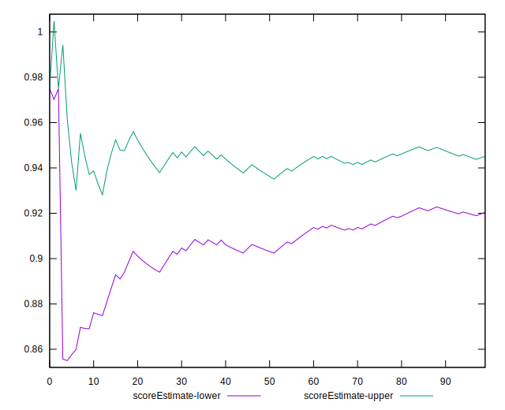
## P Score


```yaml
p90min: 0.875
p90max: 1
p90range: 0.125
p90mean: 0.9328014184397163
p90median: 0.875
p90stdev: 0.06105369723430822
p90skewness: 0.13894245628378565
p90eccentricity: 0.9999999999999988
p90discretization: 15.666666666666666
outlandishness: 1.0002471165763023
confidence: 0.024037320028420597
p90confidence: 0.02468460195843744

```

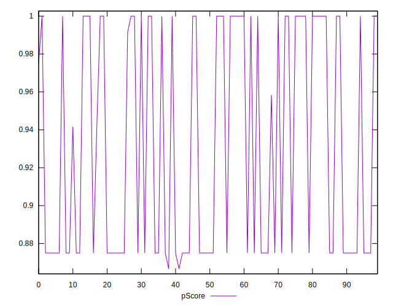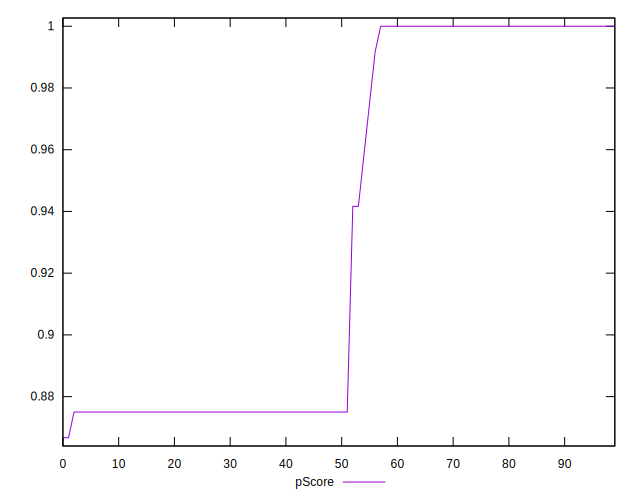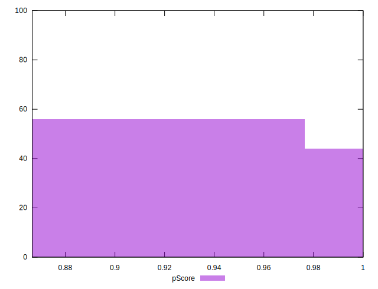
## Score Difference


```yaml
p90min: 0
p90max: 0
p90range: 0
p90mean: 0
p90median: 0
p90stdev: 0
p90skewness: .nan
p90eccentricity: .nan
p90discretization: 94
outlandishness: .inf
confidence: 6.092792000602812e-18
p90confidence: 0

```

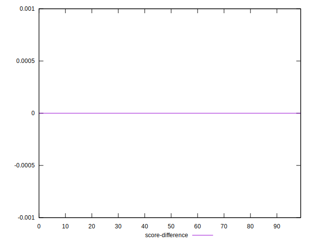
## P Score Difference


```yaml
p90min: -0.0050000000000000044
p90max: 0
p90range: 0.0050000000000000044
p90mean: -0.0026418439716312065
p90median: -0.0050000000000000044
p90stdev: 0.002460198228430566
p90skewness: 0.11692960483403637
p90eccentricity: 0.9999999999999992
p90discretization: 23.5
outlandishness: 0.9561952164316913
confidence: 0.0009924249889791126
p90confidence: 0.000994682005490991

```

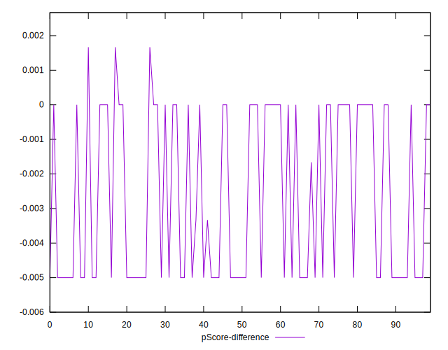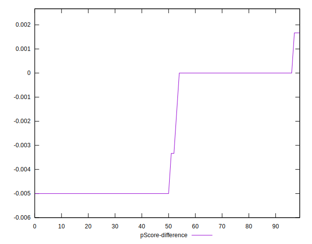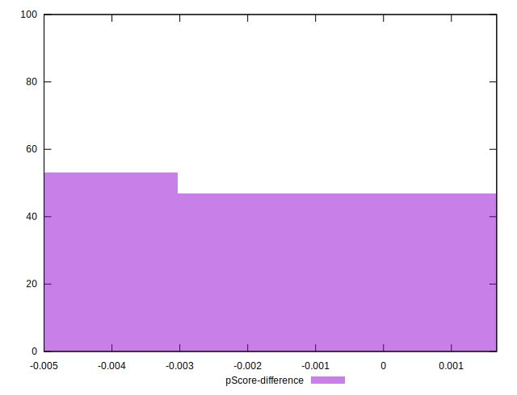