# //unminified-javascript/samples/pages+cached+noadtech

[→ Parent](../..)


## Raw


```yaml
p90min: 0
p90max: 150
p90range: 150
p90mean: 85.53191489361703
p90median: 150
p90stdev: 73.75371640512242
p90skewness: -0.29151743095099963
p90eccentricity: 0.9999999999999988
p90discretization: 23.5
outlandishness: 0.9899259975000615
confidence: 29.0365604950452
p90confidence: 29.819342888097463

```

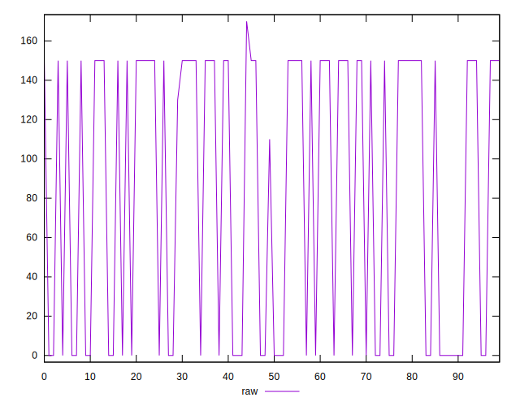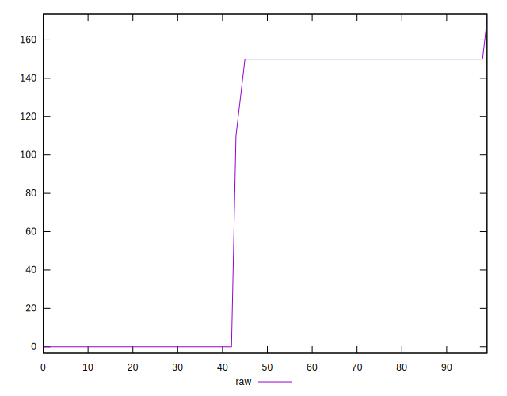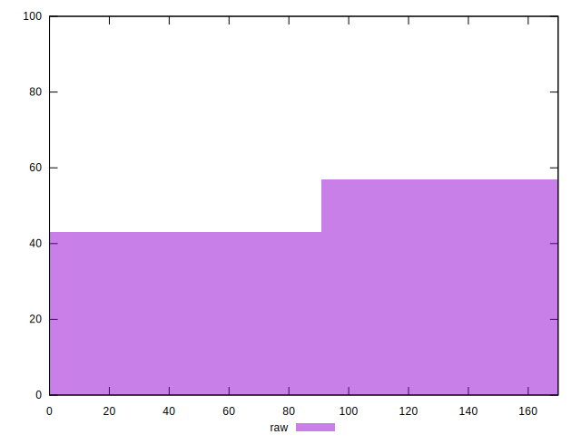
## Score


```yaml
p90min: 0.88
p90max: 1
p90range: 0.12
p90mean: 0.9314893617021274
p90median: 0.88
p90stdev: 0.05905204064084406
p90skewness: 0.2935971852629974
p90eccentricity: 0.999999999999998
p90discretization: 23.5
outlandishness: 1.0006670824323867
confidence: 0.023265887023871196
p90confidence: 0.023875312783409736

```

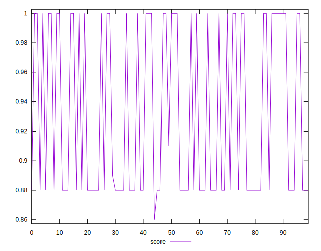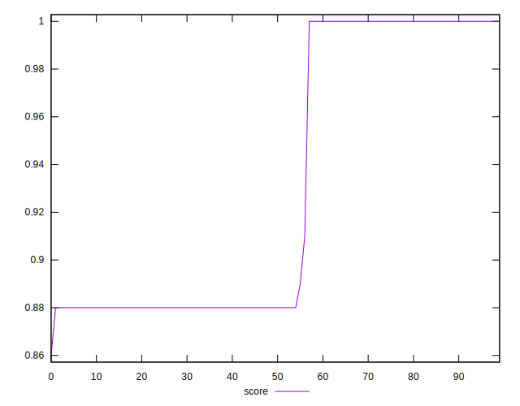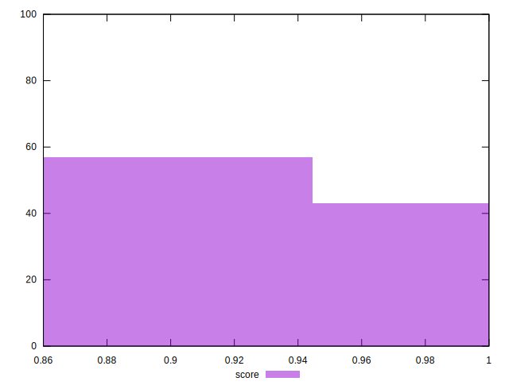
## Raw Estimate

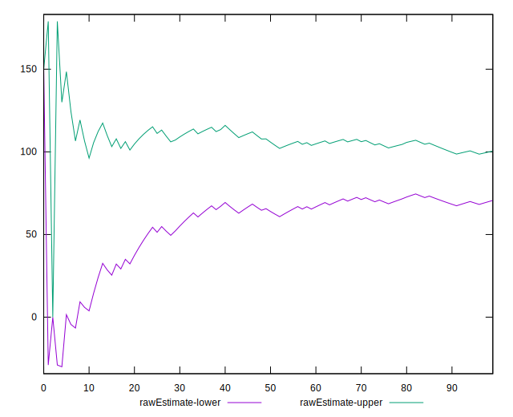
## Score Estimate

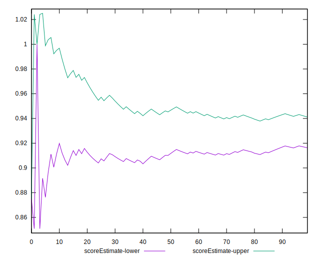
## P Score


```yaml
p90min: 0.875
p90max: 1
p90range: 0.125
p90mean: 0.9287234042553191
p90median: 0.875
p90stdev: 0.061461430337602034
p90skewness: 0.29151743095100247
p90eccentricity: 0.9999999999999984
p90discretization: 23.5
outlandishness: 1.00077525519885
confidence: 0.02419713374587098
p90confidence: 0.024849452406747893

```

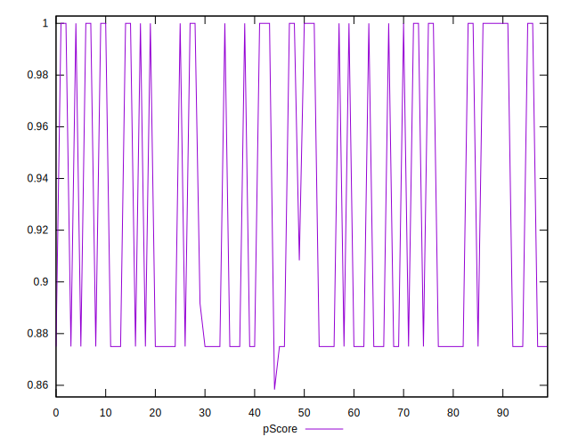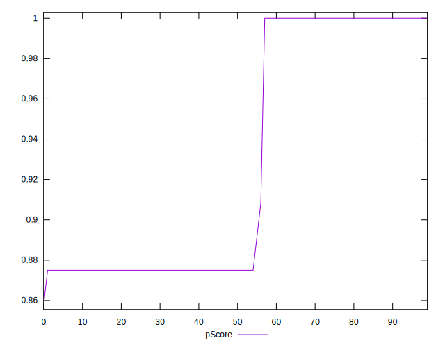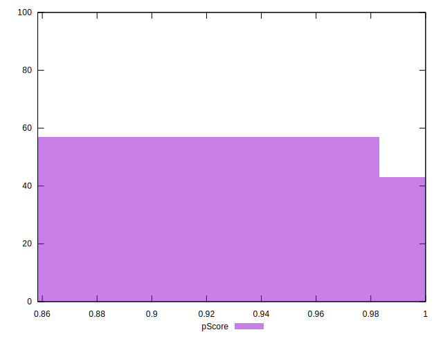
## Score Difference


```yaml
p90min: 0
p90max: 0
p90range: 0
p90mean: 0
p90median: 0
p90stdev: 0
p90skewness: .nan
p90eccentricity: .nan
p90discretization: 94
outlandishness: .nan
confidence: 0
p90confidence: 0

```


## P Score Difference


```yaml
p90min: -0.0050000000000000044
p90max: 0
p90range: 0.0050000000000000044
p90mean: -0.002748226950354612
p90median: -0.0050000000000000044
p90stdev: 0.0024637735430483427
p90skewness: 0.19295316791329498
p90eccentricity: 0.9999999999999999
p90discretization: 23.5
outlandishness: 0.9771641373569203
confidence: 0.0009762946784479494
p90confidence: 0.0009961275398683326

```

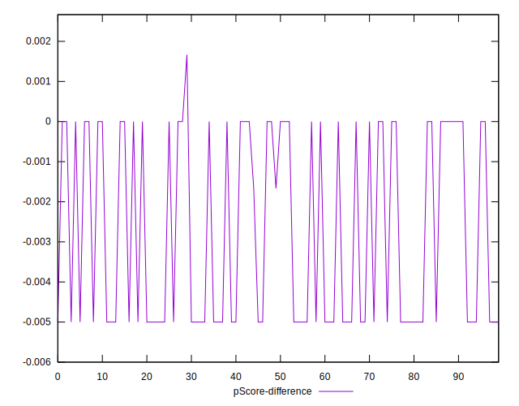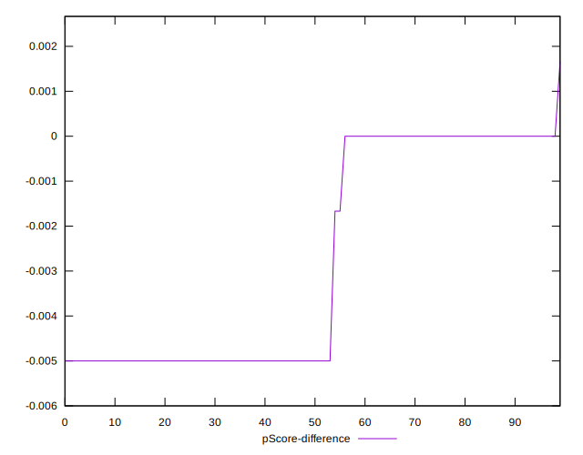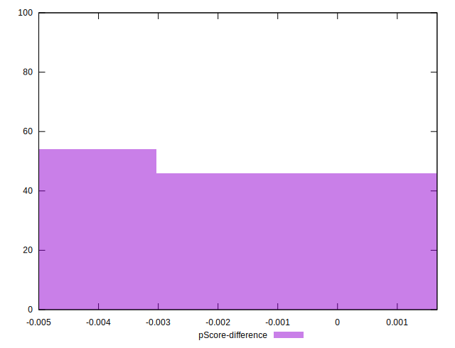