# //unused-css-rules/samples/pages+cached+noadtech+nomedia

[→ Parent](../..)


## Raw


```yaml
p90min: 80
p90max: 450
p90range: 370
p90mean: 304.36170212765956
p90median: 300
p90stdev: 85.2725107315626
p90skewness: -0.13239521784702368
p90eccentricity: 1.0000000000000018
p90discretization: 7.833333333333333
outlandishness: 0.9930355865579373
confidence: 42.58873206844446
p90confidence: 34.47650315634579

```

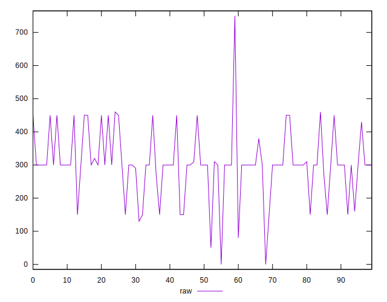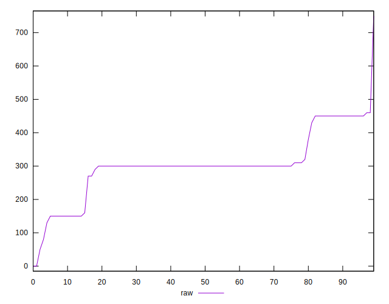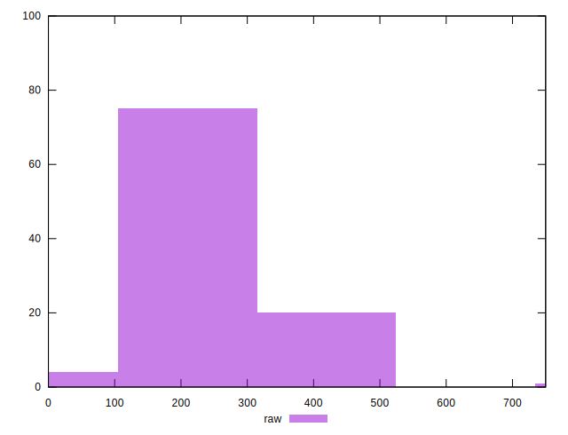
## Score


```yaml
p90min: 0.67
p90max: 0.93
p90range: 0.26
p90mean: 0.754893617021277
p90median: 0.75
p90stdev: 0.05995999873765242
p90skewness: 0.9507579797221034
p90eccentricity: 1.0000000000000016
p90discretization: 8.545454545454545
outlandishness: 1.0066513843644067
confidence: 0.029918168112810832
p90confidence: 0.02424240904833602

```

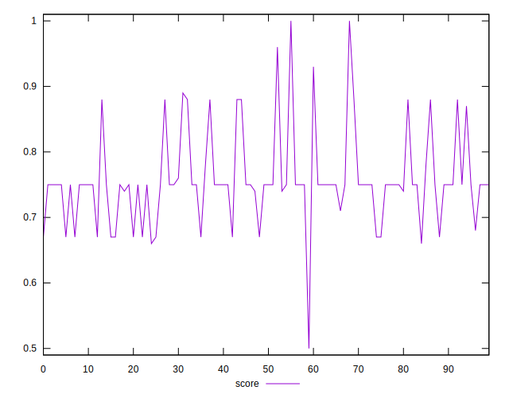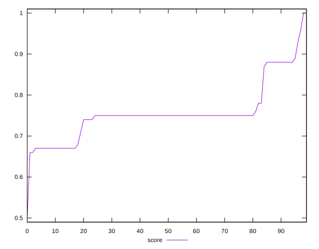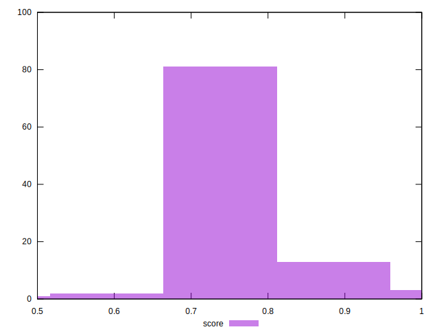
## Raw Estimate

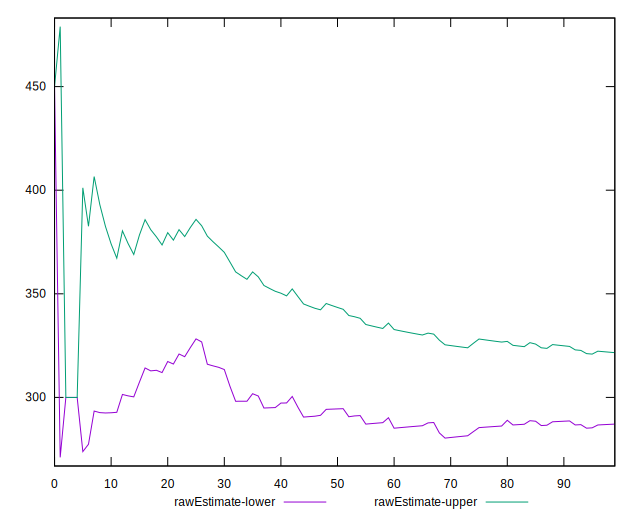
## Score Estimate

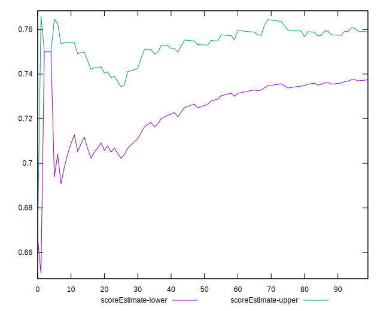
## P Score


```yaml
p90min: 0.6666666666666666
p90max: 0.9333333333333333
p90range: 0.2666666666666667
p90mean: 0.7537825059101653
p90median: 0.75
p90stdev: 0.05970586540513063
p90skewness: 0.859793863171144
p90eccentricity: 0.9999999999999992
p90discretization: 7.833333333333333
outlandishness: 1.0068534776011018
confidence: 0.02982995795894979
p90confidence: 0.024139660477129975

```

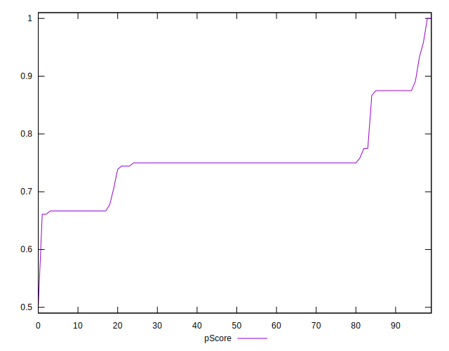
## Score Difference


```yaml
p90min: 0
p90max: 0
p90range: 0
p90mean: 0
p90median: 0
p90stdev: 0
p90skewness: .nan
p90eccentricity: .nan
p90discretization: 94
outlandishness: .nan
confidence: 0
p90confidence: 0

```


## P Score Difference


```yaml
p90min: -0.0050000000000000044
p90max: 0.0033333333333332993
p90range: 0.008333333333333304
p90mean: -0.0010874704491725896
p90median: 0
p90stdev: 0.001900318108967051
p90skewness: -0.8592158747280458
p90eccentricity: 1
p90discretization: 7.833333333333333
outlandishness: 0.9126479324196585
confidence: 0.0008560781037841283
p90confidence: 0.0007683170428522813

```

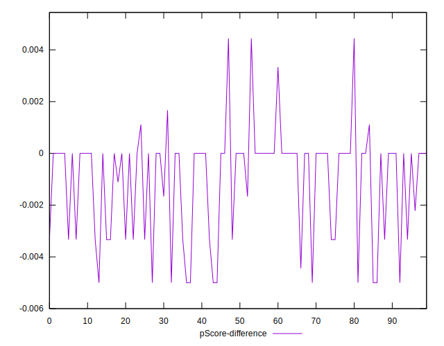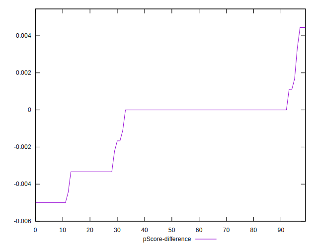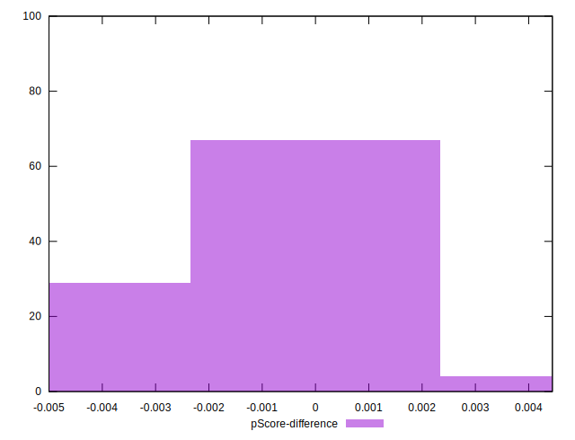