# //unused-css-rules/samples/pages

[→ Parent](../..)


## Raw


```yaml
p90min: 0
p90max: 600
p90range: 600
p90mean: 185.2127659574468
p90median: 150
p90stdev: 160.18426041231032
p90skewness: 0.6711870146484594
p90eccentricity: 0.9999999999999994
p90discretization: 2.6857142857142855
outlandishness: 1.0791164187298194
confidence: 68.47233411740422
p90confidence: 64.76405012967224

```

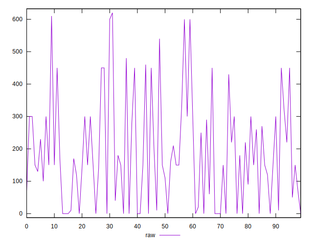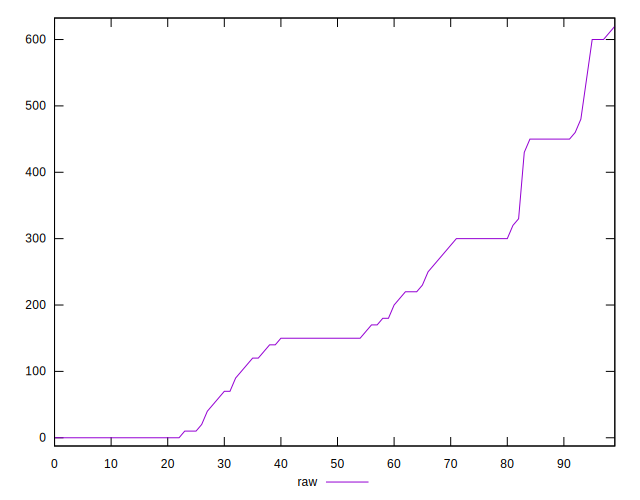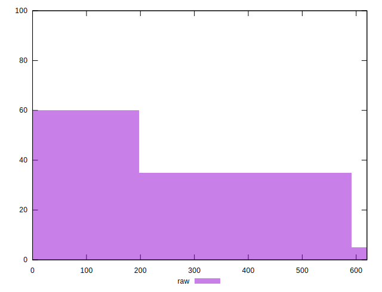
## Score


```yaml
p90min: 0.58
p90max: 1
p90range: 0.42000000000000004
p90mean: 0.8544680851063826
p90median: 0.88
p90stdev: 0.11923173414929462
p90skewness: -0.413882584551867
p90eccentricity: 0.9999999999999997
p90discretization: 2.9375
outlandishness: 0.9907337174273522
confidence: 0.05004437109357592
p90confidence: 0.04820654655842349

```

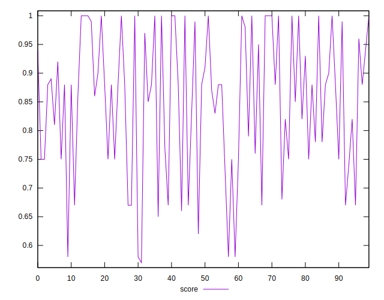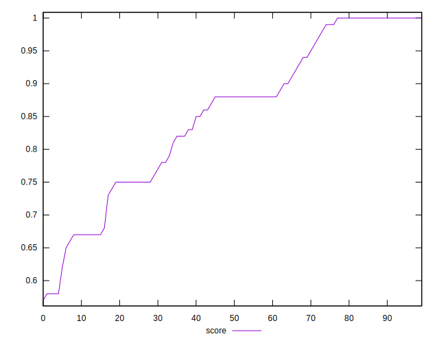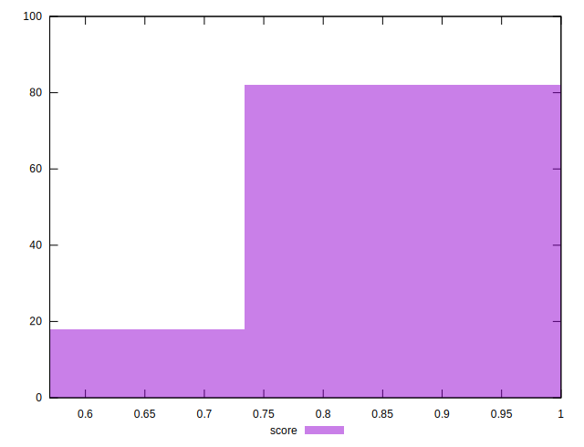
## Raw Estimate

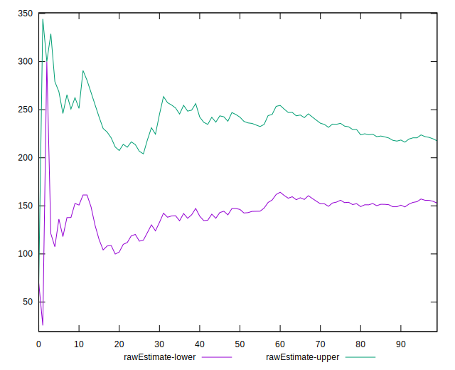
## Score Estimate

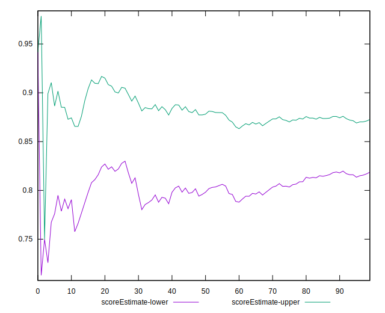
## P Score


```yaml
p90min: 0.5833333333333334
p90max: 1
p90range: 0.41666666666666663
p90mean: 0.8532210401891255
p90median: 0.875
p90stdev: 0.11953052535609729
p90skewness: -0.39138687534285094
p90eccentricity: 0.9999999999999994
p90discretization: 2.6857142857142855
outlandishness: 0.9909725666993802
confidence: 0.05010521107862396
p90confidence: 0.048327350741342985

```

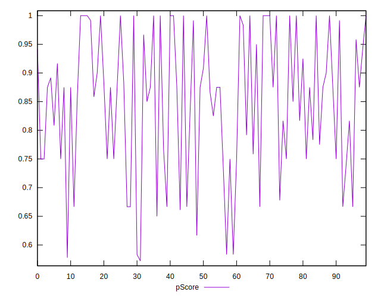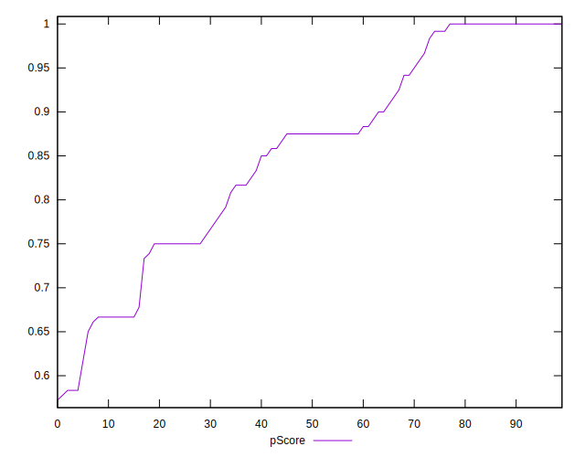
## Score Difference


```yaml
p90min: 0
p90max: 1.1102230246251565e-16
p90range: 1.1102230246251565e-16
p90mean: 7.086529944415892e-18
p90median: 0
p90stdev: 2.7139343474843184e-17
p90skewness: 3.568591947091801
p90eccentricity: 0.9999999999999984
p90discretization: 47
outlandishness: 1.9881000000000004
confidence: 1.2454613861688422e-17
p90confidence: 1.0972699794392905e-17

```

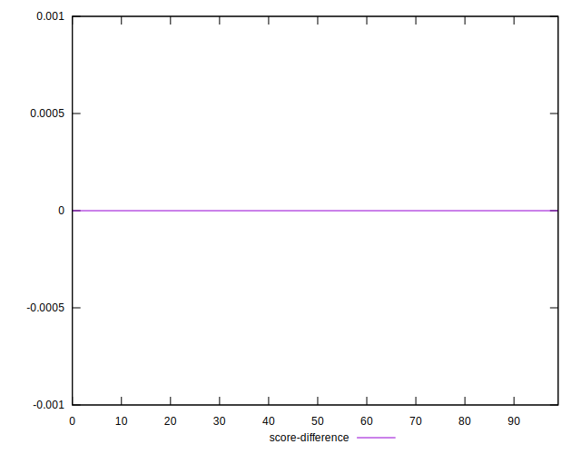
## P Score Difference


```yaml
p90min: -0.0050000000000000044
p90max: 0.0033333333333332993
p90range: 0.008333333333333304
p90mean: -0.001158392434988187
p90median: 0
p90stdev: 0.0024116372143229326
p90skewness: -0.15602272855217705
p90eccentricity: 0.9999999999999987
p90discretization: 7.230769230769231
outlandishness: 0.9666100062473929
confidence: 0.0010005158672972668
p90confidence: 0.0009750483164885927

```

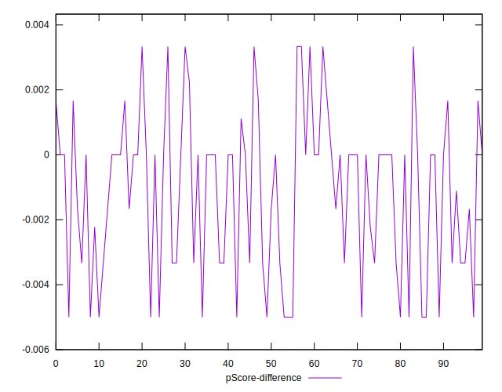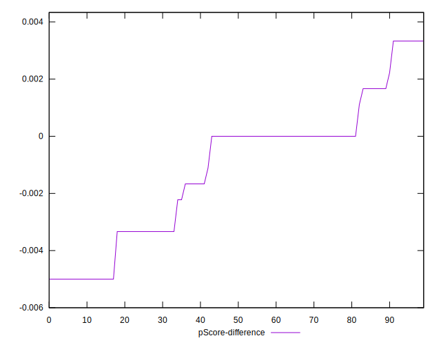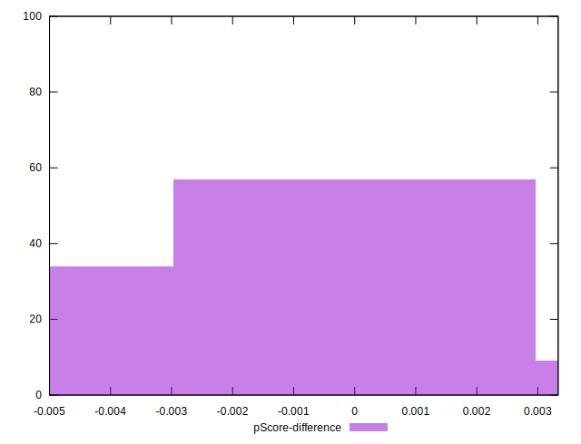