# //unused-javascript/samples/pages+cached+noadtech+nomedia

[→ Parent](../..)


## Raw


```yaml
p90min: 750
p90max: 2280
p90range: 1530
p90mean: 1842.0212765957447
p90median: 2050
p90stdev: 493.9260427609778
p90skewness: -1.4373172319258594
p90eccentricity: 1.0000000000000004
p90discretization: 2.9375
outlandishness: 0.9775207808178684
confidence: 205.26000538468904
p90confidence: 199.6990897319412

```

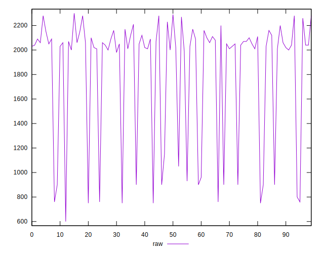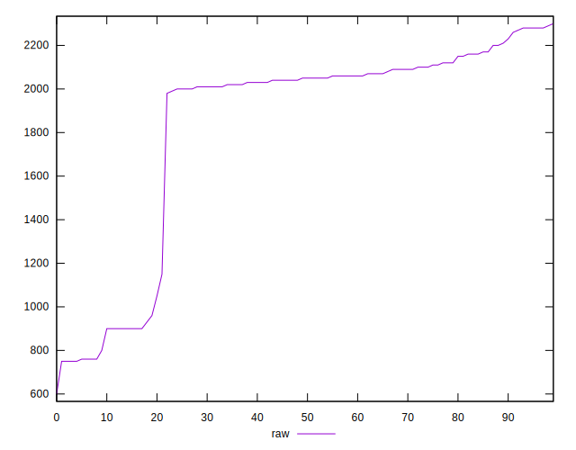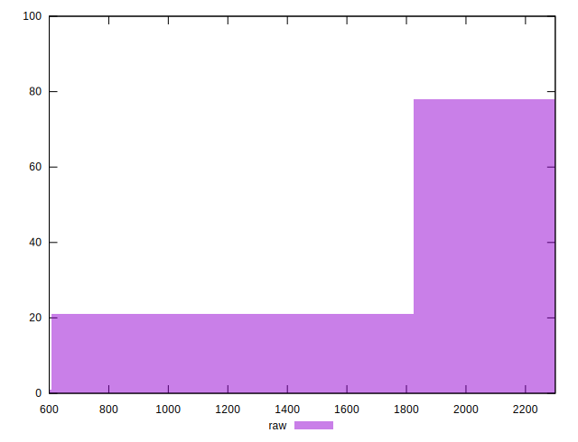
## Score


```yaml
p90min: 0.32
p90max: 0.5
p90range: 0.18
p90mean: 0.3712765957446811
p90median: 0.35
p90stdev: 0.057819124469058604
p90skewness: 1.4352811811899384
p90eccentricity: 1
p90discretization: 9.4
outlandishness: 1.0168959868638183
confidence: 0.024725518576860218
p90confidence: 0.023376832816965662

```

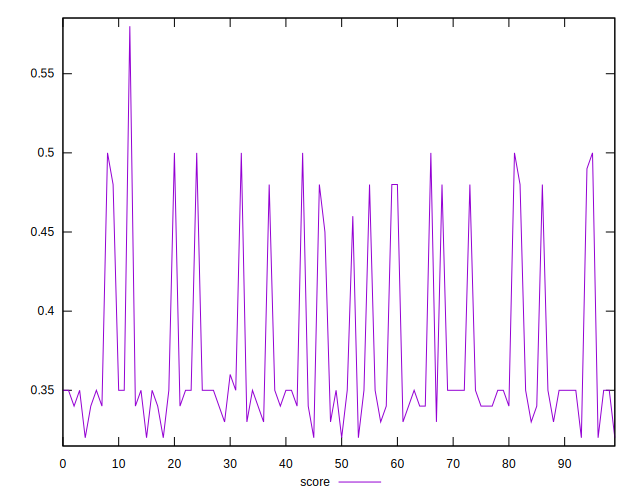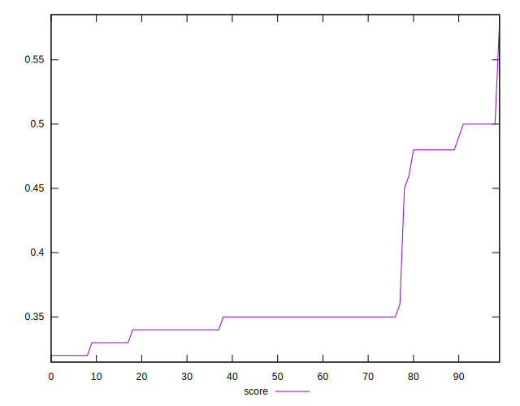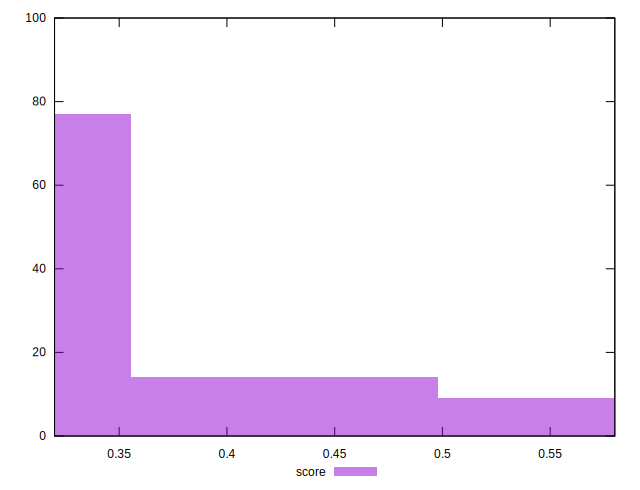
## Raw Estimate

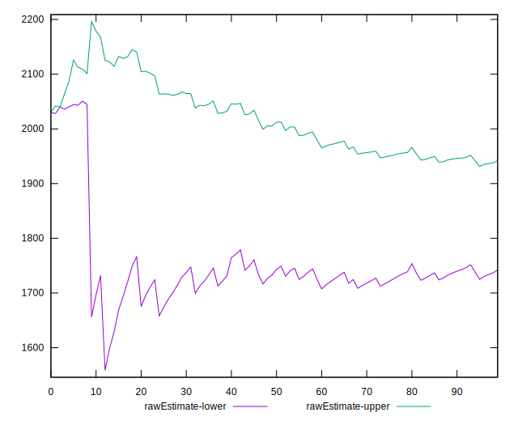
## Score Estimate

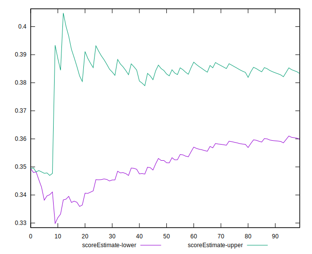
## P Score


```yaml
p90min: 0.32
p90max: 0.5
p90range: 0.18
p90mean: 0.37152690863579474
p90median: 0.34705882352941175
p90stdev: 0.058108946207173856
p90skewness: 1.437317231925856
p90eccentricity: 1.0000000000000004
p90discretization: 2.9375
outlandishness: 1.0167923851665637
confidence: 0.024873739652372374
p90confidence: 0.023494010556698964

```

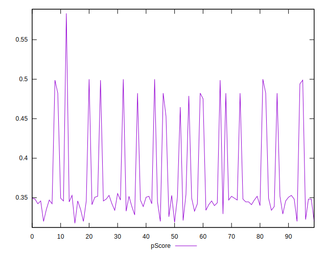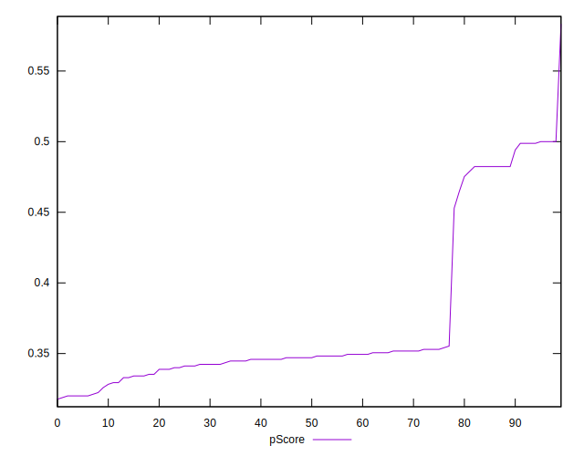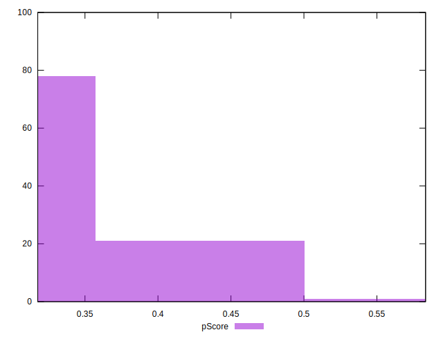
## Score Difference


```yaml
p90min: 0
p90max: 5.551115123125783e-17
p90range: 5.551115123125783e-17
p90mean: 2.1259589833247678e-17
p90median: 0
p90stdev: 2.6984702082290925e-17
p90skewness: 0.4814569204856487
p90eccentricity: 0.9999999999999992
p90discretization: 47
outlandishness: 1.0370027777777777
confidence: 1.0613424671180695e-17
p90confidence: 1.0910176779499944e-17

```

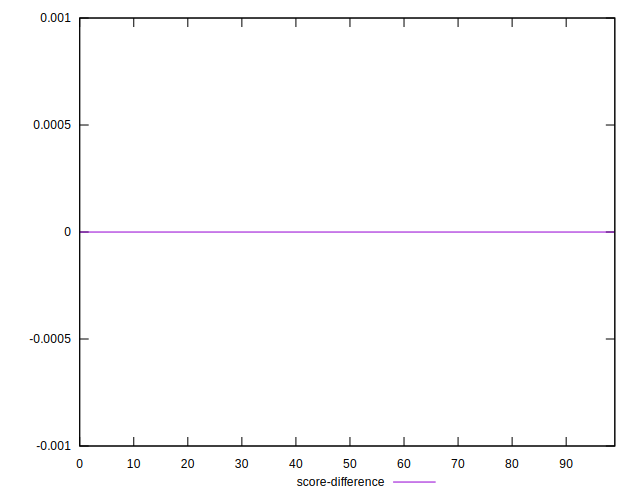
## P Score Difference


```yaml
p90min: -0.004705882352941171
p90max: 0.004705882352941171
p90range: 0.009411764705882342
p90mean: 0.0002482269503546127
p90median: 0
p90stdev: 0.0024460401662941902
p90skewness: -0.191863258847258
p90eccentricity: 1.0000000000000002
p90discretization: 4.086956521739131
outlandishness: 0.8835999999999999
confidence: 0.0010338746404625649
p90confidence: 0.0009889577636486334

```

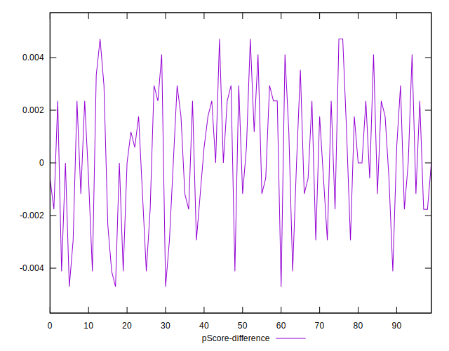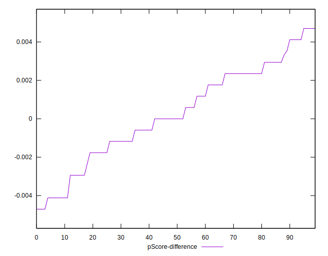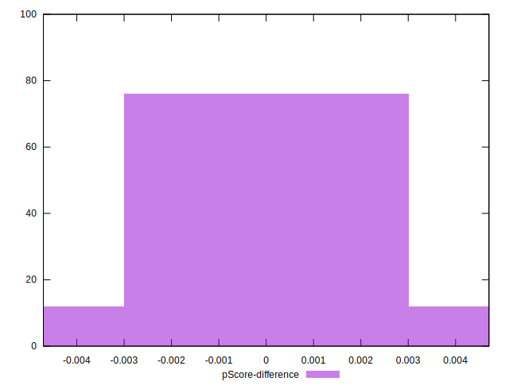