# //unused-javascript/samples/pages+cached+noadtech

[→ Parent](../..)


## Raw


```yaml
p90min: 610
p90max: 2310
p90range: 1700
p90mean: 1901.9148936170213
p90median: 2065
p90stdev: 501.22037578028386
p90skewness: -1.559351118808374
p90eccentricity: 1.0000000000000002
p90discretization: 2.611111111111111
outlandishness: 0.969825046819864
confidence: 214.35268675925465
p90confidence: 202.64825932019468

```

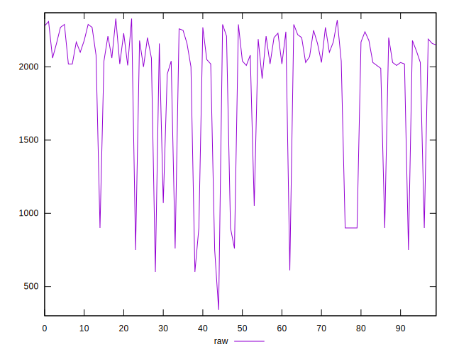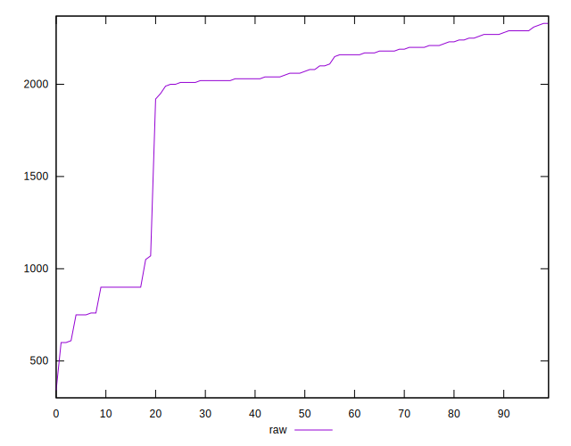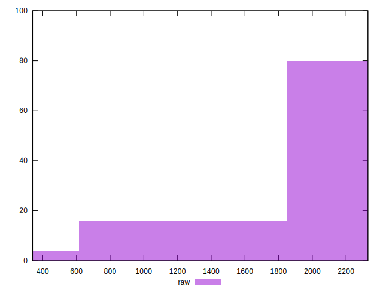
## Score


```yaml
p90min: 0.32
p90max: 0.58
p90range: 0.25999999999999995
p90mean: 0.364468085106383
p90median: 0.345
p90stdev: 0.06075092191361755
p90skewness: 1.6846415710837248
p90eccentricity: 0.9999999999999997
p90discretization: 10.444444444444445
outlandishness: 1.035606235241716
confidence: 0.029781625335244834
p90confidence: 0.02456218695963066

```

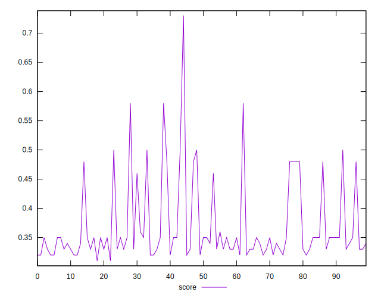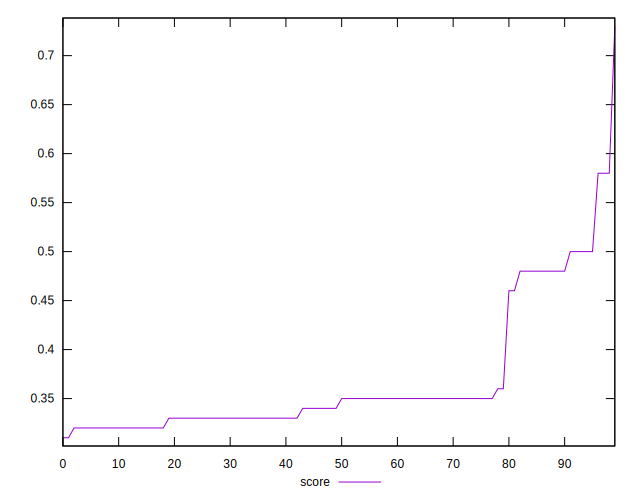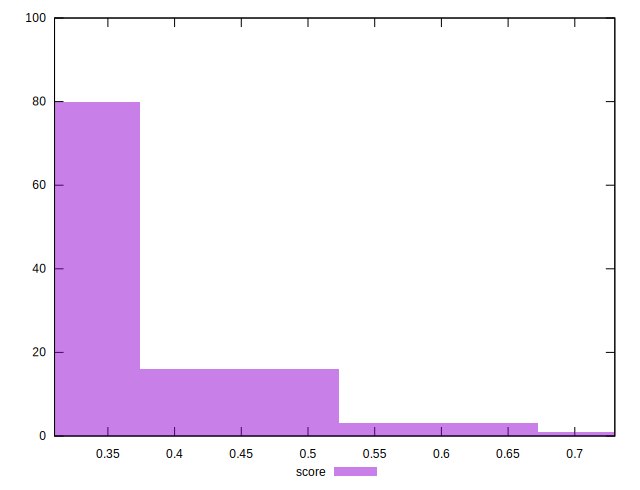
## Raw Estimate

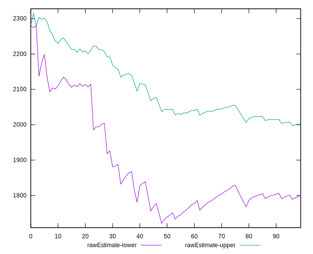
## Score Estimate

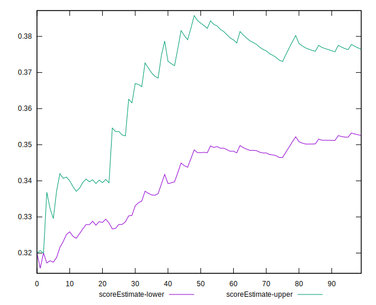
## P Score


```yaml
p90min: 0.3164705882352941
p90max: 0.5777777777777777
p90range: 0.2613071895424836
p90mean: 0.3651328048950076
p90median: 0.34529411764705886
p90stdev: 0.06095027212675351
p90skewness: 1.6709029708810124
p90eccentricity: 1.0000000000000002
p90discretization: 2.611111111111111
outlandishness: 1.0357630122264279
confidence: 0.02983883768277466
p90confidence: 0.02464278618432144

```

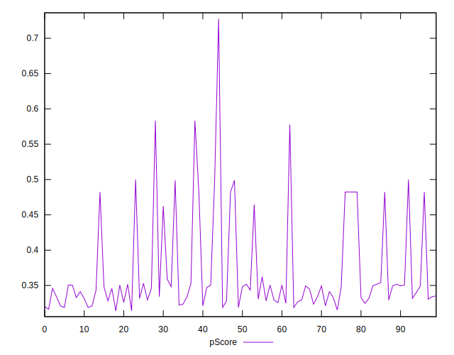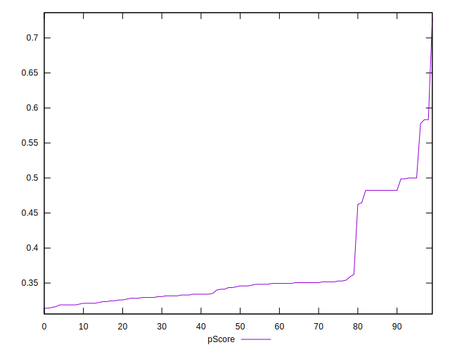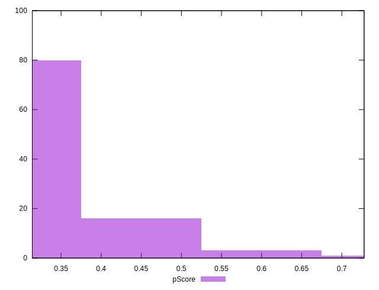
## Score Difference


```yaml
p90min: 0
p90max: 5.551115123125783e-17
p90range: 5.551115123125783e-17
p90mean: 1.4763604050866443e-17
p90median: 0
p90stdev: 2.452714114232023e-17
p90skewness: 1.0593955071547683
p90eccentricity: 0.9999999999999997
p90discretization: 47
outlandishness: 1.1083878400000005
confidence: 9.770202940771153e-18
p90confidence: 9.916561055312632e-18

```

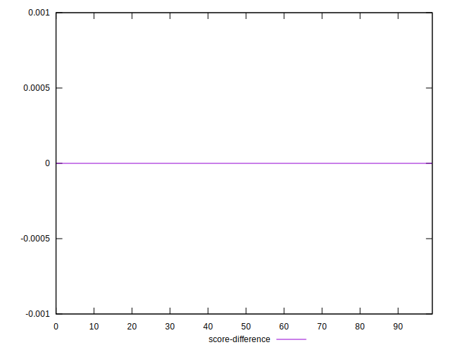
## P Score Difference


```yaml
p90min: -0.004117647058823559
p90max: 0.004705882352941171
p90range: 0.00882352941176473
p90mean: 0.0007432902238909747
p90median: 0.0005882352941176672
p90stdev: 0.002230611175849819
p90skewness: -0.2677665674014892
p90eccentricity: 0.9999999999999999
p90discretization: 3.9166666666666665
outlandishness: 0.8985408343476886
confidence: 0.0009583250368857146
p90confidence: 0.000901857733342212

```

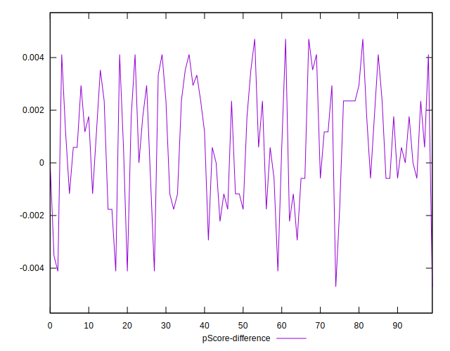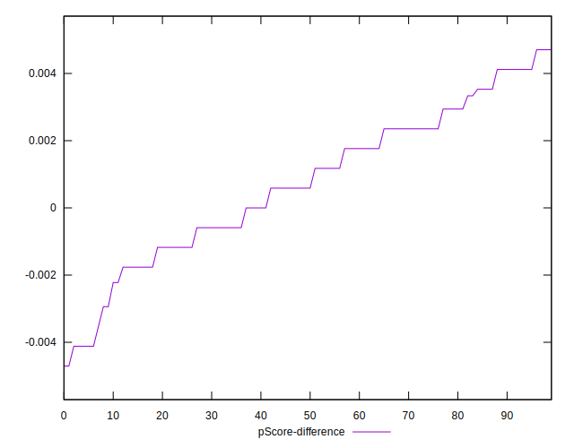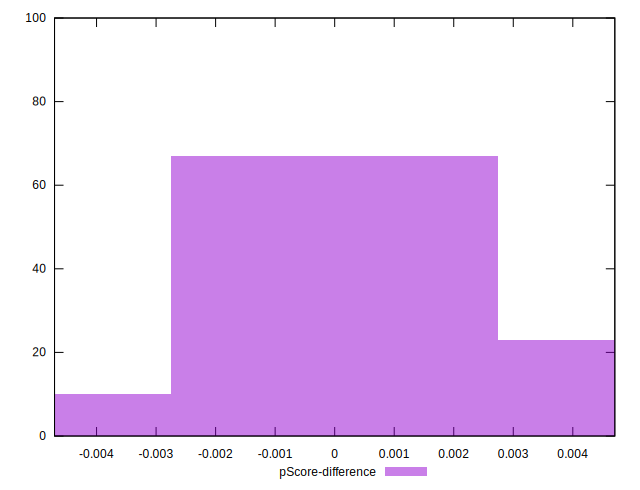