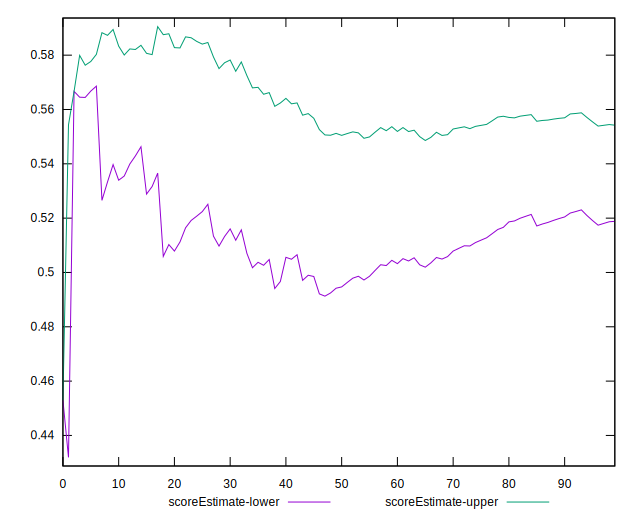
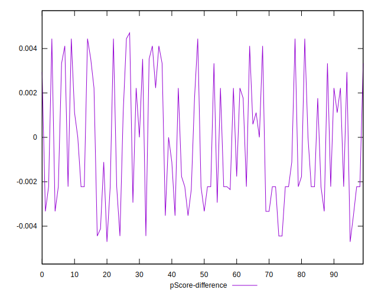

# //uses-http2/samples/pages+cached+noadtech+nomedia+nocss

[→ Parent](../..)


## Raw


```yaml
p90min: 460
p90max: 1160
p90range: 700
p90mean: 684.2553191489362
p90median: 610
p90stdev: 157.61850902289444
p90skewness: 1.2363747466238735
p90eccentricity: 1.0000000000000002
p90discretization: 2.238095238095238
outlandishness: 1.0298715477339668
confidence: 75.10590172318726
p90confidence: 63.726691957423014

```


## Score


```yaml
p90min: 0.45
p90max: 0.66
p90range: 0.21000000000000002
p90mean: 0.5554255319148932
p90median: 0.58
p90stdev: 0.05352797824039592
p90skewness: -0.30865526323693526
p90eccentricity: 1.0000000000000002
p90discretization: 4.2727272727272725
outlandishness: 1.001709214694785
confidence: 0.02359845473192806
p90confidence: 0.021641880776412332

```


## Raw Estimate


## Score Estimate


## P Score


```yaml
p90min: 0.45176470588235296
p90max: 0.6611111111111111
p90range: 0.20934640522875814
p90mean: 0.555392156862745
p90median: 0.5777777777777777
p90stdev: 0.05322998573772199
p90skewness: -0.27786277365963835
p90eccentricity: 0.9999999999999991
p90discretization: 2.238095238095238
outlandishness: 1.0010170280932529
confidence: 0.023487470226982162
p90confidence: 0.021521399517318806

```


## Score Difference


```yaml
p90min: 0
p90max: 1.1102230246251565e-16
p90range: 1.1102230246251565e-16
p90mean: 1.0039250754589182e-17
p90median: 0
p90stdev: 3.025638476747005e-17
p90skewness: 2.844319316612869
p90eccentricity: 0.9999999999999994
p90discretization: 31.333333333333332
outlandishness: 1.6173854671280277
confidence: 1.3362465195416817e-17
p90confidence: 1.2232949821532465e-17

```


## P Score Difference


```yaml
p90min: -0.004444444444444473
p90max: 0.004444444444444473
p90range: 0.008888888888888946
p90mean: -0.00023710193297176742
p90median: -0.001764705882352946
p90stdev: 0.0028238787215386783
p90skewness: 0.32939497033646087
p90eccentricity: 0.9999999999999994
p90discretization: 3.4814814814814814
outlandishness: 0.9044512001100756
confidence: 0.0011598473017021295
p90confidence: 0.0011417215562321923

```

