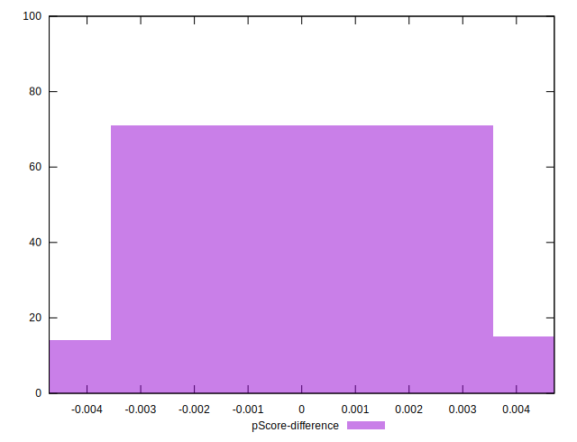

# //uses-http2/samples/pages+cached+noadtech

[→ Parent](../..)


## Raw


```yaml
p90min: 440
p90max: 1420
p90range: 980
p90mean: 817.7659574468086
p90median: 770
p90stdev: 246.90059269044255
p90skewness: 0.7029761232488441
p90eccentricity: 0.9999999999999996
p90discretization: 1.6206896551724137
outlandishness: 1.017770461175906
confidence: 114.05777976734895
p90confidence: 99.82430434108204

```


## Score


```yaml
p90min: 0.42
p90max: 0.67
p90range: 0.25000000000000006
p90mean: 0.5199999999999999
p90median: 0.5
p90stdev: 0.06331279995623217
p90skewness: 0.5125698013955488
p90eccentricity: 0.9999999999999999
p90discretization: 3.9166666666666665
outlandishness: 1.0138940828402365
confidence: 0.030411770287249496
p90confidence: 0.025597979100200098

```


## Raw Estimate


## Score Estimate


## P Score


```yaml
p90min: 0.42117647058823526
p90max: 0.6722222222222223
p90range: 0.251045751633987
p90mean: 0.5201654846335699
p90median: 0.4976470588235294
p90stdev: 0.0629921611534106
p90skewness: 0.5128896052029379
p90eccentricity: 1.0000000000000004
p90discretization: 1.6206896551724137
outlandishness: 1.0145016164334528
confidence: 0.030283452761989755
p90confidence: 0.025468341722307893

```


## Score Difference


```yaml
p90min: 0
p90max: 5.551115123125783e-17
p90range: 5.551115123125783e-17
p90mean: 1.771632486103973e-18
p90median: 0
p90stdev: 9.757390901081479e-18
p90skewness: 5.326002287485492
p90eccentricity: 1.0000000000000049
p90discretization: 47
outlandishness: 4.810711111111114
confidence: 6.34779803965686e-18
p90confidence: 3.9450077793278885e-18

```


## P Score Difference


```yaml
p90min: -0.004705882352941171
p90max: 0.004444444444444473
p90range: 0.009150326797385644
p90mean: 0.00034418022528160373
p90median: 0.0011111111111110628
p90stdev: 0.0028923962926224304
p90skewness: -0.25485354315587183
p90eccentricity: 1
p90discretization: 3.032258064516129
outlandishness: 0.8836000000000002
confidence: 0.0011889342373777511
p90confidence: 0.0011694238747809033

```

