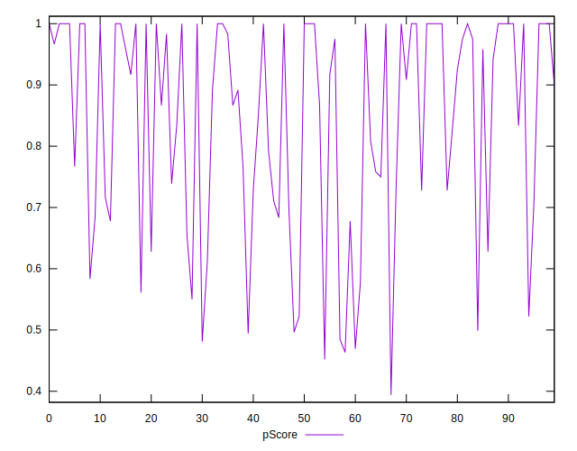

# //uses-http2/samples/pages

[→ Parent](../..)


## Raw


```yaml
p90min: 0
p90max: 1010
p90range: 1010
p90mean: 213.08510638297872
p90median: 100
p90stdev: 262.24897458674104
p90skewness: 1.1773055708616003
p90eccentricity: 1.000000000000001
p90discretization: 2.186046511627907
outlandishness: 1.2580259814970502
confidence: 125.26914736891726
p90confidence: 106.0298040074203

```


## Score


```yaml
p90min: 0.47
p90max: 1
p90range: 0.53
p90mean: 0.8474468085106378
p90median: 0.92
p90stdev: 0.17236117553045385
p90skewness: -0.7795807133451973
p90eccentricity: 1.000000000000001
p90discretization: 2.6857142857142855
outlandishness: 0.9815670311099356
confidence: 0.07199856669171288
p90confidence: 0.06968729501719306

```


## Raw Estimate


## Score Estimate


## P Score


```yaml
p90min: 0.46941176470588236
p90max: 1
p90range: 0.5305882352941176
p90mean: 0.8470122375191208
p90median: 0.9166666666666666
p90stdev: 0.17211630853465726
p90skewness: -0.7714074646556276
p90eccentricity: 0.9999999999999996
p90discretization: 2.186046511627907
outlandishness: 0.9818388108571889
confidence: 0.07182456034321454
p90confidence: 0.06958829291580024

```


## Score Difference


```yaml
p90min: 0
p90max: 1.1102230246251565e-16
p90range: 1.1102230246251565e-16
p90mean: 2.9527208101732887e-18
p90median: 0
p90stdev: 1.6920919490504977e-17
p90skewness: 5.856608956366593
p90eccentricity: 0.9999999999999976
p90discretization: 31.333333333333332
outlandishness: 4.276624
confidence: 9.680130628467232e-18
p90confidence: 6.841291867893119e-18

```


## P Score Difference


```yaml
p90min: -0.0050000000000000044
p90max: 0.004117647058823504
p90range: 0.009117647058823508
p90mean: -0.0003160200250312928
p90median: 0
p90stdev: 0.0020536042045247184
p90skewness: -0.0938965821150253
p90eccentricity: 1.0000000000000007
p90discretization: 3.9166666666666665
outlandishness: 0.9896419237523276
confidence: 0.0009022503807189806
p90confidence: 0.0008302920980251526

```

