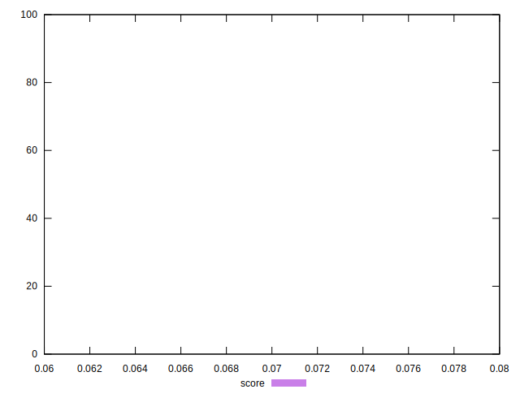

# //uses-long-cache-ttl/samples/pages+cached+noadtech

[→ Parent](../..)


## Raw


```yaml
p90min: 784855.3666666667
p90max: 784858.0166666666
p90range: 2.6499999999068677
p90mean: 784857.4246453893
p90median: 784858.0166666666
p90stdev: 1.103796716316474
p90skewness: -1.3281045527589166
p90eccentricity: 1.000000000000003
p90discretization: 47
outlandishness: 0.99998987637276
confidence: 15.409075049683969
p90confidence: 0.44627571825398843

```


## Score


```yaml
p90min: 0.07
p90max: 0.07
p90range: 0
p90mean: 0.07000000000000008
p90median: 0.07
p90stdev: 6.938893903907228e-17
p90skewness: -1
p90eccentricity: 1
p90discretization: 94
outlandishness: 1.0000000000000004
confidence: 3.26399571460865e-17
p90confidence: 2.8054621064541785e-17

```


## Raw Estimate


## Score Estimate


## P Score


```yaml
p90min: 0.06562860522397074
p90max: 0.06562896892217418
p90range: 3.636982034427305e-7
p90mean: 0.06562868647569702
p90median: 0.06562860522397074
p90stdev: 1.5149014441675308e-7
p90skewness: 1.3281045554828097
p90eccentricity: 0.9999999999999984
p90discretization: 47
outlandishness: 1.000016625602071
confidence: 0.0000021160168246534857
p90confidence: 6.124893470746948e-8

```


## Score Difference


```yaml
p90min: 0
p90max: 0
p90range: 0
p90mean: 0
p90median: 0
p90stdev: 0
p90skewness: .nan
p90eccentricity: .nan
p90discretization: 94
outlandishness: .nan
confidence: 0
p90confidence: 0

```


## P Score Difference


```yaml
p90min: -0.004371394776029269
p90max: -0.0043710310778258266
p90range: 3.636982034427305e-7
p90mean: -0.004371313524302968
p90median: -0.004371394776029269
p90stdev: 1.51490144416753e-7
p90skewness: 1.3281045550190442
p90eccentricity: 1.0000000000000016
p90discretization: 47
outlandishness: 0.9997504082474952
confidence: 0.0000021160168246534857
p90confidence: 6.124893470746944e-8

```

