# //uses-long-cache-ttl/samples/pages

[→ Parent](../..)


## Raw


```yaml
p90min: 1305653.011027894
p90max: 1391200.4609096833
p90range: 85547.44988178927
p90mean: 1362478.00749714
p90median: 1389344.799736557
p90stdev: 39132.28499979381
p90skewness: -0.7237374343281807
p90eccentricity: 1
p90discretization: 1
outlandishness: 0.9987663886236471
confidence: 15485.85037327405
p90confidence: 15821.562373805476

```

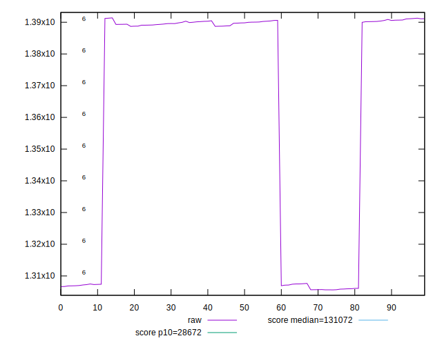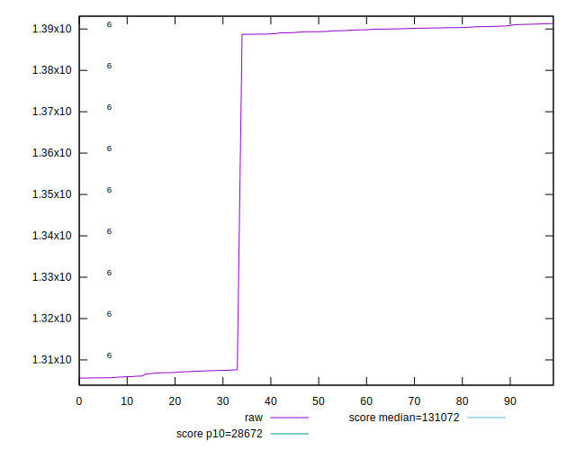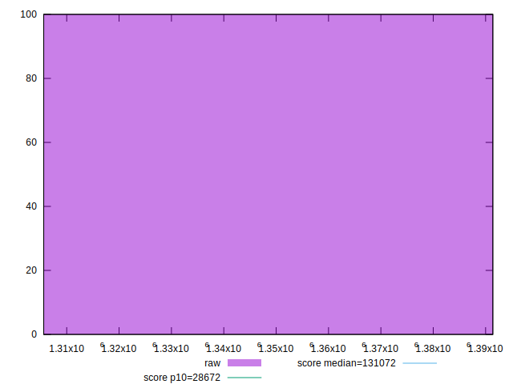
## Score


```yaml
p90min: 0.02
p90max: 0.03
p90range: 0.009999999999999998
p90mean: 0.02329787234042555
p90median: 0.02
p90stdev: 0.0047013574029753915
p90skewness: 0.7241005155222733
p90eccentricity: 1.0000000000000002
p90discretization: 47
outlandishness: 1.0087863389003566
confidence: 0.001856904261790318
p90confidence: 0.0019008043970118078

```

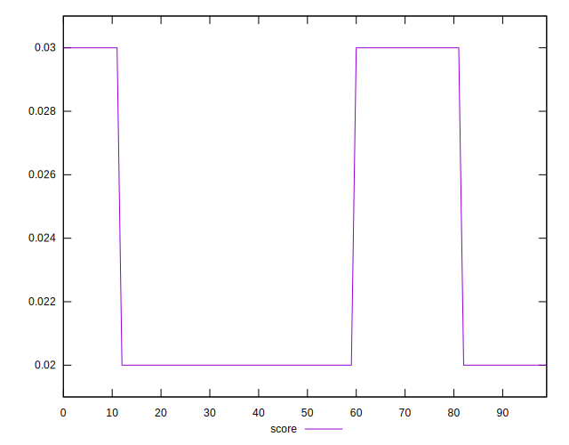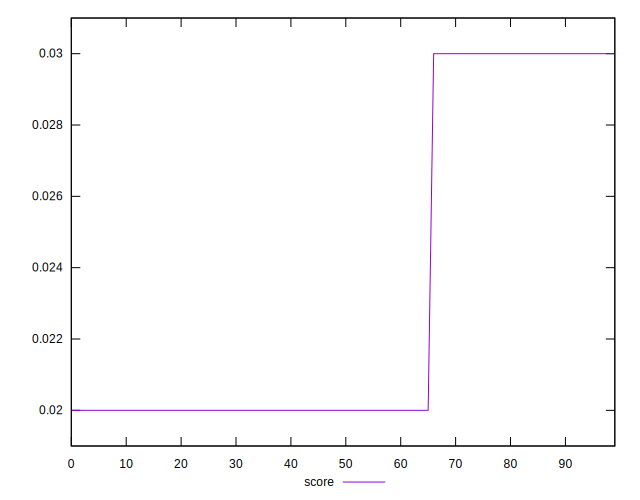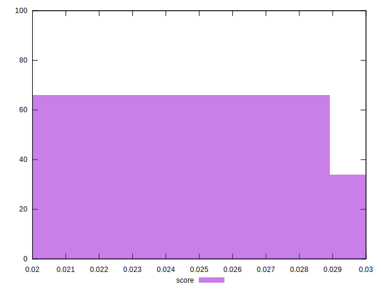
## Raw Estimate

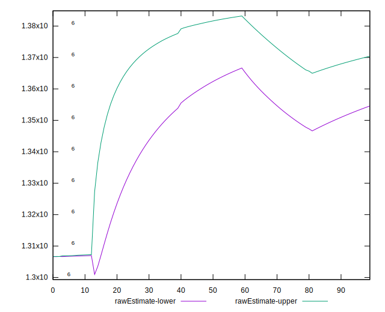
## Score Estimate

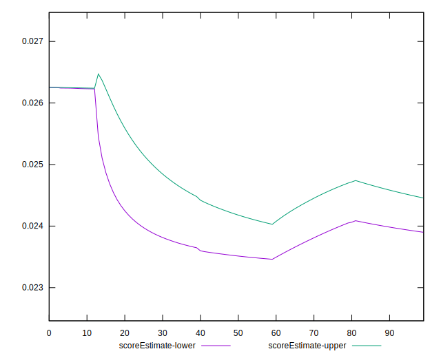
## P Score


```yaml
p90min: 0.023194239273719885
p90max: 0.02629166574248848
p90range: 0.0030974264687685937
p90mean: 0.024230649250196353
p90median: 0.02325607253181572
p90stdev: 0.0014170628529414481
p90skewness: 0.723901255766672
p90eccentricity: 1.0000000000000004
p90discretization: 1
outlandishness: 1.0025325563276224
confidence: 0.0005607960863705648
p90confidence: 0.0005729322556946008

```

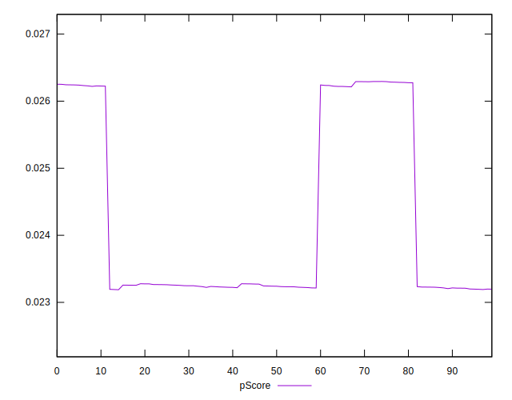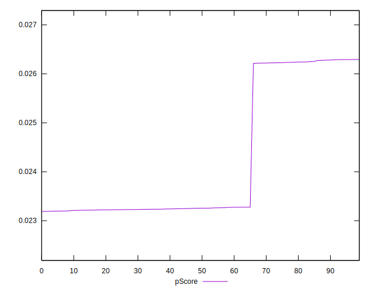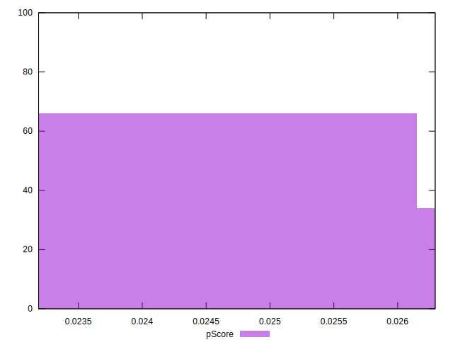
## Score Difference


```yaml
p90min: 0
p90max: 0
p90range: 0
p90mean: 0
p90median: 0
p90stdev: 0
p90skewness: .nan
p90eccentricity: .nan
p90discretization: 94
outlandishness: .nan
confidence: 0
p90confidence: 0

```


## P Score Difference


```yaml
p90min: -0.003780104008058033
p90max: 0.003275719374022785
p90range: 0.007055823382080818
p90mean: 0.0009324498043793513
p90median: 0.003215692239113683
p90stdev: 0.003279185957671955
p90skewness: -0.7240623485666299
p90eccentricity: 1.0000000000000007
p90discretization: 1
outlandishness: 0.8532389387955673
confidence: 0.0012962431276551153
p90confidence: 0.001325806687876449

```

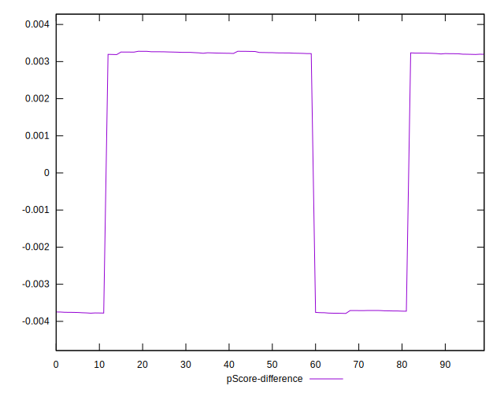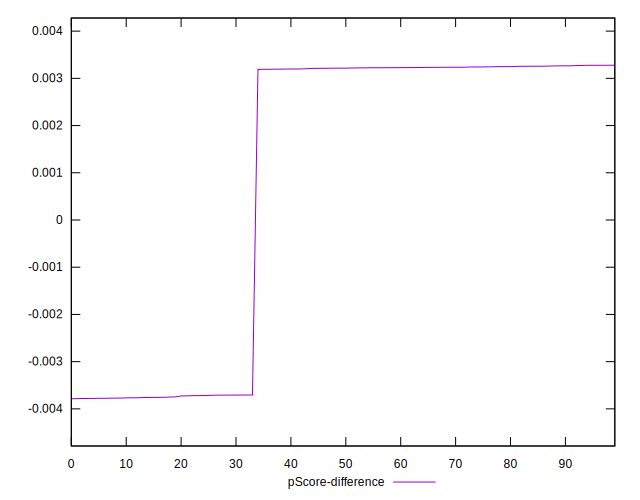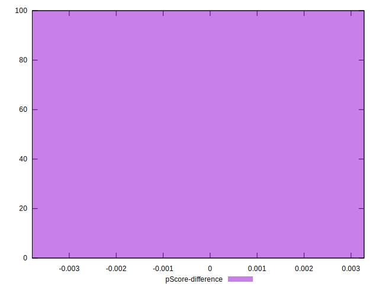