# //uses-rel-preconnect/samples/pages+cached+noadtech

[→ Parent](../..)


## Raw


```yaml
p90min: 108.93499994277954
p90max: 367.7790000140667
p90range: 258.84400007128716
p90mean: 300.1849574462733
p90median: 301.345
p90stdev: 33.1151434137424
p90skewness: -3.399795576791875
p90eccentricity: 1.000000000000001
p90discretization: 1.0930232558139534
outlandishness: 0.9831892754456321
confidence: 21.43012909088043
p90confidence: 13.388773669638756

```

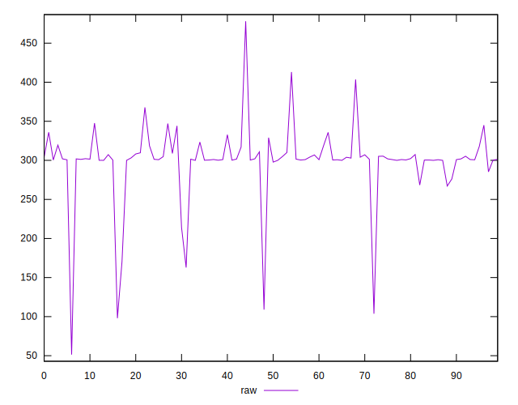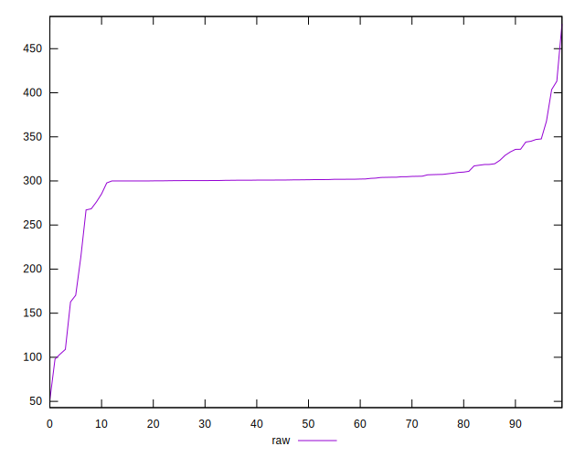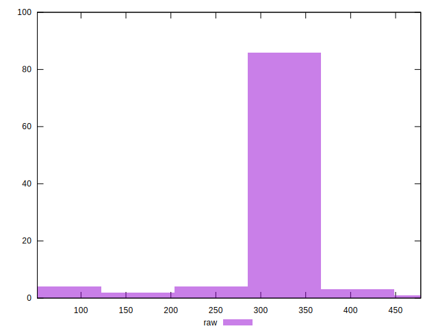
## Score


```yaml
p90min: 0.71
p90max: 0.91
p90range: 0.20000000000000007
p90mean: 0.7523404255319149
p90median: 0.75
p90stdev: 0.026028851909637045
p90skewness: 3.9342704338406977
p90eccentricity: 1.000000000000001
p90discretization: 8.545454545454545
outlandishness: 1.008150022554052
confidence: 0.016495586001155575
p90confidence: 0.010523717283798738

```

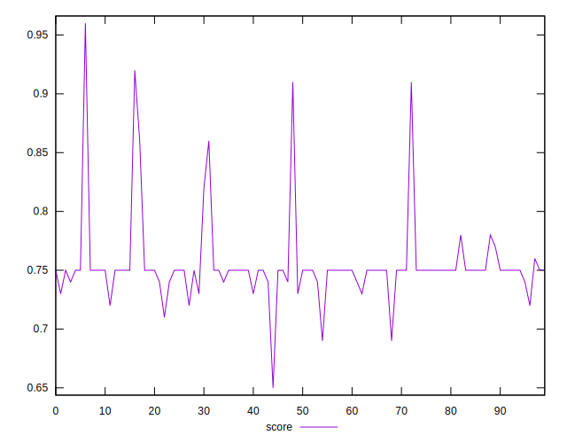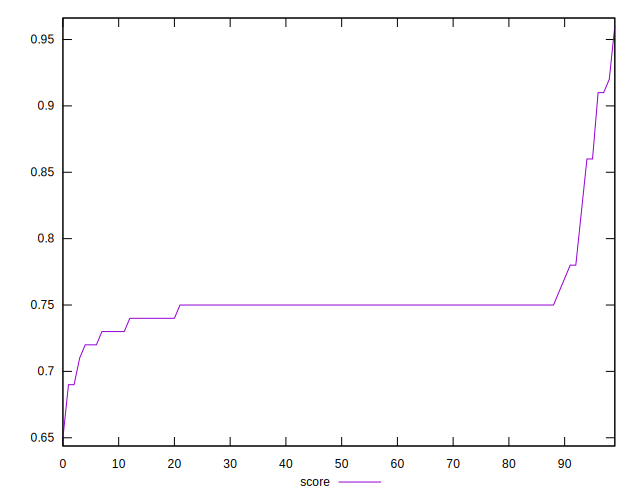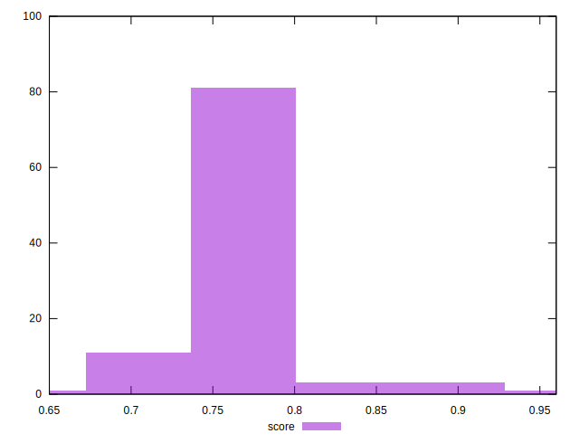
## Raw Estimate

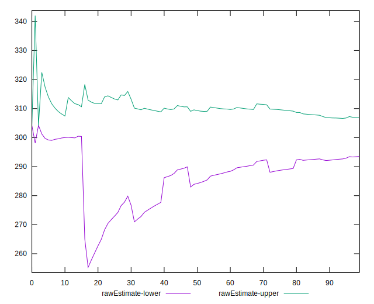
## Score Estimate

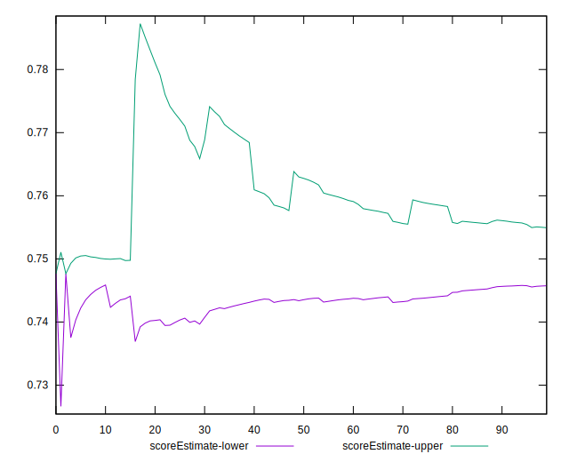
## P Score


```yaml
p90min: 0.7123449999921851
p90max: 0.909220833381017
p90range: 0.19687583338883186
p90mean: 0.7518150975181658
p90median: 0.7492527777777778
p90stdev: 0.025947037993116734
p90skewness: 4.083804673324562
p90eccentricity: 0.9999999999999997
p90discretization: 1.0930232558139534
outlandishness: 1.008235988916169
confidence: 0.016456422685014602
p90confidence: 0.010490639123827293

```

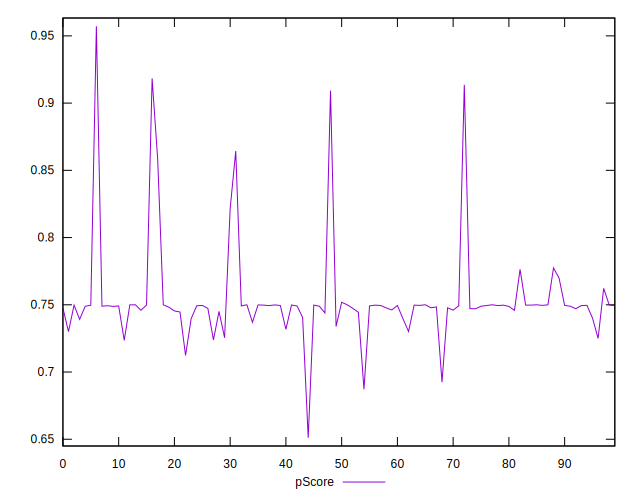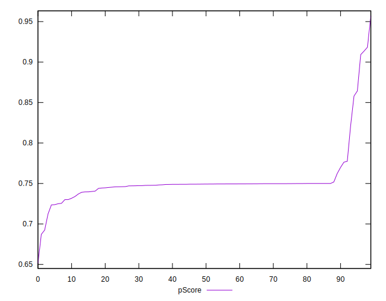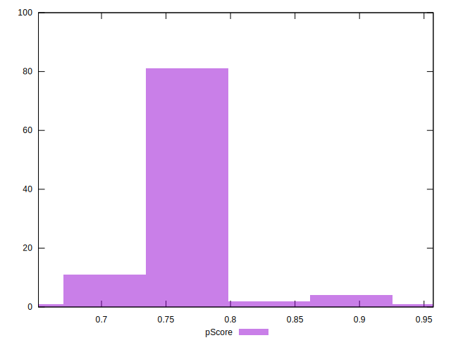
## Score Difference


```yaml
p90min: 0
p90max: 0
p90range: 0
p90mean: 0
p90median: 0
p90stdev: 0
p90skewness: .nan
p90eccentricity: .nan
p90discretization: 94
outlandishness: .inf
confidence: 7.423946114831071e-18
p90confidence: 0

```

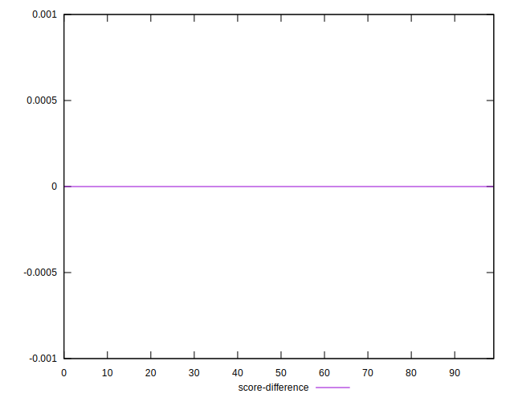
## P Score Difference


```yaml
p90min: -0.004135555555555559
p90max: 0.00432333332796897
p90range: 0.008458888883524529
p90mean: -0.0005277216306582383
p90median: -0.00046944444444441125
p90stdev: 0.0017618392762351676
p90skewness: 0.556518829438416
p90eccentricity: 1.0000000000000002
p90discretization: 1.0930232558139534
outlandishness: 0.8808313511204378
confidence: 0.0008076661217110967
p90confidence: 0.0007123287076571653

```

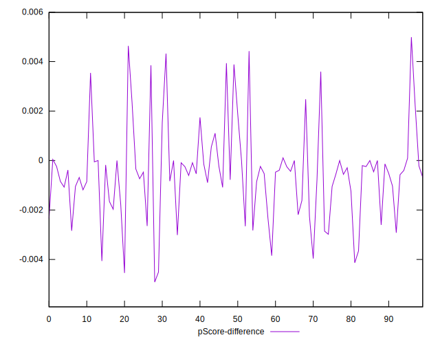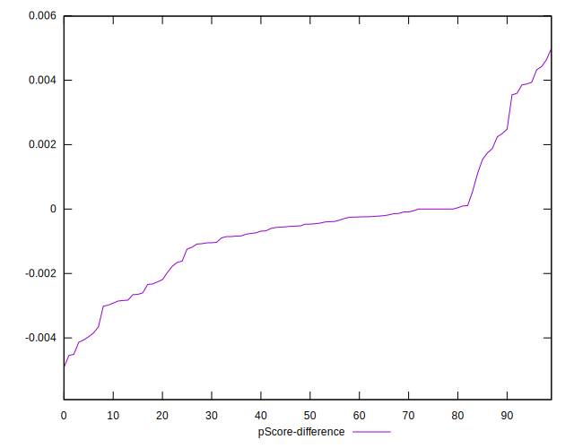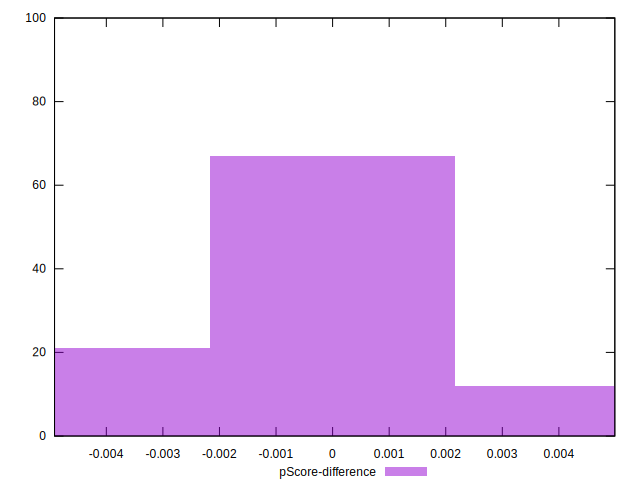