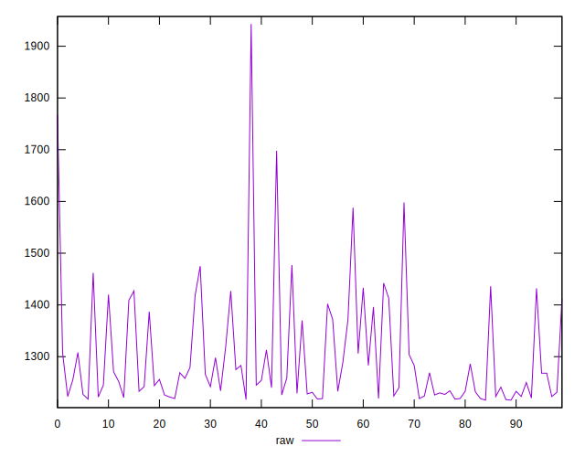

# //uses-rel-preload/samples/pages+cached+noadtech+nomedia+nocss

[→ Parent](../..)


## Raw


```yaml
p90min: 1217
p90max: 1598
p90range: 381
p90mean: 1291.0425531914893
p90median: 1253
p90stdev: 87.86933177065613
p90skewness: 1.444390263944185
p90eccentricity: 0.9999999999999997
p90discretization: 1.4461538461538461
outlandishness: 1.0204082880920038
confidence: 48.685106911457005
p90confidence: 35.52642308930767

```


## Score


```yaml
p90min: 0.4
p90max: 0.45
p90range: 0.04999999999999999
p90mean: 0.4345744680851064
p90median: 0.44
p90stdev: 0.009748419797426348
p90skewness: -1.6374021692340872
p90eccentricity: 0.9999999999999972
p90discretization: 15.666666666666666
outlandishness: 0.9941432395380292
confidence: 0.005545139582045173
p90confidence: 0.003941380675108386

```


## Raw Estimate


## Score Estimate


## P Score


```yaml
p90min: 0.400235294117647
p90max: 0.4450588235294118
p90range: 0.04482352941176476
p90mean: 0.4363479349186481
p90median: 0.4408235294117647
p90stdev: 0.010337568443606608
p90skewness: -1.4443902639441206
p90eccentricity: 1
p90discretization: 1.4461538461538461
outlandishness: 0.9929444938890725
confidence: 0.005727659636642
p90confidence: 0.0041795791869773755

```


## Score Difference


```yaml
p90min: 0
p90max: 0
p90range: 0
p90mean: 0
p90median: 0
p90stdev: 0
p90skewness: .nan
p90eccentricity: .nan
p90discretization: 94
outlandishness: .inf
confidence: 3.046396000301405e-18
p90confidence: 0

```


## P Score Difference


```yaml
p90min: -0.0048235294117647265
p90max: 0.0048235294117647265
p90range: 0.009647058823529453
p90mean: 0.001602002503128914
p90median: 0.0021764705882353075
p90stdev: 0.002749772273195873
p90skewness: -0.6415153559713429
p90eccentricity: 1.000000000000001
p90discretization: 1.709090909090909
outlandishness: 0.8836000000000002
confidence: 0.0011573571120515808
p90confidence: 0.0011117596004005033

```

