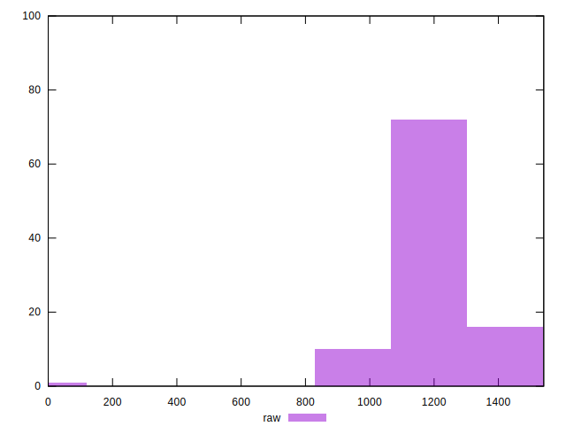

# //uses-rel-preload/samples/pages+cached+noadtech+nomedia

[→ Parent](../..)


## Raw


```yaml
p90min: 1011
p90max: 1427
p90range: 416
p90mean: 1194.4574468085107
p90median: 1179
p90stdev: 96.12798039466871
p90skewness: 0.18665574935906495
p90eccentricity: 0.9999999999999997
p90discretization: 1.175
outlandishness: 0.9895000048237453
confidence: 64.0770964016343
p90confidence: 38.86547482954841

```


## Score


```yaml
p90min: 0.42
p90max: 0.47
p90range: 0.04999999999999999
p90mean: 0.44755319148936185
p90median: 0.45
p90stdev: 0.01217655317654402
p90skewness: -0.019550057679776463
p90eccentricity: 1.0000000000000007
p90discretization: 15.666666666666666
outlandishness: 1.0217764191106442
confidence: 0.022244477384512393
p90confidence: 0.004923098551021631

```


## Raw Estimate


## Score Estimate


## P Score


```yaml
p90min: 0.4203529411764706
p90max: 0.4692941176470588
p90range: 0.04894117647058821
p90mean: 0.4477108886107636
p90median: 0.4495294117647059
p90stdev: 0.011309174164078667
p90skewness: -0.18665574935902607
p90eccentricity: 0.9999999999999999
p90discretization: 1.175
outlandishness: 1.0218162934906143
confidence: 0.022172912236912916
p90confidence: 0.004572408803476281

```


## Score Difference


```yaml
p90min: 0
p90max: 5.551115123125783e-17
p90range: 5.551115123125783e-17
p90mean: 4.724353296277262e-18
p90median: 0
p90stdev: 1.5489828153710845e-17
p90skewness: 2.9737221214857814
p90eccentricity: 0.999999999999997
p90discretization: 47
outlandishness: 1.67055625
confidence: 6.808472172051194e-18
p90confidence: 6.262687760113051e-18

```


## P Score Difference


```yaml
p90min: -0.004588235294117671
p90max: 0.004352941176470615
p90range: 0.008941176470588286
p90mean: 0.0001802252816019978
p90median: 0.0004705882352941393
p90stdev: 0.0025708657198039164
p90skewness: -0.25400967159047205
p90eccentricity: 0.9999999999999999
p90discretization: 1.4461538461538461
outlandishness: 0.8713703896604907
confidence: 0.0010775011361920566
p90confidence: 0.001039425945629556

```

