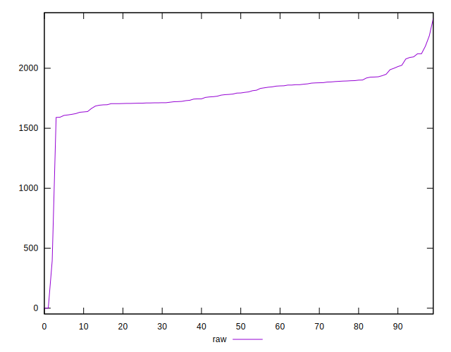

# //uses-rel-preload/samples/pages+cached+noadtech

[→ Parent](../..)


## Raw


```yaml
p90min: 1590
p90max: 2121
p90range: 531
p90mean: 1806.872340425532
p90median: 1793.5
p90stdev: 123.10298698715926
p90skewness: 0.5165921545851029
p90eccentricity: 1.0000000000000002
p90discretization: 1.1325301204819278
outlandishness: 0.9608069387561073
confidence: 127.30434132713131
p90confidence: 49.77173162848442

```


## Score


```yaml
p90min: 0.34
p90max: 0.4
p90range: 0.06
p90mean: 0.37648936170212766
p90median: 0.38
p90stdev: 0.015416725292406046
p90skewness: -0.533149944105167
p90eccentricity: 0.9999999999999994
p90discretization: 13.428571428571429
outlandishness: 1.0752617571242848
confidence: 0.0371129207879363
p90confidence: 0.006233131564254731

```


## Raw Estimate


## Score Estimate


## P Score


```yaml
p90min: 0.3387058823529412
p90max: 0.4011764705882353
p90range: 0.06247058823529411
p90mean: 0.37566207759699627
p90median: 0.37723529411764706
p90stdev: 0.014482704351430502
p90skewness: -0.51659215458511
p90eccentricity: 0.9999999999999999
p90discretization: 1.1325301204819278
outlandishness: 1.075908497774287
confidence: 0.03704673002365497
p90confidence: 0.0058554978386452265

```


## Score Difference


```yaml
p90min: 0
p90max: 5.551115123125783e-17
p90range: 5.551115123125783e-17
p90mean: 1.1810883240693154e-18
p90median: 0
p90stdev: 8.010530753054492e-18
p90skewness: 6.63488802697038
p90eccentricity: 0.9999999999999991
p90discretization: 47
outlandishness: 7.952399999999999
confidence: 6.014575766359395e-18
p90confidence: 3.238735278489523e-18

```


## P Score Difference


```yaml
p90min: -0.004588235294117671
p90max: 0.004470588235294115
p90range: 0.009058823529411786
p90mean: -0.0007867473230427003
p90median: -0.0011764705882353343
p90stdev: 0.0024901407783128548
p90skewness: 0.4108885161558329
p90eccentricity: 1
p90discretization: 1.5666666666666667
outlandishness: 0.8864135131677935
confidence: 0.0010536793897486625
p90confidence: 0.0010067880688245253

```

