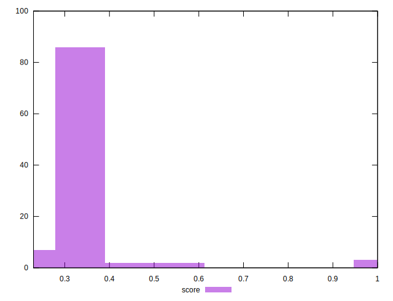

# //uses-rel-preload/samples/pages+cached

[→ Parent](../..)


## Raw


```yaml
p90min: 573
p90max: 2848
p90range: 2275
p90mean: 2203.351063829787
p90median: 2199.5
p90stdev: 331.29859603220604
p90skewness: -2.1099379570608057
p90eccentricity: 1
p90discretization: 1.0444444444444445
outlandishness: 0.9602362911669489
confidence: 200.99789491251897
p90confidence: 133.94723567778755

```


## Score


```yaml
p90min: 0.25
p90max: 0.6
p90range: 0.35
p90mean: 0.32989361702127645
p90median: 0.33
p90stdev: 0.0452297840312432
p90skewness: 3.0657022019049913
p90eccentricity: 0.9999999999999994
p90discretization: 5.222222222222222
outlandishness: 1.108949585558788
confidence: 0.048510973516946686
p90confidence: 0.018286840372542405

```


## Raw Estimate


## Score Estimate


## P Score


```yaml
p90min: 0.2531764705882353
p90max: 0.5983333333333334
p90range: 0.3451568627450981
p90mean: 0.3300703657349464
p90median: 0.32947058823529407
p90stdev: 0.04454057735235924
p90skewness: 3.117806799403523
p90eccentricity: 0.9999999999999997
p90discretization: 1.0444444444444445
outlandishness: 1.1088220715032082
confidence: 0.048408631794878206
p90confidence: 0.018008187427577316

```


## Score Difference


```yaml
p90min: 0
p90max: 5.551115123125783e-17
p90range: 5.551115123125783e-17
p90mean: 4.133809134242604e-18
p90median: 0
p90stdev: 1.457340475159286e-17
p90skewness: 3.241763593892412
p90eccentricity: 0.9999999999999958
p90discretization: 47
outlandishness: 1.8032653061224493
confidence: 6.527991429217294e-18
p90confidence: 5.892168890144147e-18

```


## P Score Difference


```yaml
p90min: -0.004705882352941171
p90max: 0.004470588235294115
p90range: 0.009176470588235286
p90mean: 0.00017925184258099546
p90median: 0
p90stdev: 0.002597065373636165
p90skewness: -0.04718151154937063
p90eccentricity: 1.0000000000000007
p90discretization: 1.3623188405797102
outlandishness: 0.8590945691327512
confidence: 0.0010889790836262
p90confidence: 0.0010500187197872936

```

