# //uses-text-compression/samples/pages+cached+noadtech+nomedia

[→ Parent](../..)


## Raw


```yaml
p90min: 1200
p90max: 3190
p90range: 1990
p90mean: 2588.6170212765956
p90median: 2820
p90stdev: 613.1148257035627
p90skewness: -1.3680086542788523
p90eccentricity: 1.0000000000000009
p90discretization: 2.088888888888889
outlandishness: 0.9794645956817237
confidence: 260.84326762852777
p90confidence: 247.8882707009034

```

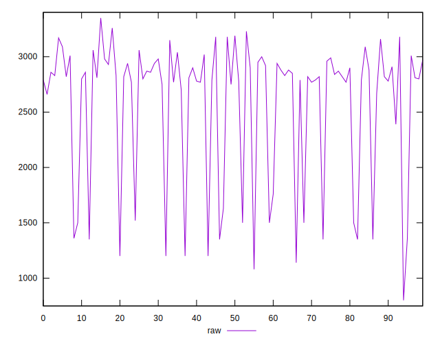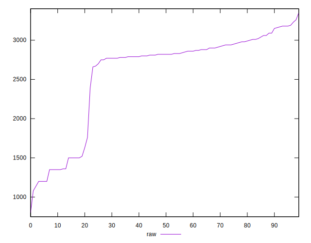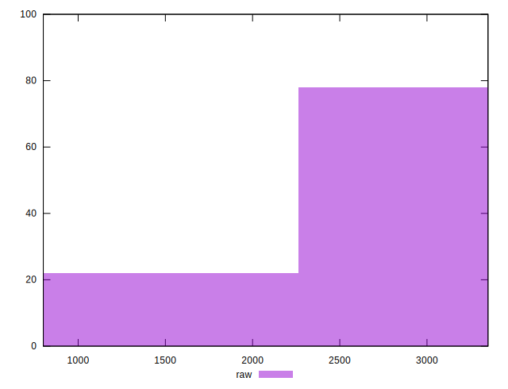
## Score


```yaml
p90min: 0.21
p90max: 0.45
p90range: 0.24000000000000002
p90mean: 0.2838297872340427
p90median: 0.26
p90stdev: 0.07256847658296094
p90skewness: 1.3621168366615253
p90eccentricity: 1.0000000000000002
p90discretization: 6.714285714285714
outlandishness: 1.0210390465936443
confidence: 0.030780196970313884
p90confidence: 0.029340138932224587

```

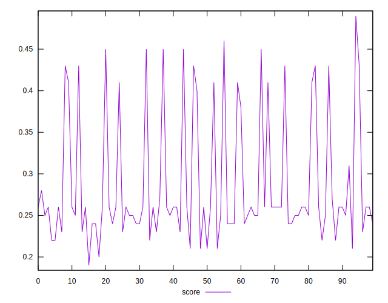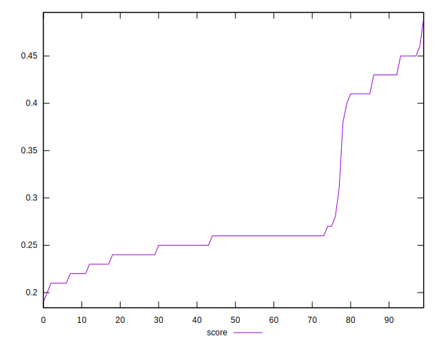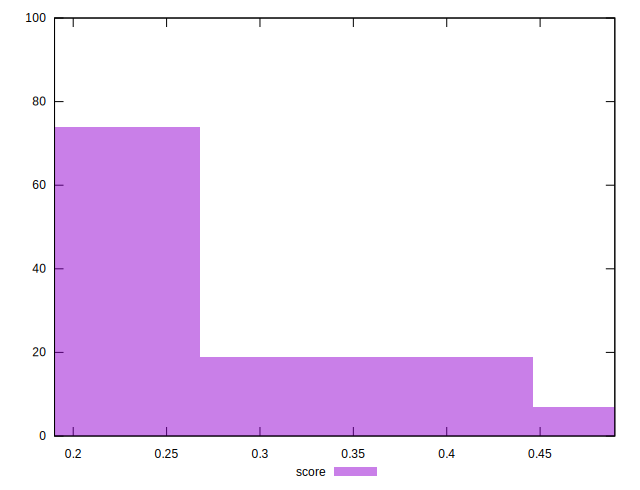
## Raw Estimate

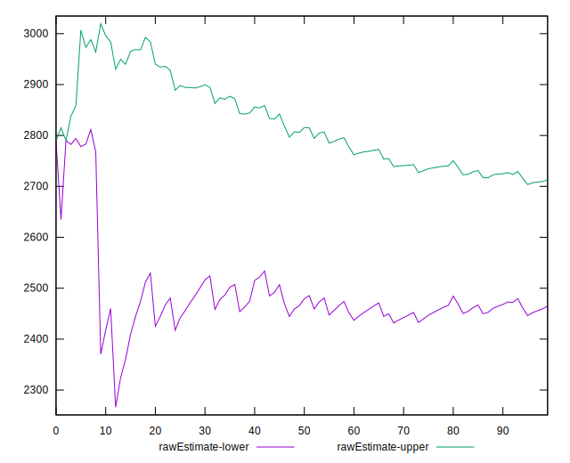
## Score Estimate

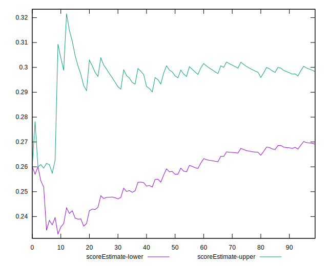
## P Score


```yaml
p90min: 0.21294117647058824
p90max: 0.4470588235294118
p90range: 0.23411764705882354
p90mean: 0.28369211514393
p90median: 0.2564705882352941
p90stdev: 0.07213115596512504
p90skewness: 1.3680086542788552
p90eccentricity: 0.9999999999999999
p90discretization: 2.088888888888889
outlandishness: 1.0222818421677304
confidence: 0.03068744325041505
p90confidence: 0.02916332596481217

```

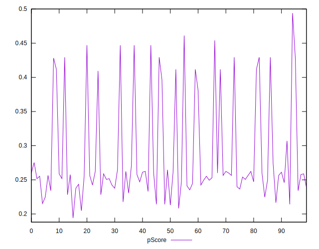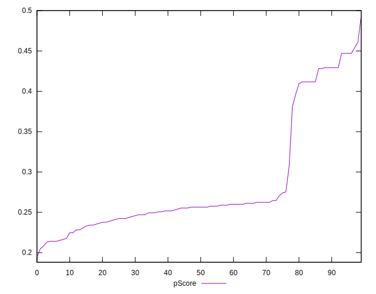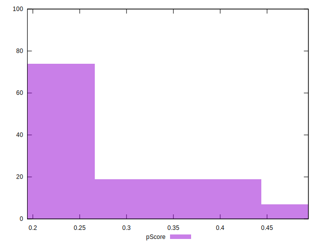
## Score Difference


```yaml
p90min: 0
p90max: 5.551115123125783e-17
p90range: 5.551115123125783e-17
p90mean: 1.771632486103973e-18
p90median: 0
p90stdev: 9.75739090108148e-18
p90skewness: 5.3260022874854975
p90eccentricity: 1.0000000000000049
p90discretization: 47
outlandishness: 3.5344000000000007
confidence: 5.1677068914518484e-18
p90confidence: 3.945007779327889e-18

```

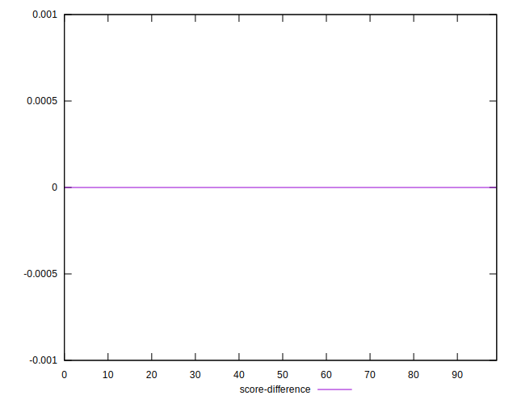
## P Score Difference


```yaml
p90min: -0.004705882352941226
p90max: 0.004705882352941171
p90range: 0.009411764705882397
p90mean: 0.000037546933667079234
p90median: 0
p90stdev: 0.0026803064435829294
p90skewness: 0.06525231209828163
p90eccentricity: 1.0000000000000002
p90discretization: 2.8484848484848486
outlandishness: 0.8835999999999168
confidence: 0.0011143769423069888
p90confidence: 0.0010836738917311753

```

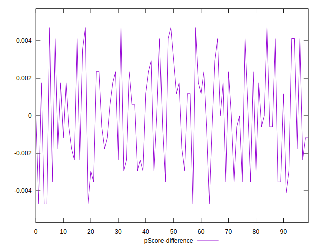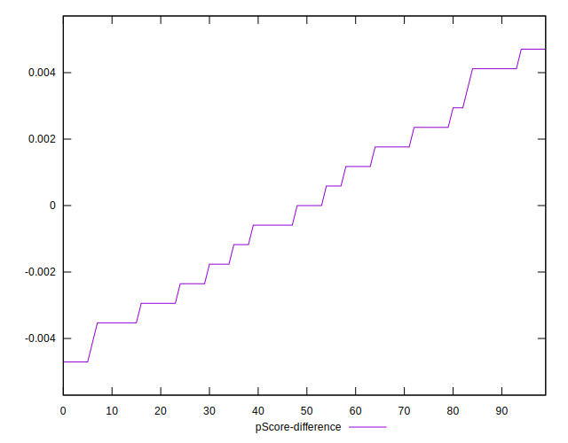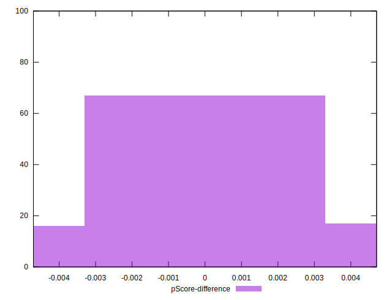